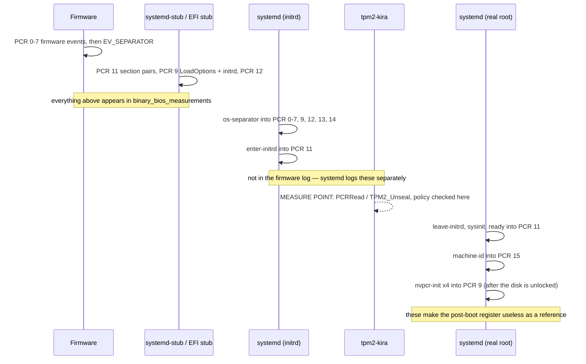
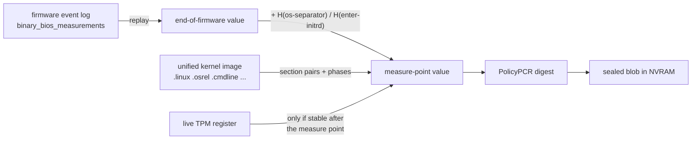
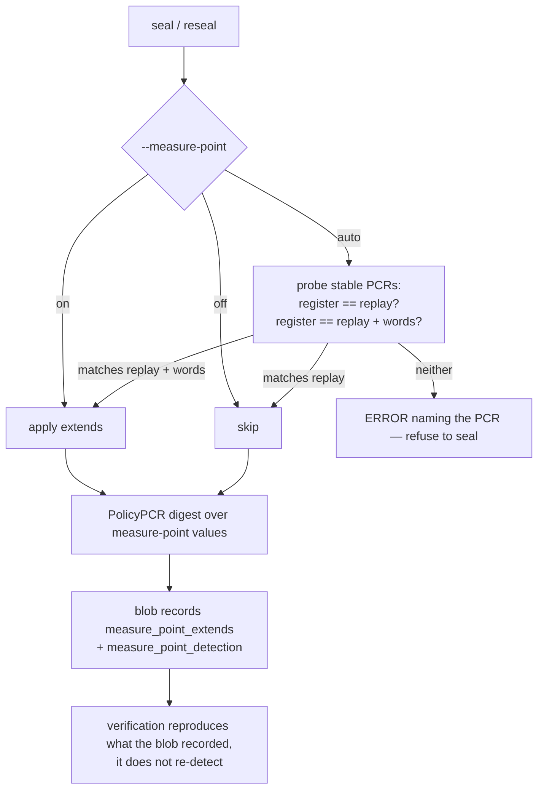

# TPM2-KIRA Security Background

This document describes the security architecture of tpm2-kira: how secrets are
protected, where data is stored, how authentication works, and what trust
boundaries exist.

---

## 1. Purpose

tpm2-kira seals a TOTP secret into a TPM 2.0 so that the secret can only be
retrieved when the machine is in a known-good firmware/boot state. If the boot
chain changes (firmware update, bootloader change, Secure Boot policy change),
the TPM refuses to release the secret via the normal path. A second,
cryptographic recovery path allows the owner — proven by possession of a
signing private key — to retrieve the secret and re-seal it against the new
boot measurements.

---

## 2. High-Level Architecture

```
┌──────────────────────────────────────────────────────┐
│                     TPM 2.0 chip                     │
│                                                      │
│  ┌──────────────┐   ┌─────────────────────────────┐  │
│  │ PCR Registers │   │ Sealed Object               │  │
│  │ (SHA-256)     │   │  ├─ Public area (template)  │  │
│  │               │   │  ├─ Private area (wrapped)  │  │
│  │ PCR0: ...     │   │  └─ AuthPolicy: PolicyOR    │  │
│  │ PCR2: ...     │   │       digest                │  │
│  │ PCR7: ...     │   │                             │  │
│  └──────────────┘   └─────────────────────────────┘  │
│                                                      │
│  ┌──────────────────────────────────────────────────┐│
│  │ NVRAM Index 0x01803010                           ││
│  │  Stores: serialised SealedBlob (public +         ││
│  │          private + metadata)                     ││
│  └──────────────────────────────────────────────────┘│
└──────────────────────────────────────────────────────┘

┌──────────────────────────────────────────────────────┐
│                    Filesystem                        │
│                                                      │
│  /var/lib/tpm2-kira/keys/seal.pub   (signing pub key)  │
│  /var/lib/tpm2-kira/keys/seal.key   (signing priv key) │
│                                                      │
│  These are the Secure Boot DB key pair managed by    │
│  sbctl. Any RSA-2048 or ECC P-256/P-384 key pair    │
│  can be used instead via --pubkey / --privkey.       │
└──────────────────────────────────────────────────────┘
```

---

## 3. What Is Stored Where

### 3.1 TPM NVRAM (the "blob")

The NVRAM index (default `0x01803010`) stores a serialised `SealedBlob`
(format version 5). It contains:

| Field                | Content                                                        | Sensitive? |
|----------------------|----------------------------------------------------------------|------------|
| `Version`            | Blob format version (5)                                        | No         |
| `AppVersion`         | tpm2-kira version that created the blob                        | No         |
| `Public`             | TPM2B\_PUBLIC of the sealed object (object template)            | No         |
| `Private`            | TPM2B\_PRIVATE of the sealed object (TPM-wrapped ciphertext)    | **Yes**¹   |
| `PCRDigests`         | Per-PCR index, source (register/eventlog/uki), and digest      | No         |
| `SignedBranchDigest` | Pre-computed PolicySigned branch digest (SHA-256, 32 bytes)    | No³        |
| `EventlogInfo`       | Metadata about eventlog calculation (path, hash, timestamps)   | No         |
| `PublicKeyPath`      | Filesystem path to the signing public key at seal time         | No²        |
| `PrivateKeyPath`     | Filesystem path to the signing private key at seal time        | No²        |

¹ The `Private` field is an opaque blob encrypted by the TPM's internal
storage hierarchy key. It **cannot** be decrypted outside the specific TPM
that created it. Possessing this blob alone is useless without the TPM and a
valid policy session.

² The key **paths** are stored purely for operational convenience so that
`reseal` can locate the keys automatically. They contain no secret material —
only filesystem paths (e.g. `/var/lib/sbctl/keys/db/db.key`). The paths are
optional: old blobs without them still work, and CLI flags always override
blob paths. Storing the path of the private key does **not** weaken security:
the private key itself is never stored in the blob; the path merely tells
reseal where to find it on the filesystem, and the TPM still performs the
actual signature verification.

³ The `SignedBranchDigest` is a 32-byte SHA-256 hash computed at seal time:
`H(0…0 || TPM_CC_PolicySigned || keyName)`. It is the PolicySigned branch
digest needed by `TPM2_PolicyOR` at unseal time. Storing only this digest
(instead of the full public key PEM as in blob v4) avoids embedding
unnecessary key material in the blob. The public key itself is not stored —
it is loaded from the filesystem (via the stored paths) or derived from the
private key when needed.

The NVRAM index attributes are:

- `OwnerWrite`, `OwnerRead`, `AuthWrite`, `AuthRead`
- No PCR-based NVRAM policy — access control is on the sealed **object** inside,
  not on the NVRAM index itself.

### 3.2 Inside the TPM (never leaves the chip)

- **Storage Primary Seed**: Generates the primary key deterministically.
  Never exportable.
- **Primary Key** (ECC P-256, restricted decrypt): Ephemeral parent created
  via `TPM2_CreatePrimary` in the Owner hierarchy with a fixed template, so
  it is deterministically re-derived on every use. It wraps/unwraps the sealed
  object's `Private` area.
- **Sealed Secret** (the TOTP key): Only exists in cleartext inside the TPM
  during an `TPM2_Unseal` command that satisfies the PolicyOR auth policy. It
  is returned to the caller over the TPM transport and immediately used to
  generate the TOTP code.

### 3.3 Filesystem (signing key pair)

The signing key pair lives on the filesystem. By default these are the sbctl
Secure Boot DB keys, but any supported key pair can be used.

| File       | Purpose                                                    |
|------------|------------------------------------------------------------|
| Public key | Baked into the PolicyOR digest at seal time. Its           |
| (`.pem`)   | filesystem path is stored in the blob for reseal.          |
| Private key| Required **only** for PolicySigned recovery when PCRs have |
| (`.key`)   | changed. Never stored in the blob or in the TPM.           |

The private key should be protected by filesystem permissions (readable only
by root). It is never sent to the TPM — tpm2-kira signs a nonce locally and
sends the **signature** to the TPM for verification.

When both `--pubkey` and `--privkey` are provided at seal time, their
filesystem paths are stored in the blob. This allows `reseal` to locate the
keys automatically without requiring the user to re-specify them every time.
CLI flags always take priority over stored paths.

---

## 4. Authentication Model: PolicyOR

The sealed object's `authPolicy` is a **TPM2 PolicyOR** digest combining two
branches. Either branch alone is sufficient to unseal.

### 4.1 Branch 1 — PolicyPCR (normal boot path)

```
PolicyDigest = H(0…0 || TPM_CC_PolicyPCR || PCR-selection || PCR-composite-digest)
```

- The PCR composite digest is computed from the PCR values at seal time.
- At unseal time, the TPM reads the **live** PCR registers and computes the
  same composite. If the PCR values match exactly, the branch is satisfied.
- **No key, no password, no user interaction** — the TPM decides autonomously
  based on hardware measurements.

This is the fast, silent path used during every normal boot.

### 4.2 Branch 2 — PolicySigned (recovery path)

```
PolicyDigest = H(0…0 || TPM_CC_PolicySigned || keyName)
```

Where `keyName = SHA-256-alg-id || SHA-256(TPMT_PUBLIC of the signing key)`.

At unseal time, this branch requires:

1. The public key is loaded into the TPM via `TPM2_LoadExternal`.
2. The TPM generates a nonce (`nonceTPM`) for the policy session.
3. tpm2-kira computes `aHash = SHA-256(nonceTPM || expiration=0)` and signs
   it with the private key using RSASSA-PKCS1-SHA256 (RSA) or ECDSA-SHA256
   (ECC).
4. The signature is sent to the TPM via `TPM2_PolicySigned`.
5. **The TPM verifies the signature** against the loaded public key. If valid,
   the branch is satisfied.

The critical point: **the TPM performs the signature verification**, not
tpm2-kira. The private key never touches the TPM. Only the signature travels
to the TPM, and only the public key is loaded.

### 4.3 PolicyOR combination

```
CombinedDigest = H(0…0 || TPM_CC_PolicyOR || Branch1Digest || Branch2Digest)
```

This combined digest is set as the sealed object's `authPolicy` at creation
time. At unseal time, the caller must:

1. Satisfy exactly **one** branch (PolicyPCR or PolicySigned).
2. Then call `TPM2_PolicyOR` with **both** branch digests.
3. The TPM verifies that the session's current digest matches one of the
   provided branches, then replaces it with the PolicyOR digest.
4. The resulting session digest matches the object's `authPolicy`, and
   `TPM2_Unseal` succeeds.

### 4.4 Object attributes

The sealed object is created with:

```
FixedTPM:    true    — cannot be duplicated to another TPM
FixedParent: true    — cannot be moved to a different parent key
UserWithAuth: false  — password/HMAC auth is NOT accepted; policy-only
```

Setting `UserWithAuth = false` is essential. It means there is **no password
bypass**. The only way to unseal is through a policy session that satisfies the
PolicyOR — either matching PCRs or a valid cryptographic signature.

### 4.5 Where the guarantee is enforced

The release decision is made **inside the TPM**, not by tpm2-kira:

| Step | Code | What the TPM does |
|------|------|-------------------|
| Object creation | `cmd/policy_or.go`, `CreateSealedObjectPolicyOR` | Stores `AuthPolicy: policyDigest`; `UserWithAuth` is deliberately left unset |
| Normal boot unseal | `cmd/policy_or.go`, `UnsealWithPCRBranch` | `TPM2_PolicyPCR` reads the **live** registers and folds their composite digest into the session |
| | | `TPM2_PolicyOr` then `TPM2_Unseal` |

`TPM2_PolicyPCR` is issued **without** a caller-supplied `PcrDigest`, so the
TPM derives the value from its own registers. If a single bit differs, the
session digest no longer equals the object's `authPolicy` and `TPM2_Unseal`
returns `TPM_RC_POLICY_FAIL`. The secret never crosses the chip boundary.
A caller cannot assert "the PCRs matched"; it can only ask the TPM to try.

Two distinctions worth being explicit about, because both are easy to misread:

- **Trial sessions are never used to unseal.** `tpm2.PolicySession(..., tpm2.Trial())`
  appears in `ComputeFullPolicyDigest` and friends purely to *calculate* digests
  at seal time. A trial session can be driven to any digest and authorises
  nothing. The unseal path uses a real `tpm2.Policy(...)` session.
- **The software PCR comparison is advisory only.** §5.2 steps 2–3 compare the
  blob's digests against live registers to produce a helpful error before
  touching the TPM. It is a user-experience shortcut, not the gate — deleting
  it would not weaken the guarantee by one bit, and patching it out does not
  yield the secret.

### 4.6 What this does *not* guarantee

"Only when the PCRs match" is not the whole statement. PolicyOR has two doors,
and the second one is intentional:

> The TPM releases the secret when the PCRs match **or** when a valid signature
> from the sealing key is presented.

Anyone holding the signing private key can unseal regardless of PCR state —
that is the recovery path, and it is why a kernel update does not lock you out.
It also means the private key is as security-critical as the TPM policy itself.

The mitigating property is *where* the key lives, not what the TPM enforces:
`/var/lib/tpm2-kira/keys/seal.key` sits on the encrypted root filesystem, so at
tpm2-kira's measure point in the initrd — before the disk is unlocked — it is
not reachable. An attacker in that window has only the PCR door. Note this is a
filesystem-layout property that a different deployment could undo, not a
guarantee the TPM makes.

---

## 5. Operation Flows

### 5.1 Seal

```
1.  Generate 256-bit random TOTP secret
2.  Read PCR values from TPM registers (or eventlog/uki)
3.  Compute Branch 1 digest: trial PolicyPCR with the read values
4.  Compute Branch 2 digest: trial PolicySigned with the signing public
    key loaded into the TPM
5.  Compute PolicyOR digest combining both branches (trial session)
6.  TPM2_CreatePrimary → deterministic parent key
7.  TPM2_Create → sealed object with authPolicy = PolicyOR digest
    (UserWithAuth = false, no password)
8.  Serialise SealedBlob (public, private, PCR digests, signed branch
    digest, key paths)
9.  Write blob to NVRAM
```

The TOTP secret exists in cleartext only briefly in step 1 and is displayed
to the user (QR code). After sealing, the cleartext is discarded.

### 5.2 Reveal (normal boot)

```
1.  Read blob from NVRAM, deserialise
2.  Compare blob's PCR digests against live TPM register values   (advisory)
3.  If mismatch → fail early with a readable PCR mismatch error   (advisory)
4.  TPM2_CreatePrimary → same parent key
5.  TPM2_Load → load sealed object into TPM
6.  Build policy session:
    a. TPM2_PolicyPCR with the blob's PCR selection
       → TPM reads live registers, computes digest
    b. TPM2_PolicyOR with [PCR-branch-digest, signed-branch-digest]
       (signed branch digest is read directly from the blob — no key loading needed)
7.  TPM2_Unseal → TPM releases secret if policy satisfied
8.  Compute TOTP code from secret, display it
```

Steps 2–3 only produce a better error message. The enforcement is steps 6–7,
inside the TPM — see §4.5.

No private key is needed. No password is needed. The TPM decides based on PCRs.

### 5.3 Reseal (PCR values changed)

```
1.  Read blob from NVRAM, deserialise
2.  Attempt normal unseal via PCR branch
3.  If PCR branch fails (values changed):
    a. Load signing private key from filesystem (--privkey)
    b. Derive public key from private key, load into TPM (TPM2_LoadExternal)
    c. Build policy session:
       i.   TPM generates nonceTPM
       ii.  tpm2-kira computes aHash = SHA-256(nonceTPM || 0x00000000)
       iii. tpm2-kira signs aHash with private key
       iv.  TPM2_PolicySigned — TPM verifies signature
       v.   TPM2_PolicyOR with both branch digests
            (signed branch digest from blob, PCR branch digest recomputed from blob's PCR digests)
    d. TPM2_Unseal → TPM releases secret
4.  Re-seal with current PCR values and chosen signing key
```

**Authentication authority is the TPM, not the software.** The TPM verifies
the signature inside `TPM2_PolicySigned`. tpm2-kira merely shuttles the nonce
and signature between the TPM and the local signing operation.

### 5.4 Reseal (PCR values unchanged)

```
1.  Read blob from NVRAM, deserialise
2.  Resolve key paths: CLI flags override blob-stored paths
3.  Unseal via PCR branch (succeeds — PCRs match)
4.  Re-seal with current PCR values
    Signing key for the new blob (in priority order):
    a. --pubkey flag (explicit override)
    b. Blob's stored PublicKeyPath (loaded from filesystem)
    c. Derived from --privkey / blob's PrivateKeyPath
```

When PCRs match, no private key is required. The TPM authorises the unseal
through PCR verification alone. This is the expected path after a
`tpm2-kira reseal` following a planned change where the user has already
rebooted into the new configuration.

### 5.5 Key path resolution in reseal

Reseal resolves key paths with a two-tier fallback:

```
Effective privkey path = --privkey flag  →  blob.PrivateKeyPath  →  (empty)
Effective pubkey path  = --pubkey flag   →  blob.PublicKeyPath   →  (empty)
```

If a path is resolved (from either source), the key is loaded from the
**filesystem** — never from the blob. The blob only stores the path as a
hint. If the file has been moved or deleted, the user must provide the new
path via CLI flags.

This means that after an initial `seal --pubkey /path/pub --privkey /path/priv`,
subsequent `reseal` commands need no flags at all — the paths are remembered
in the blob and the keys are read fresh from the filesystem each time.

### 5.6 The measure point

A PCR policy is checked against **live registers at the instant of unsealing**.
For tpm2-kira that instant is one specific point in the boot: the moment
`tpm2-kira run` reads the TPM in the initrd, before the LUKS passphrase prompt.
Everything sealing does must answer one question:

> What will PCR *i* be at the measure point of the *next* boot?

That is neither "what the firmware log says" nor "what the running system
shows". Both differ, in different directions:



Two consequences follow, and both caused real breakage:

1. **The firmware event log stops short of the measure point.** It describes
   the end of firmware. The systemd extends that follow are recorded in
   `/run/log/systemd/tpm2-measure.log`, a different file written by a
   different producer. Replaying only the firmware log under-counts.
2. **The live register at seal time is past the measure point** for any PCR
   that keeps being extended afterwards. PCRs 9, 11 and 15 do; PCRs 0–7, 12,
   13 and 14 stop, which is what makes them usable as a reference.

### 5.7 Reconstructing each PCR



Per source:

| Source | Reconstruction | Valid for |
|--------|----------------|-----------|
| `r` register | read the register as-is | PCRs that stop changing at the measure point |
| `e` eventlog | replay the firmware log, then apply the measure-point extends | PCRs 0–12 |
| `u` uki | replay systemd-stub's section measurements from the image, then the boot phases | PCR 11 |

**Measure-point extends** (systemd hashes the literal word: no NUL terminator,
no machine-id, no salt, so these are universal constants, not per-host values):

| Word | Extended into | Unit | `sha256` |
|------|---------------|------|----------|
| `os-separator` | PCR 0–7, 9, 12, 13, 14 | `systemd-pcrosseparator.service` | `ff5b9d73dad709633ae76adf444012b57e913a12ed7403c3931145862f35f841` |
| `enter-initrd` | PCR 11 | `systemd-pcrphase-initrd.service` | `51e6b92f405d1f98d96e3de343d61d420ad6923b25de21d766f9298192f14fed` |

Extended *after* the measure point, and therefore never part of a sealed
policy: `leave-initrd`, `sysinit`, `ready` (PCR 11), `machine-id:<id>` (PCR 15),
`nvpcr-init:<name>:...` (PCR 9).

**UKI section measurement.** systemd-stub measures each present section twice,
in its own fixed order (`.linux`, `.osrel`, `.cmdline`, `.initrd`, `.ucode`,
`.splash`, `.dtb`, `.uname`, `.sbat`, `.pcrpkey`; `.pcrsig` is never measured
because it carries the signature over these measurements):

```
PCR11 = Extend(PCR11, H(section_name + "\0"))    # NUL-terminated ASCII
PCR11 = Extend(PCR11, H(section_bytes))
```

The firmware event log *renders* the name as UTF-16 (`".\0l\0i\0n\0u\0x\0\0\0"`),
which is the event payload — but the measured digest is over the ASCII form.
`H(".linux\0")` = `0da293e37ad5511c59be47993769aacb91b243f7d010288e118dc90e95aaef5a`.

**Useful constants for diagnosis.** PCRs 2, 3 and 6 normally contain only the
firmware `EV_SEPARATOR`, so their value is machine-independent:

| State | sha256 |
|-------|--------|
| `EV_SEPARATOR` event digest | `df3f619804a92fdb4057192dc43dd748ea778adc52bc498ce80524c014b81119` |
| zero PCR + separator (end of firmware) | `3d458cfe55cc03ea1f443f1562beec8df51c75e14a9fcf9a7234a13f198e7969` |
| the same + `os-separator` (measure point) | `8d22c738fcd1730fb0789cb09c0f72a0012baa3ea867723b26772c9ca0ae6571` |

If PCR 2/3/6 hold neither of the last two, something is performing extra
extends — it is never a changed measurement.

### 5.8 Making the seal match the measure point



Three properties make this safe:

- **Refusal beats guessing.** A PCR whose register matches neither branch is
  not reconstructible on that host, and sealing would bind the policy to a
  value the machine will never produce. That is a silent failure at the next
  boot, so `auto` errors out instead.
- **Build-time beats run-time for the transition.** The mkinitcpio install
  hook inspects the image being built and records the verdict, because
  probing the *current* boot cannot know what the *next* one will do — exactly
  the case where these units first appear in the initramfs.
- **The blob is self-describing.** What was applied is stored, so verification
  recomputes the sealed values rather than re-deriving them from a system that
  may have changed. `tpm2-kira info` shows it.

Ordering is enforced so the measure point is deterministic:
`tpm2-kira.service` declares `After=systemd-pcrosseparator.service` and
`After=systemd-pcrphase-initrd.service`. Without those edges the measure point
could land on either side of the extends, which would make an identical machine
pass or fail across identical boots. `tpm2-kira run` re-checks the policy in a
loop for the whole duration of the prompt, so the PCRs must be stable for its
entire lifetime — that is why it runs *after* these units rather than before.

---

## 6. Signed Branch Digest: Software vs TPM Computation

The PolicySigned branch digest is computed **entirely in software** at seal
time, without loading the key into the TPM. The calculation is:

```
keyName     = 0x000B || SHA-256(Marshal(TPMT_PUBLIC))
branchDigest = SHA-256(zeros(32) || 0x00000160 || keyName)
                        ↑                ↑
                   empty policy    TPM_CC_PolicySigned
```

This is mathematically identical to what a TPM trial session would produce,
but avoids two real-world issues:

1. **TPM key-size limits**: Some TPMs do not support RSA-4096 in
   `TPM2_LoadExternal`. Computing in software sidesteps this entirely for the
   seal-time calculation.
2. **Trial session scheme validation**: Some TPM implementations reject
   `TPM2_PolicySigned` with `sigAlg = NULL` even in trial mode, violating the
   spec's intent that trial sessions skip signature verification.

The actual signing key is still validated against the TPM via
`ValidateKeyForTPM()` at seal time. This catches hardware incompatibilities
early — if the TPM cannot load the key, it will also be unable to verify
signatures during PolicySigned recovery, so sealing is refused.

---

## 7. Key Requirements and TPM Compatibility

### Supported key types

| Key Type   | PolicySigned | LoadExternal | Notes                              |
|------------|-------------|--------------|------------------------------------|
| RSA-2048   | ✓           | ✓            | Universally supported              |
| RSA-4096   | ✓*          | TPM-dependent| Many consumer TPMs reject this     |
| ECC P-256  | ✓           | ✓            | Recommended; compact and fast      |
| ECC P-384  | ✓           | ✓            | Supported but less common          |

*RSA-4096 branch digest computation works (software-only), but actual
PolicySigned recovery requires `TPM2_LoadExternal` which may fail. The seal
command detects this and reports it.

### Key scheme

Keys are loaded into the TPM with an explicit signing scheme:

- RSA: `TPM_ALG_RSASSA` with `TPM_ALG_SHA256`
- ECC: `TPM_ALG_ECDSA` with `TPM_ALG_SHA256`

The scheme is part of the `TPMT_PUBLIC` structure and therefore part of the
key's **Name**. Changing the scheme changes the Name, which changes the
PolicySigned branch digest. The scheme must be consistent between seal and
unseal.

---

## 8. Threat Model

### What the TPM protects against

| Threat                                      | Mitigation                                |
|---------------------------------------------|-------------------------------------------|
| Offline disk theft                          | Secret is TPM-wrapped; useless without the specific TPM chip |
| Boot chain tampering (evil maid)            | PCR values change → PCR branch fails → TOTP code absent → user detects compromise |
| Software-only attack (malware in OS)        | Secret requires TPM policy session; malware would need to execute TPM commands with matching PCR state |
| Blob tampering in NVRAM                     | `Private` area is integrity-protected by TPM; tampering causes `TPM2_Load` to fail |
| Re-seal by unauthorised party (PCRs match)  | Requires access to the TPM device (`/dev/tpm0`, typically root-only) |
| Re-seal by unauthorised party (PCRs differ) | Requires possession of the signing private key on the filesystem |

### What the TPM does NOT protect against

| Threat                                       | Why                                        |
|----------------------------------------------|--------------------------------------------|
| Root access on a running, measured system     | Root can open `/dev/tpm0` and unseal while PCRs still match the sealed state |
| Physical TPM interposer / bus sniffing        | The TOTP secret travels from TPM to CPU in cleartext over the TPM bus (LPC/SPI). A hardware interposer could capture it |
| Cold boot / DMA attacks                       | Once unsealed, the secret exists in process memory briefly |
| Compromise of the signing private key         | Attacker can use PolicySigned to unseal regardless of PCR state |
| TPM reset attacks (if PCRs can be replayed)   | Platform-specific; DRTM/measured launch can mitigate |

### Trust boundaries

```
┌─────────────────────────────────┐
│  TRUSTED: TPM 2.0 chip         │
│  - Sealed secret storage        │
│  - PCR register integrity       │
│  - PolicyOR enforcement         │
│  - PolicySigned sig verification│
└─────────────┬───────────────────┘
              │ /dev/tpm0 (kernel mediated)
┌─────────────┴───────────────────┐
│  PRIVILEGED: root userspace     │
│  - tpm2-kira binary             │
│  - Signing private key (fs)     │
│  - Unsealed secret (in memory)  │
└─────────────┬───────────────────┘
              │
┌─────────────┴───────────────────┐
│  UNTRUSTED: non-root userspace  │
│  - Cannot access /dev/tpm0      │
│  - Cannot read private key      │
└─────────────────────────────────┘
```

---

## 9. NVRAM Index Security

The NVRAM index is defined with `OwnerRead | OwnerWrite | AuthRead | AuthWrite`
and an empty auth value. This means:

- Any process that can talk to the TPM can **read** the blob.
- Any process that can talk to the TPM can **overwrite** the blob.

This is acceptable because:

1. **Reading the blob is harmless.** The `Private` field is TPM-encrypted and
   reveals nothing without a valid policy session. The `Public` field, PCR
   digests, and signing public key are not secret.
2. **Overwriting the blob is a denial-of-service**, not a secret compromise.
   An attacker who overwrites the NVRAM destroys the sealed secret but cannot
   recover it. The user loses their TOTP enrollment and must re-seal.
3. **The real access control is on the sealed object**, not the NVRAM index.
   The object's `authPolicy` (PolicyOR) is what prevents unauthorised unseal.

If NVRAM write protection is desired, the index could be defined with
platform-specific policies (e.g., owner auth), but this is outside the scope
of tpm2-kira's current design.

---

## 10. Blob Format (Version 7)

The blob is a binary-serialised structure with explicit length prefixes and
maximum size limits to prevent memory exhaustion during deserialisation.

Version 7 adds the measure-point metadata and replaces the external predict
source with the UKI source. The `p:COMMAND` source was removed outright: it
stored a command string in the blob which `reseal` executed, so a planted blob
meant arbitrary code execution as root. No command is ever executed now.

```
Offset  Field                   Type        Notes
─────────────────────────────────────────────────────────────
0       Version                 uint32      Must be 7
4       Payload length          uint32      Signed region length
8       AppVersion length       uint32      ≤ 1024
?       AppVersion              string
?       Public length           uint32      ≤ 2MB
?       Public                  []byte      TPM2B_PUBLIC
?       Private length          uint32      ≤ 2MB
?       Private                 []byte      TPM2B_PRIVATE
?       PCR digest count        uint32      ≤ 100
        For each PCR digest:
          PCR index             uint32
          PCR source            uint8       0=register, 1=eventlog, 3=uki
                                            (2 was the removed predict source)
          Path length           uint16      Only if source=uki
          Path                  string      Only if source=uki (UKI location)
          Digest length         uint16      ≤ 1024
          Digest                []byte      Value at the MEASURE POINT
?       SignedBranchDigest len  uint16      ≤ 64
?       SignedBranchDigest      []byte      Pre-computed PolicySigned branch digest
?       HasEventlogInfo         uint8       0 or 1
        If HasEventlogInfo=1:
          EventlogPath length   uint32
          EventlogPath          string
          EventlogHash length   uint32
          EventlogHash          string
          CalcTime length       uint32
          CalcTime              string
          TotalEvents           uint32
          ProcessedEvents       uint32
          MeasurePointExt len   uint16      ≤ 512
          MeasurePointExtends   string      "word:pcr,pcr;word:pcr" applied
                                            on top of the eventlog replay
          MeasurePointDet len   uint16      ≤ 512
          MeasurePointDetection string      how that was decided
?       HasKeyPaths             uint8       0 or 1
        If HasKeyPaths=1:
          PubKeyPath length     uint16      ≤ 4096
          PubKeyPath            string      Filesystem path to public key
          PrivKeyPath length    uint16      ≤ 4096
          PrivKeyPath           string      Filesystem path to private key
```

Everything except the trailing signature is covered by `SealedBlobPayload`, so
any field added there is automatically inside the signed region.

The stored PCR digests are **measure-point values**, not end-of-firmware values
and not the values a running system would report. `MeasurePointExtends` records
which userspace extends were folded in, so verification reproduces exactly what
was sealed instead of re-deriving it — see §5.6–5.8.

**Migration from version 4:** Blobs in the older v4 format (which stored the
full signing public key PEM instead of the signed branch digest) are not
compatible with version 5. Users must re-seal with `tpm2-kira seal` to create
a v5 blob.

All multi-byte integers are big-endian. Strings are UTF-8 without null
terminators.

---

## 11. Why No Password Fallback

Previous versions of tpm2-kira offered a password-based recovery mechanism.
This was removed because:

1. **Passwords are weak.** A password stored alongside the blob (or memorised
   by the user) has far less entropy than an asymmetric key pair.
2. **Passwords enable brute-force.** The TPM's dictionary attack lockout helps
   but does not eliminate the risk, especially for weak passwords.
3. **Key-based recovery integrates with Secure Boot.** Using the sbctl DB key
   pair means the same key that signs boot components also authorises TOTP
   re-sealing. No additional secret to manage.
4. **`UserWithAuth = false`** on the sealed object means the TPM physically
   cannot accept password auth. The enforcement is in hardware, not software.

---

## 12. Operational Security Recommendations

1. **Protect the signing private key.** It is the recovery master key. Store
   it with restrictive permissions (`chmod 600`, owned by root). Consider
   keeping a backup in a secure offline location.
2. **Use RSA-2048 or ECC P-256.** These are universally supported by TPM 2.0
   hardware. RSA-4096 may not work on all TPMs.
3. **Monitor TOTP codes.** If the TOTP code is absent or wrong at boot, the
   boot chain may have been tampered with. Do not enter disk decryption
   passwords until the TOTP code is verified.
4. **Re-seal after planned changes.** After firmware updates, bootloader
   changes, or Secure Boot key rotations, run `tpm2-kira reseal` to bind the
   secret to the new PCR values.
5. **NVRAM index range.** tpm2-kira uses indices in `0x01800000–0x01BFFFFF`
   (TPM2 owner-defined NV range). Avoid conflicts with other applications
   using the same range.
