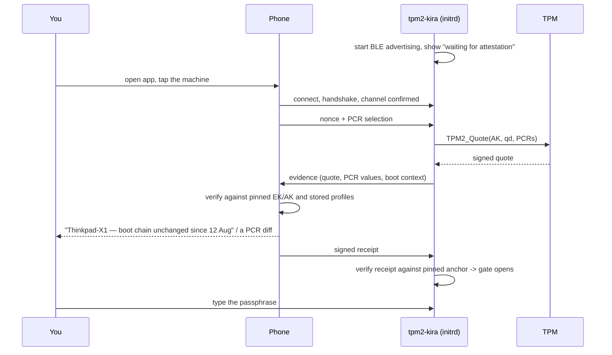

# PLAN — BLE Attestation with a Mobile Device

> **Status:** partially implemented — phases 1–4, and phase 5 (Bluetooth in
> the initramfs) for lazy mode; nothing yet verified on real hardware. The wire
> contract is [PROTOCOL-BLE.md](PROTOCOL-BLE.md); "Implementation status" below
> lists what is done and what is open.
> **Depends on:** [PLAN-REMOTEATTESTATION.md](PLAN-REMOTEATTESTATION.md)
> phases 1–5. This document adds a *transport* (Bluetooth LE), a *verifier*
> (an Android/iOS app) and a *gate* (what happens at the passphrase prompt).
> Everything cryptographic lives in the core and is not restated here.

---

## Implementation status

Last updated 2026-10-05.

### Done

| Phase | What exists | Verified by |
|---|---|---|
| 1 — BLE stack | **Decided: in-tree.** `transport/ble/`: pure-Go HCI user channel peripheral — advertising, ACL fragmentation and flow control, L2CAP, ATT/GATT server, pairing refused — about 1,500 lines, no dependency beyond `golang.org/x/sys`. `go-ble/ble` rejected (unmaintained, dependency surface). | fake-controller tests: iOS-style discovery, MTU 23/185, records both ways, framing errors, idle deadline, re-advertising |
| 2 — peripheral, framing, encrypted session | `transport/frame/`, Noise XX/IK in `attest/noise.go`, `tpm2-kira attest enrol` with SAS | unit tests, fuzzing, interop with the reference `noiseprotocol` library |
| 3 — mobile core | `mobile/kiracore` (gomobile verifier), `mobile/kiratest` (simulated machine); apps specified in [mobile/](mobile/) | Go tests through the binding API; gobind generates Java and Objective-C cleanly |
| 4 — attestation round trip, lazy mode | `tpm2-kira attest gate --mode lazy` on a booted system | swtpm integration test (real AK, EK, quotes, ActivateCredential) |
| 5 — initramfs (part) | `tpm2-kira attest initramfs-deps` resolves the configured adapter's driver modules (the whole sysfs path) and the firmware the kernel loaded for it, from the kernel log. `/etc/tpm2-kira/attest.conf` (`TPM2_KIRA_ATTEST=off\|lazy`). mkinitcpio: modules, exact firmware, `modules-load.d`, `tpm2-kira-attest.service` (runs beside the TOTP display, never holds the boot, stopped at switch-root). initramfs-tools: same resolution, `init-premount` loads modules and starts the gate in the background, `init-bottom` stops it. The gate waits for the adapter (`TPM2_KIRA_ATTEST_ADAPTER_WAIT`), retries while the kernel finishes controller setup, and uses `/dev/tpmrm0` so it can share the TPM with the TOTP display. Hooks add nothing when attestation is off, no phone is enrolled, the adapter is missing, or the installed binary is too old. | resolver unit tests on a fake sysfs (Intel, Realtek, Broadcom log formats); stubbed-hook tests for both hooks; a real `mkinitcpio` image build on Arch containing exactly 6 modules and 1 firmware file (≈1.1 MB) |

### Open

| Item | Notes |
|---|---|
| **Real hardware** | Nothing has run against a physical adapter or phone yet — the development machine has none. First boot test: an Intel/Realtek USB adapter on Arch, then Debian. |
| **Boot test** (§8) | QEMU + swtpm boot of an image with the gate; needs a passed-through or virtual (`hci_vhci`, root) controller. |
| **Debian firmware size** | `manual_add_modules` queues modules for `dracut-install`, which copies every firmware file the modules *declare* (dozens for btusb's dependencies) on top of the exact files. mkinitcpio avoids this; on Debian it costs space until initramfs-tools offers a way to skip declared firmware. Measure on a Debian box. |
| **Debian measured PCRs** | Adding Bluetooth changes PCR 9 on GRUB machines; the existing post-update reminder covers resealing, but has not been re-checked with the new files. |
| 6 — enforced mode | `attest gate --mode enforced` is refused; needs the image anchor, sealed payload v9 and the fail-closed matrix (§7.5). |
| Salt release | `Release` is defined in the protocol; the attester answers "unsupported" (PLAN-FACTORRELEASE.md). |
| Break-glass tokens (§7.6) | not started |
| 7 — verdict UX | the shared PCR explanation exists (`attest/explain.go`); the UI belongs to the apps |
| Phone apps | specified as agent prompts in [mobile/](mobile/), not built |
| Lost-phone ceremony (§6.2, open question 3) | today: `attest enrol` with the new phone, `attest unenrol` to drop all; no per-phone removal command yet |
| EK certificate chain | parsed and stored by the phone, not validated against vendor roots |

Decisions taken while implementing, superseding the text below where they differ:

- **Native apps, shared Go core** instead of Flutter (§6.1): Kotlin/Compose and
  Swift/SwiftUI, each linking the same `gomobile` library. The verifier is
  still never written twice. Open question 2 is settled.
- **Two Noise patterns** (§5.2): `Noise_XX_25519_ChaChaPoly_SHA256` at
  enrolment, `Noise_IK_25519_ChaChaPoly_SHA256` afterwards. The machine stays
  silent for any phone not enrolled. Interoperability with the reference
  `noiseprotocol` library was checked for both patterns.
- **SAS with commit-then-reveal** (§5.3): a code derived from the handshake
  hash alone could be ground by a man in the middle in about a second; the
  machine now commits to a nonce before seeing the phone's
  ([PROTOCOL-BLE.md](PROTOCOL-BLE.md) §6.4).
- **Advertising carries a keyed tag** (§4.2): 13 bytes of scan-response
  service data, `flags ‖ prand ‖ HMAC(adv_key, prand)[0:8]`. Observers still
  learn only that *a* machine is booting; an enrolled phone learns *which*.
  This answers open question 6: unknown machines stay hidden except during an
  explicit enrolment.
- **Rejects are unsigned** (§6.2): a reject needs no biometric prompt, because
  believing a false "no" costs a check, never trust. OK and approved receipts
  are always signed.
- **The machine's anchor in lazy mode** is the attestation blob, which the
  initrd cannot authenticate; the console verdict is therefore advisory and the
  phone's display is authoritative. The image anchor arrives with phase 6.
- Attestation and salt release share one session: release is an optional
  message after a trusted receipt ([PROTOCOL-BLE.md](PROTOCOL-BLE.md) §1.1).

---

## 1. What this changes for the user

Today: the machine shows six digits, you compare them with your authenticator
app, and you decide. The comparison proves the PCRs matched, because a code can
only be produced when the TPM released the seed
(SECURITY-BACKGROUND.md §4.5) — but the check is manual, unlogged, and silent
after any legitimate update.

With this plan: at seal time the machine is **bound** to your phone. At the
passphrase prompt the machine advertises over BLE, your phone connects,
demands a fresh TPM quote, checks it against what it recorded at binding time,
and — if it is satisfied — hands back a signed receipt. The machine verifies
the receipt against a pinned key and either notes it (lazy) or opens the gate
(enforced).

The manual OTP path is untouched and remains the default fallback (§7.3).



---

## 2. Roles: the Linux box advertises, the phone connects

The machine is the **GATT peripheral** and the phone is the **GATT central**.
This is forced, not chosen:

- iOS can act as a peripheral only in a limited, foreground-biased way, and
  cannot advertise reliably in the background. As a central scanning for a
  fixed service UUID, background operation is a supported pattern.
- iOS never exposes peer MAC addresses; devices are identified by service UUID
  and an opaque per-app identifier. A protocol that assumes the phone knows a
  MAC does not work there.
- The user story is "the phone requests an attestation", which is the central
  role initiating a connection.

Consequence: tpm2-kira must implement a BLE **peripheral** in the initrd,
which is the hard part of this plan (§3).

---

## 3. Bluetooth in an initramfs

### 3.1 What has to be in the image

| Piece | Notes |
|---|---|
| `bluetooth`, `bluetooth_6lowpan`-free core stack | kernel modules |
| Transport driver | `btusb` plus `btintel` / `btrtl` / `btbcm` / `btmtk` as appropriate; `hci_uart` + `btqca` on some ARM boards |
| Firmware | `/lib/firmware/intel/ibt-*.sfi` and `.ddc`, `rtl_bt/*.bin`, `qca/*`, `mediatek/*` — several hundred KB to a few MB, and **required**: without it the adapter never comes up |
| `rfkill` state | soft-blocked adapters must be unblocked; the boot-time default differs per machine |

The mkinitcpio install hook and the initramfs-tools hook both grow a step that
resolves the *actual* adapter on the build host (`/sys/class/bluetooth/hci0`,
its driver and its firmware files via `modinfo -F firmware`) and copies exactly
those. Copying all of `linux-firmware` is not acceptable for an initramfs.

> **As implemented:** firmware comes from the kernel log of the build host's
> current boot (`Bluetooth: hci0: Found device firmware: …`), not from
> `modinfo -F firmware`. The declarations are incomplete — `btintel` declares
> four legacy files, while current Intel adapters load names such as
> `intel/ibt-0041-0041.sfi` that appear nowhere in modinfo — and they list
> files for every chip a driver supports (`btrtl` declares 50). If the log
> holds no firmware line (rotated, or an adapter without firmware), the hooks
> fall back to the declarations and say so.

If no adapter is found at build time, the hook warns and installs nothing; a
machine configured for `enforced` that then cannot find an adapter at boot
fails closed, which is why `attest enrol` refuses to enable enforced mode
unless the hook has confirmed the firmware is in the image.

### 3.2 No BlueZ, no D-Bus

BlueZ in an initramfs means `bluetoothd`, a D-Bus system bus, a configuration
tree and a state directory — a large surface, an extra daemon to order against
`cryptsetup-pre.target`, and a dependency that Debian's non-systemd initramfs
cannot satisfy at all.

Instead tpm2-kira takes the adapter directly, via an **HCI user channel**:
`socket(AF_BLUETOOTH, SOCK_RAW, BTPROTO_HCI)` bound with
`hci_channel = HCI_CHANNEL_USER`, which gives exclusive control of the
controller and bypasses the kernel's own Bluetooth host stack. That requires
the adapter to be down and unused — trivially true in an initramfs, and a
documented disruption on a running desktop (§5.4).

Above that socket the following has to exist: HCI command/event handling, LE
advertising, ACL fragmentation, L2CAP on CID `0x0004`, and an ATT server with
MTU exchange, attribute discovery, write-without-response and notifications.

**Recommendation:** evaluate `github.com/go-ble/ble` first — it is pure Go,
already speaks the HCI user channel, and supports the peripheral role, which
would save several thousand lines. If its maintenance state or dependency
surface does not hold up against this project's two-dependency budget
([PLAN-REMOTEATTESTATION.md](PLAN-REMOTEATTESTATION.md) §9.3), write a minimal
in-tree HCI/L2CAP/ATT peripheral: the subset actually needed is small, because
there is exactly one service, two characteristics and no security manager
(§5.1). Decide in phase 1, with a spike against real hardware, not on paper.

### 3.3 Ordering and the measure point

The gate starts together with the TOTP display, `After=systemd-pcrphase-initrd.service`
(`enter-initrd` is in PCR 11 by then), and ends with it. The display holds
`systemd-pcrosseparator.service` back until the boot is confirmed, so the
gate's quotes come from *before* the separator. The enrolment baseline, and a
gate run by hand or by initramfs-tools, see the registers *after* it.

Both are the same boot. The separator is a constant systemd extends into
PCRs 0-7, 9, 12-14 of every boot, so the verifier treats a register that
differs from a profile by exactly one `os-separator` extend, in either
direction, as equal (`attest.SameBootState`, PROTOCOL-BLE.md §7.5). Different
code gives different registers before the separator and after it alike.

A slot that is enrolled with a phone is verified by the phone instead of by
comparing the code: the phone's verdict releases the boot the way Enter does.
The code stays on the screen as the fallback, and so does the end of the hold
(lazy mode never holds the boot). A phone that is in the middle of its
session when the hold ends extends it by at most a minute, so the registers
do not change between its question and its answer.

The gate is two processes of the one binary. The display is its
*coordinator* (`tpm2-kira run --gate SOCKET`): it holds the TPM, checks the
enrolment record, issues the quotes, and reads the phone's receipt against
the anchors and the quotes it issued. The *radio worker* (`tpm2-kira attest
gate --coordinator SOCKET`, the confined unit) advertises and runs the
session; it has no TPM and asks the coordinator over the socket: identity,
quote, boot context, event log, receipt, progress report - length-prefixed
JSON, one request at a time (`cmd/gate_ipc.go`). Before the separator the
TPM computes TOTP codes for any process that can reach it, so the process
that parses radio input must not be able to.

Lazy mode ends with the hold: the coordinator closes its socket when it
releases the boot and exits, and the worker, which watches the connection,
stops advertising and exits too. The display's process must not stay on the
console past the hold in any case: `StandardInput=tty` makes it the owner of
the terminal, and systemd's password agent waits for the console to be free
before it shows the passphrase prompt.

The enrolment baseline must describe the same point: `attest enrol` runs in
the booted system, where PCR 11 already carries systemd's later phases, so it
predicts the measure-point values with the seal's own code (`ReadPCRValues`)
and sends them as `measure_point_values` (PROTOCOL-BLE.md §7.3.11). The phone
pins those, not the live registers.

Loading a Bluetooth module does not extend a PCR, so bringing the radio up does
not itself move the measure point. But the modules and firmware are *content of
the initramfs*, so they change PCR 11 (UKI) or PCR 9 (Debian/GRUB) — that is,
adding BLE support requires a reseal, like any other initramfs change.

---

## 4. The GATT profile and framing

### 4.1 Service

| | Value |
|---|---|
| Service UUID | one fixed random 128-bit UUID, allocated once for the project |
| `RX` characteristic | Write Without Response — phone → machine |
| `TX` characteristic | Notify — machine → phone |
| `INFO` characteristic | Read — protocol schema version and capability bits only |

Two characteristics and a length-prefixed byte stream, not a characteristic per
field. The protocol is defined in the core; BLE only carries frames.

### 4.2 Advertising and privacy

The advertisement carries the service UUID and nothing else: **no hostname, no
device id, no user-visible name.** A random non-resolvable address is set per
boot.

This is not free of leakage and the documentation must say so: a fixed service
UUID makes "a tpm2-kira machine is sitting at its passphrase prompt" observable
to anyone within radio range, and that is a signal about your boot schedule and
your presence. A machine in a hostile physical environment should consider
`--attest=off` and the OTP. The identity of the machine is only revealed inside
the encrypted session (§5.2), so an observer learns *that* a machine is
booting, not *which*.

### 4.3 MTU and throughput

Request an ATT MTU of 517. The machine grants at most 247 (one ATT PDU per
251-byte LE data packet, and HCI ACL packets capped at 251 bytes, because
controllers in the field differ in how they handle larger ones); iOS settles
around 185. Assume the worst case of 23 (20 usable bytes) and let the framing
handle it.

| Payload | Size | At 185-byte notifications, 15 ms interval (~12 kB/s) |
|---|---|---|
| Hello + request | < 200 B | instant |
| Evidence without event log | ~1–2 KB | < 1 s |
| Receipt | ~200 B | instant |
| **Event log** | **30–200 KB** | **3–20 s** |

Which is the concrete reason the core makes the event log
opt-in and hash-addressed
([PLAN-REMOTEATTESTATION.md](PLAN-REMOTEATTESTATION.md) §5.1): the phone
requests it only when the PCR values fail to match a profile and a human needs
to see *what* changed. On the happy path nothing large is ever transferred.

### 4.4 Framing

```
Frame := u16 total_len ‖ u8 flags ‖ u16 seq ‖ payload
```

Rules, each with a failure it prevents:

- A maximum message size is enforced on both ends (mirroring `cmd/blob.go`'s
  explicit limits) — a peer cannot make the initrd allocate unbounded memory.
- Reassembly buffers are pre-sized from `total_len`, and a message exceeding
  the limit is rejected before any allocation.
- Out-of-order or gapped `seq` aborts the session rather than being repaired:
  this is a reliable, ordered link, so a gap means something is wrong.
- A session has a hard wall-clock budget and a byte budget. Exceeding either
  drops the connection and returns the peripheral to advertising.

---

## 5. Binding the phone at seal time

### 5.1 BLE link security is not used

No pairing, no bonding, no SMP, no LE Secure Connections. The BLE link is
treated as an **untrusted, lossy byte pipe**, and all confidentiality,
authentication and channel binding come from an application-layer handshake
carried inside it.

Reasons, in order of weight:

1. **The gate must not depend on state that the initrd does not have.** Bonding
   keys live in BlueZ's state directory on the encrypted root filesystem, which
   is not mounted at the moment the gate runs. A scheme that needs bonds cannot
   work at the passphrase prompt.
2. Implementing the security manager on a raw HCI channel is a large amount of
   protocol with a poor track record — Just Works pairing is unauthenticated,
   and legacy pairing is broken.
3. An application-layer handshake gives a **channel binding value** for free,
   which the core needs anyway
   ([PLAN-REMOTEATTESTATION.md](PLAN-REMOTEATTESTATION.md) §6.2).
4. The same handshake then works unchanged over TCP for
   [remote unlocking](PLAN-REMOTEUNLOCKING.md), so there is one channel
   implementation rather than two.

### 5.2 The session handshake

X25519 ephemeral–static (Noise `IK`-shaped), HKDF-SHA256, ChaCha20-Poly1305.
After enrolment each side knows the other's static public key, so the handshake
is mutually authenticated and a man in the middle cannot complete it. The
handshake hash becomes the channel binding `cb` folded into the quote's
qualifying data.

### 5.3 Enrolment needs out-of-band confirmation

At the very first contact neither side knows the other's static key, so the
handshake authenticates nothing and an attacker in radio range could sit in the
middle. This is resolved the way pairing protocols resolve it, but at the
application layer:

Both sides derive a **six-digit short authentication string** from the
handshake transcript hash. The machine prints it on the console, the app shows
it, and the user confirms they are equal. A man in the middle would have to
produce a transcript matching both sides, which the commitment structure of the
handshake prevents.

This is the one moment the whole chain of trust rests on a human comparing
digits — the same act the OTP asks for daily, but performed once, in a
controlled situation, with the user physically holding both devices.

```
=== tpm2-kira attest enrol ===
Adapter:       hci0 (Intel AX201)
Advertising:   waiting for a phone to connect ...
Connected:     iPhone (anonymous)

    Confirm this number matches the one shown in the app:

                        4 8 2 9 1 7

    [y] it matches   [n] it does not — abort
```

### 5.4 What enrolment transfers, and what it costs

Enrolment runs on the **booted, unlocked system**, not in the initrd: it writes
NVRAM and needs the signing key, exactly like `seal`. The exchange is defined
in [PLAN-REMOTEATTESTATION.md](PLAN-REMOTEATTESTATION.md) §6.1; the phone ends
up holding the EK public key (and EK certificate where present), the AK name,
the device id, a friendly name, the baseline PCR profile and the event log; the
machine ends up holding the phone's receipt-signing public key as its pinned
anchor.

With [factor release](PLAN-FACTORRELEASE.md) enrolled, the phone additionally
holds a wrapped factor: a blob that only this machine's TPM can open. That is
the first secret-bearing item on the phone, and the receipt-signing key then
doubles as the approval key for the TPM's `PolicySigned` branch
([PLAN-FACTORRELEASE.md](PLAN-FACTORRELEASE.md) §4.1).

Operational cost worth documenting: taking the adapter through an HCI user
channel **disconnects everything else using Bluetooth** for the duration —
mice, headphones, keyboards. `attest enrol` says so before it starts, offers
`--adapter hciN` to use a second adapter, and restores the adapter afterwards.

### 5.5 Where the anchor is stored

Per [PLAN-REMOTEATTESTATION.md](PLAN-REMOTEATTESTATION.md) §10.2: the
recommended placement is `image` — a file inside the initramfs/UKI, authenticated
by Secure Boot and measured into PCR 11. `enrol` writes it there and then tells
the user to rebuild the initramfs and reseal, because an anchor that is not in
the image is not the anchor the gate will use.

```
Anchor written to /etc/tpm2-kira/verifier.pub

Next steps — the anchor only takes effect once it is inside the boot image:
    sudo mkinitcpio -P          # or: sudo update-initramfs -u
    sudo tpm2-kira reseal
```

---

## 6. The phone as verifier

### 6.1 Application architecture

```
┌──────────────────────────────────────────────┐
│  UI layer — Flutter                          │
│   device list, verdicts, PCR diff, approvals │
├──────────────────────────────────────────────┤
│  BLE layer — flutter_blue_plus (central)     │
│   scan by service UUID, connect, MTU, notify │
├──────────────────────────────────────────────┤
│  Core — Go, compiled from attest/            │
│   handshake, MakeCredential, Verify, receipt │
│   Android: c-shared .so   iOS: c-archive     │
│   reached through dart:ffi                   │
├──────────────────────────────────────────────┤
│  Platform keystore                           │
│   iOS: Secure Enclave (P-256, biometry-gated)│
│   Android: StrongBox/TEE Keystore            │
└──────────────────────────────────────────────┘
```

The security decision is the Go core, byte for byte the same code that runs on
the server and in CI against the golden corpus
([PLAN-REMOTEATTESTATION.md](PLAN-REMOTEATTESTATION.md) §9.2). Flutter carries
pixels and BLE frames; it must never decide whether a boot is trustworthy.

The alternative — native Kotlin and Swift apps with a verifier written twice —
is rejected: two implementations of one security check will differ, and the
difference will be found by an attacker rather than by a test.

### 6.2 The receipt signing key

Generated on the phone at enrolment, **non-exportable**, in the Secure Enclave
(iOS) or StrongBox/TEE Keystore (Android), ECDSA P-256, with
`userAuthenticationRequired` / `kSecAccessControlBiometryCurrentSet`. Every
receipt signature therefore costs a Face ID / fingerprint prompt.

This matters more than it looks: it means a phone that is merely *unlocked and
in someone else's hand* cannot silently attest a machine, and it makes the
approval a deliberate human act rather than a background service. It is also
what turns "phone stolen" into a recoverable event rather than a compromise of
every bound machine — the key cannot leave the hardware.

Losing the phone still costs an anchor rotation, which requires the signing key
and a rebuild. That ceremony is an open question in the core plan
([PLAN-REMOTEATTESTATION.md](PLAN-REMOTEATTESTATION.md) §15.5) and must be
answered before this ships, because "my phone fell in a lake" is a Tuesday, not
an edge case.

### 6.3 What the user actually sees

The app must not show PCR hex to a person deciding whether to type a
passphrase. Three states:

| State | Display |
|---|---|
| Matches a profile | ✅ *Thinkpad-X1 — unchanged since 12 Aug 2026.* Signed automatically after biometry. |
| Differs, changes are explainable | ⚠️ *PCR 4, 8, 9 changed. Looks like a kernel update: initrd and bootloader measurements moved, Secure Boot policy unchanged.* With **Approve once** / **Approve and remember as a new profile** / **Reject**. |
| Differs in a way that is not explainable, or a hard check failed | 🛑 *Attestation failed: firmware version changed and the TPM reset counter jumped.* Reject is the only non-destructive action; approving requires typing the device name. |

Producing the middle row's sentence is real work: it means classifying PCR
diffs against what each register measures, which is knowledge the repo already
holds in `cmd/pcrtips.go` and README's Debian PCR table. That table should move
into the shared core so the app and the CLI explain a diff identically.

### 6.4 Platform specifics to plan for

| | Android | iOS |
|---|---|---|
| Permissions | `BLUETOOTH_SCAN` + `BLUETOOTH_CONNECT` (API 31+); location permission for scanning below that | none for central role, but the background mode `bluetooth-central` must be declared |
| Background | foreground service with a notification while attesting | background scanning **only** with an explicit service-UUID filter; no wildcard scans |
| MTU | request 517; the machine grants at most 247 | fixed by the OS, ~185 |
| Key storage | StrongBox where present, TEE otherwise; `setUserAuthenticationRequired(true)` | Secure Enclave, `kSecAttrTokenIDSecureEnclave` |
| Identity of the peer | MAC visible | opaque per-app UUID; the machine is identified by what it says inside the session, never by address |

---

## 7. The gate: lazy and enforced

### 7.1 Modes

`/etc/tpm2-kira/attest.conf`, with its digest bound into the sealed object so
it cannot be silently downgraded on a machine that does not measure its
initramfs ([PLAN-REMOTEATTESTATION.md](PLAN-REMOTEATTESTATION.md) §10.3):

| Mode | Behaviour at the prompt |
|---|---|
| `off` | No radio, no advertising. Exactly today's behaviour. |
| `lazy` | Advertise and serve attestation requests. Display the verdict when one arrives. **Boot proceeds regardless**; the passphrase prompt is never blocked. |
| `enforced` | Advertise and **hold the boot** until a valid receipt with `verdict = ok` arrives. The passphrase prompt does not appear before then. |

**The attestation blob is not a trust anchor for enforced mode.** Its NV
index refuses in-place writes without the signing key, but the owner
hierarchy can undefine it and write a blob that lists any phone, and the
initrd has no key to notice. The anchor therefore comes from the image: the
hook puts the signing public key there (`attest signer`), and the gate
refuses, before it advertises, a blob that key did not sign. Replacing the
blob then means changing the image too, which Secure Boot or the measured
PCRs report (PLAN-REMOTEATTESTATION.md §10.2). An older blob, signed all the
same, is refused by its count: each blob carries the value of a TPM NV counter
for the slot, which cannot be turned back. The console verdict stays advisory and the
phone's screen authoritative.

### 7.2 How the hold is implemented

**Arch / systemd initramfs, as built.** tpm2-kira is the key provider of
the volumes the initrd unlocks: `tpm2-kira-unlock.socket` is the key file
of each of them (crypttab(5), AF_UNIX key files, named in the key field
of `/etc/crypttab`), `systemd-cryptsetup` connects to it when it
activates the volume and reads the key, and `tpm2-kira.service` answers
once the code screen's hold has ended. Enforced mode is then nothing but
"do not answer before the phone's verdict is `ok`": the request waits for
as long as it takes, no unit has to fail to hold the boot, and the TPM
side of the attestation still happens before the OS separator, where the
boot key's policy holds. The fail-closed matrix of §7.5 becomes the list
of conditions under which the provider never answers. The original design
of a separate oneshot gate unit follows for the record:

```ini
[Unit]
Description=tpm2-kira remote attestation gate
DefaultDependencies=no
Requires=dev-tpm0.device
After=dev-tpm0.device
After=systemd-pcrosseparator.service
After=systemd-pcrphase-initrd.service
Before=cryptsetup-pre.target
Before=systemd-ask-password-console.service

[Service]
Type=oneshot
RemainAfterExit=yes
ExecStart=tpm2-kira attest gate
StandardOutput=tty
StandardError=tty
```

plus a drop-in making it a *requirement* of `cryptsetup-pre.target` — ordering
alone would let a failed gate be skipped rather than blocking. A failed gate
then fails the target, no cryptsetup job runs, and the initrd drops to its
emergency shell.

**Debian / initramfs-tools.** `init-premount` already runs synchronously in
`/init`, before `mountroot` reaches `local-top/cryptroot`. The gate runs there
in the foreground and, on failure, calls `panic` from `/scripts/functions`
rather than returning.

**The exit-status exception.** README.md's rule is that tpm2-kira always exits
0 so a failure cannot break a boot chain. `attest gate` is the one command
where that rule inverts: a gate that exits 0 on failure is not a gate. It exits
non-zero, its help says so, README.md gains a sentence next to the existing
rule, and there is a test that asserts it — because getting this wrong turns
enforced mode into a decoration that still prints reassuring messages.

### 7.3 What is displayed

| Mode | OTP | Attestation line |
|---|---|---|
| `off` | always | — |
| `lazy` | always (default; `--otp=never` available) | added when a receipt arrives |
| `enforced` | `never` by default, `--otp=always` to keep both | the primary output |

The OTP default stays "shown" in lazy mode on purpose: lazy exists precisely
for the boot where the phone is flat, and removing the fallback in the mode
designed for degraded conditions would be perverse.

### 7.4 What enforced mode is actually worth

Stated plainly, because the gap between what this feels like and what it
guarantees is the thing most likely to mislead:

**Enforced mode is a local software gate.** It is code in the initramfs that
declines to proceed. Anyone who can modify that initramfs can delete it. The
gate is therefore worth exactly as much as the measured, signed boot chain that
protects the image containing it:

- With Secure Boot and a signed UKI, modifying the image breaks the signature
  or moves PCR 11, so removing the gate is detectable and the anchor inside the
  image is authenticated. Here enforced mode is a real control.
- Without Secure Boot, or with an unmeasured initramfs, an attacker who can
  write to `/boot` simply ships an image with no gate. Here enforced mode is a
  usability feature: it stops *you* from being careless. It does not stop an
  attacker.

`attest enrol --mode=enforced` therefore inspects the platform and says which
of these two situations the machine is in, in those words. It refuses without
`--allow-sealed-anchor` when there is no image anchor
([PLAN-REMOTEATTESTATION.md](PLAN-REMOTEATTESTATION.md) §10.2).

The way to make the gate real on either kind of machine is to stop asking
software to hold and withhold a secret instead:
[PLAN-FACTORRELEASE.md](PLAN-FACTORRELEASE.md) has the phone release one
factor of the LUKS key after a successful attestation. It runs in `lazy` mode,
because the missing factor does the enforcing.

The second thing to be plain about: enforced mode **cannot lock you out of your
data**. It holds one initramfs. Boot any rescue medium and the disk unlocks
with the passphrase you already have. That also caps its value — an attacker
can boot a rescue medium too — but it means the failure mode of this feature is
an inconvenience, never a loss. Keep a second LUKS keyslot regardless.

### 7.5 Failure and timeout behaviour

| Situation | `lazy` | `enforced` |
|---|---|---|
| No adapter / firmware missing | warn once, show OTP, continue | fail closed, name the missing firmware |
| No phone in range | silent, continue | keep advertising in 30 s rounds, reporting "phone not reachable yet, still waiting" after each; with a timeout, fail with "phone not reachable" (not a TPM failure) |
| Phone connects, verdict is "reject" | display it, continue | fail closed immediately; do not keep waiting for a better answer |
| Receipt signature does not verify | display an error, continue | fail closed, and say **anchor mismatch** explicitly — this is either a wrong phone or an attack |
| PCRs changed (kernel update) | OTP is absent as today; the phone can still attest and show the diff | the phone shows the diff and a human approves; this is the designed path, not an exception |

Waiting forever is the default for "no phone in range" because a hard timeout
on an attended machine just moves the failure five minutes later.
`--attest-timeout` exists for unattended machines that would rather fail into a
monitored state.

### 7.6 Break-glass

In order of preference:

1. **Boot another medium.** Your passphrase still works. This is the answer for
   a laptop in front of you and needs no feature at all.
2. **A signed bypass token**, for headless or remote machines. The app produces
   a short signed statement (`verdict = bypass`, covering the device id and a
   counter) which the user types at the console. Replay is prevented by a TPM
   monotonic counter NV index: a token must carry a counter strictly greater
   than the stored value, and using it increments the counter. The token is
   ~110 base32 characters, which is unpleasant to type and correct for
   something used approximately never.
3. **Not** a kernel command-line switch. `kira.attest=off` would be a bypass
   available to exactly the person the gate exists to stop, and on a UKI the
   cmdline is fixed and measured anyway, so it would also be a lie on the
   platform where enforced mode is worth something.

---

## 8. Testing

| Layer | How |
|---|---|
| Framing and reassembly | in-memory pipe with an MTU of 20 bytes, fuzzed truncation, reordering and oversize frames |
| Handshake and SAS | property test: a man-in-the-middle cannot produce matching short authentication strings on both sides |
| Peripheral stack | `hci_vhci` virtual controllers in CI; two USB adapters on a physical test box for the real thing |
| Gate ordering (systemd) | boot a test initramfs under QEMU with swtpm; assert no password prompt appears before the gate unit completes |
| Gate ordering (Debian) | the same under initramfs-tools; assert `panic` is reached on gate failure |
| Enforced fails closed | matrix over: no adapter, no firmware, no phone, wrong anchor, rejecting verdict, replayed receipt |
| Exit status | `attest gate` returns non-zero on every failure in that matrix |
| Mobile | the golden corpus through the FFI boundary; UI tests for the three verdict states |
| Interop | a real iPhone and a real Android device against a real machine — MTU, background behaviour and reconnection are not simulable |

The QEMU + swtpm boot test is the one that matters most. Every claim in §7.2
about ordering is a claim about systemd's job scheduling, and those are only
ever settled by booting.

---

## 9. Milestones

| Phase | Deliverable | Done when |
|---|---|---|
| 1 | BLE spike: `go-ble/ble` vs. in-tree HCI, on real hardware | a Linux box advertises and exchanges frames with a phone; the library decision is recorded here |
| 2 | Peripheral + framing + encrypted session, on a booted system | `attest enrol` completes with a throwaway CLI verifier over BLE |
| 3 | Mobile app skeleton: scan, connect, Go core via FFI, enrolment with SAS | a phone enrols a machine and stores the profile |
| 4 | Attestation round trip and receipts; `lazy` mode in the initrd | a phone verifies a real boot and the console shows the verdict |
| 5 | Initramfs hooks: modules, firmware resolution, adapter bring-up | BLE works in the initrd on both Arch and Debian test machines |
| 6 | `enforced` mode, gate units, fail-closed matrix, break-glass | the QEMU test suite passes the whole §7.5 matrix |
| 7 | Verdict UX: PCR diff explanation shared with `pcrtips`, approval flows | the middle row of §6.3 reads like a sentence a person can act on |

Phases 1 and 5 carry the schedule risk. Everything else is ordinary work;
Bluetooth firmware in an initramfs is where this plan meets hardware reality.

---

## 10. Open questions

1. **`go-ble/ble` or an in-tree stack.** Settled by the phase 1 spike. The
   deciding criteria are: does it work from an HCI user channel without extra
   daemons, what does it drag in, and does it survive an adapter that resets.
2. **Flutter or Kotlin Multiplatform** for the UI. Flutter is the current
   inclination because one BLE plugin covers both platforms; KMP would suit a
   team that already writes native. Either way the verifier stays Go.
3. **How many phones per machine, and how is a lost one replaced?** Needs the
   anchor-rotation ceremony from the core plan, and the answer determines
   whether the anchor file holds one key or a list.
4. **Should `lazy` mode keep advertising after the disk is unlocked?** Useful
   for attesting a running system on demand; also an always-on radio and a
   privacy question. Currently: no, the gate stops with the initrd, and
   attesting a running system is a separate, explicit command.
5. **Firmware in the image vs. firmware size.** Some adapters need over a
   megabyte. A `/boot` of 512 MB with several kernels is not unusual. Measure
   before promising Debian users this fits.
   *Measured on Arch (Intel AX adapter):* 6 compressed modules (≈620 KB) and
   one firmware file (≈500 KB), ≈1.1 MB per image. Debian still to measure
   (see "Open").
6. **What does the phone do when it sees a machine it has never enrolled?**
   Showing it invites phishing-by-proximity; hiding it makes enrolment
   confusing. Probably: hidden by default, visible only while an enrolment is
   explicitly in progress on the phone.
