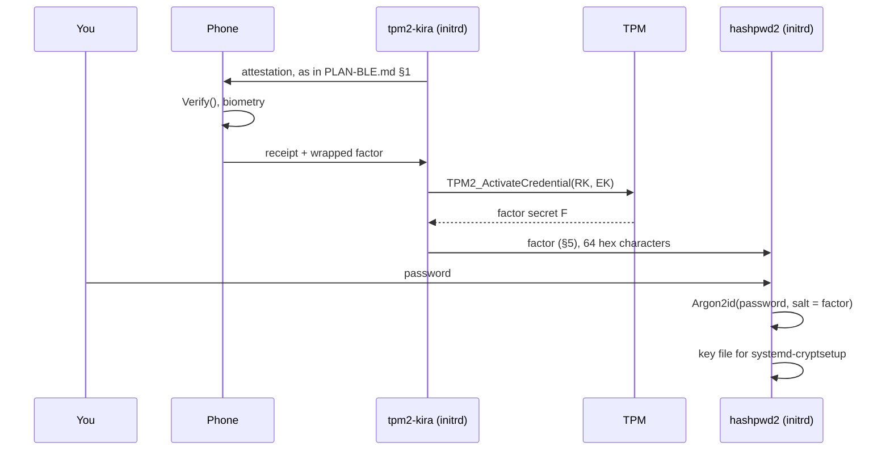

# PLAN — Factor Release for External Key Derivation

> **Status:** draft / design. Nothing in here is implemented yet.
> **Depends on:** [PLAN-REMOTEATTESTATION.md](PLAN-REMOTEATTESTATION.md)
> phases 1–5, the release key from
> [PLAN-REMOTEUNLOCKING.md](PLAN-REMOTEUNLOCKING.md) §5.1 (its phase 1 spike),
> and a transport: [PLAN-BLE.md](PLAN-BLE.md) for a phone, or TCP for a server.
>
> This is the third consumer of the attestation core. The verifier does not
> hand out a passphrase. It hands out one **factor** of a passphrase, and a
> separate program combines it with something the user types.

---

## 1. The idea

At the passphrase prompt the machine attests to the phone, as in
[PLAN-BLE.md](PLAN-BLE.md). If the phone is satisfied, it returns a small
wrapped secret that only this machine's TPM can open. tpm2-kira unwraps it and
passes it — as a *salt* — to an external key-derivation tool. That tool asks
for the user's password and derives the LUKS key from both.



The reference combiner is [hashpwd2](https://github.com/mrwiora/hashpwd2). It
is, and stays, a separate program (§1.2).

### 1.1 Why a factor and not the passphrase

[PLAN-REMOTEUNLOCKING.md](PLAN-REMOTEUNLOCKING.md) releases the whole
passphrase, because nobody is at the rack. A laptop has a person in front of
it, and that person can hold a factor too. LUKS cannot require two keyslots at
once, so "phone **and** password" has to be built *before* cryptsetup, by
deriving one key from both.

| Released | Who can unlock |
|---|---|
| The passphrase | whoever satisfies the verifier and the TPM |
| A factor | whoever satisfies the verifier and the TPM **and** knows the password |

It also changes what a verifier compromise is worth. A phone that releases a
passphrase is the key to the disk. A phone that releases a factor is half of
one.

### 1.2 The boundary between the two programs

| | tpm2-kira | combiner (hashpwd2) |
|---|---|---|
| Talks to the TPM, the radio, the verifier | yes | never |
| Sees the user's password | **never** | yes |
| Derives the LUKS key | **never** | yes |
| Touches LUKS keyslots | never | never — the user runs `cryptsetup` |

Neither binary links, imports or executes the other. They meet at the
interface in §5, and deployment glue (a unit and a few lines of shell, §7)
connects them. tpm2-kira does not learn Argon2 parameters; the combiner does
not learn what a PCR is.

This also keeps the rule from
[PLAN-REMOTEATTESTATION.md](PLAN-REMOTEATTESTATION.md) §9.3 intact: no new
dependency for a KDF that another tool already owns.

---

## 2. What is reused, and what is new

| Component | Source |
|---|---|
| AK, quotes, evidence, `Verify()`, policy, profiles, receipts | [PLAN-REMOTEATTESTATION.md](PLAN-REMOTEATTESTATION.md) — unchanged |
| Transport, encrypted session, enrolment with SAS, the mobile app | [PLAN-BLE.md](PLAN-BLE.md) |
| Release key (RK) and its PolicyOR | [PLAN-REMOTEUNLOCKING.md](PLAN-REMOTEUNLOCKING.md) §5.1 — the `PolicySigned` key is the verifier's approval key, here the phone's |
| **The factor and its wrap** | new, §3 |
| **The release message** | new in the core, shared with remote unlocking, §4 |
| **The provider interface** | new, §5 |

---

## 3. The factor

```
at enrolment, on the booted machine:
    F          = random 32 bytes
    credential = TPM2_MakeCredential(ek_pub, secret = F, name = rk_name)
    send to verifier: { credential }                 # never F
    emit once, for keyslot enrolment: factor(F, label)   (§6)
    wipe F

at unlock, in the initrd:
    receive { credential }
    F = TPM2_ActivateCredential(activateHandle = RK, keyHandle = EK, credential)
    emit factor(F, label)
    wipe F

factor(F, label) := hex( HKDF-SHA256(ikm = F, salt = "",
                         info = "tpm2-kira/factor/v1" ‖ lp(label), len = 32) )
```

- `F` is 32 bytes, so it fits `TPM2_MakeCredential` directly. The AES-GCM layer
  of [PLAN-REMOTEUNLOCKING.md](PLAN-REMOTEUNLOCKING.md) §5.2 is not needed.
- `F` itself is never output. The `label` (default `luks`) lets one enrolment
  serve several volumes with unrelated factors, and keeps a factor handed to
  one consumer from being the secret behind another.
- The machine does not keep `F` or the credential. After enrolment the factor
  exists only inside a blob on the verifier that one specific TPM can open.

The properties of [PLAN-REMOTEUNLOCKING.md](PLAN-REMOTEUNLOCKING.md) §5.2 carry
over unchanged, and the third one is again the reason for the design: **a
relayed quote does not earn a factor.** Sending `F` through the encrypted BLE
session after a good quote would be simpler and would lose exactly that
(§8.2).

### 3.1 The factor is static

Unlike a token that computes a fresh response, `F` is a fixed value. Every
successful boot puts it in the initrd's memory. Anyone who captures it once —
root on the running system during the initrd, a cold-boot attack — keeps it.
What they still lack is the password, and the combiner's cost per guess.

Rotation (`factor rotate`) creates a new `F` and therefore a new LUKS key: the
user must enrol the new key through the combiner and remove the old keyslot.
tpm2-kira prints those steps; it does not perform them.

---

## 4. The release message

The core gains one message, sent by the verifier after a receipt with
`verdict = ok`, inside the same session:

```
Release := {
    kind        uint8       // 1 = passphrase (remote unlocking), 2 = factor
    slot        uint8
    credential  []byte      // TPM2_MakeCredential output
    ciphertext  []byte      // kind 1 only
    approval    []byte      // optional: signature for the RK's PolicySigned branch
}
```

It is defined once, in `attest/`, for both this plan and
[PLAN-REMOTEUNLOCKING.md](PLAN-REMOTEUNLOCKING.md) — a factor-only or
unlocking-only variant inside the core would be the design failure that plan's
§2 warns about. A `Release` for kind 2 is a few hundred bytes; over BLE it is
instant ([PLAN-BLE.md](PLAN-BLE.md) §4.3).

### 4.1 The two branches

| Boot state | RK branch | What the phone does |
|---|---|---|
| PCRs match the sealed selection | `PolicyPCR` | verifies, biometry, sends `credential` |
| PCRs changed (kernel update) | `PolicySigned` | shows the diff ([PLAN-BLE.md](PLAN-BLE.md) §6.3); on approval signs the TPM's `nonceTPM` and sends `credential` + `approval` |

The approval key is the phone's receipt-signing key
([PLAN-BLE.md](PLAN-BLE.md) §6.2), so an approval costs a biometric prompt and
is evaluated by the TPM, not by software in the initrd.

The phone's hardware is not a functional requirement. The TPM checks an
ordinary ECDSA P-256 / SHA-256 signature over
`nonceTPM ‖ expiration ‖ cpHashA ‖ policyRef`; any key can produce it, and in
the `PolicyPCR` branch the phone signs nothing the TPM sees at all. Keeping the
approval key in the Secure Enclave or StrongBox is hardening: it decides
whether a copy of the app's data is enough to approve a tampered boot (§8.2),
or whether the attacker needs the phone itself and its owner's biometry.

> **To verify in phase 1:** the signature conversion (DER from the phone to
> the TPM's `r`, `s`), on swtpm and one real TPM.

---

## 5. The provider interface

This is the contract between tpm2-kira and any combiner. It is deliberately
the smallest thing that works in both a systemd and a non-systemd initramfs:
one process, one line on stdout, one exit status. No socket, no D-Bus, no
daemon — the reasoning of [PLAN-BLE.md](PLAN-BLE.md) §3.2 applies.

### 5.1 Contract, version 1

```
tpm2-kira factor release [--nvram N] [--label STR] [--timeout DUR] [--out PATH]
```

| | Rule |
|---|---|
| **stdout** | exactly 64 lowercase hexadecimal characters followed by one `\n`. Nothing else is ever written to stdout. |
| **Meaning** | the 64 ASCII characters *are* the salt. The consumer must not hex-decode them. |
| **Atomicity** | the line is written with a single `write` after the factor is complete. On any failure stdout stays empty. |
| **Exit status** | `0` only when the full line was written. Non-zero otherwise (§5.2). |
| **stderr / console** | all progress and diagnostics. Never the factor, in any mode; there is no flag that prints it. |
| **`--out PATH`** | instead of stdout: write to a temporary file and rename, mode `0600`. Refused unless the target is on `tmpfs` or `ramfs` and the parent directory is root-owned and not group- or world-accessible. |
| **Memory** | `F` and the factor live in the `secretbuf` of [PLAN-REMOTEUNLOCKING.md](PLAN-REMOTEUNLOCKING.md) §5.3 and are wiped before exit. |
| **Stability** | same enrolment + same label ⇒ same line, for the lifetime of the enrolment. The derivation string `tpm2-kira/factor/v1` is part of the contract. |

A hex line, because line-oriented tools consume it without framing rules: no
NUL bytes, no embedded newline, no locale. hashpwd2 reads its salt as a line
today, so the contract works with it unchanged.

`tpm2-kira factor status --json` reports `"interface": 1`. A change to any row
above is a new interface number and a new derivation string.

### 5.2 Exit status

`factor release` joins the commands that do not follow the exit-0 rule
([PLAN-REMOTEATTESTATION.md](PLAN-REMOTEATTESTATION.md) §12.1). A provider that
exits 0 without a factor would make the combiner derive a key from an empty
salt.

| Code | Meaning | Sensible reaction of the caller |
|---|---|---|
| `0` | factor written | continue |
| `1` | internal error | fall back to the console prompt |
| `2` | usage error | fix the unit |
| `3` | verifier unavailable: no adapter, timeout, nobody in range | fall back, say the phone was not reached |
| `4` | verifier rejected the attestation | fall back, **and warn before any passphrase is typed** |
| `5` | TPM refused the unwrap | fall back, **and warn** |

Codes 4 and 5 are the product, not an error to swallow: they are the moment
the user must not type anything into this machine without checking further.

### 5.3 What the combiner must guarantee

Requirements on the other side of the interface. For hashpwd2 these are
changes to make there, tracked there:

1. **Exit non-zero on an empty secret or an empty salt, and on any read
   error.** Today it hashes empty input and exits 0.
2. **No diagnostic output of secret or salt in the boot path** (`--debug`).
3. **A stable output format.** The derived key includes hashpwd2's trailing
   newline; that must not change under an enrolled keyslot.
4. *Optional, preferred:* read the salt from a file descriptor or file
   (`--salt-fd N` / `--salt-file PATH`), so the factor never has to pass
   through a shell variable.

### 5.4 Calling patterns

Works with hashpwd2 as it is today — the factor first, the password second:

```sh
#!/bin/sh
# /usr/local/lib/hashpwd2-derive <volume-name>
set -eu
umask 077

factor=$(tpm2-kira factor release --label "$1") || exit $?
secret=$(systemd-ask-password --timeout=0 "Password for $1:")
[ -n "$secret" ] || exit 1

mkdir -p /run/cryptsetup-keys.d
printf '%s\n%s\n' "$secret" "$factor" | hashpwd2 > "/run/cryptsetup-keys.d/$1.key.tmp" 2>/dev/null
mv "/run/cryptsetup-keys.d/$1.key.tmp" "/run/cryptsetup-keys.d/$1.key"
```

**The order is the point.** The password prompt appears only after the
verifier has accepted this boot. A machine that fails attestation never asks
for the password.

With a file-descriptor option in the combiner, the factor skips the shell:

```sh
tpm2-kira factor release --label "$1" --out /run/tpm2-kira/factor
systemd-ask-password --timeout=0 "Password for $1:" \
    | hashpwd2 --salt-file /run/tpm2-kira/factor > "/run/cryptsetup-keys.d/$1.key"
rm -f /run/tpm2-kira/factor
```

---

## 6. Enrolment

On the booted, unlocked system, after `attest enrol`:

```
tpm2-kira factor enrol [--nvram N] [--label STR] --out PATH
```

1. Refuse unless the user confirms a second LUKS keyslot exists
   ([PLAN-REMOTEUNLOCKING.md](PLAN-REMOTEUNLOCKING.md) §4.1 applies verbatim).
2. Create the RK, generate `F`, wrap it, send the credential to the verifier.
3. **Prove the round trip before anything depends on it:** request a release
   from the verifier, unwrap, and compare with `F`. Abort on mismatch.
4. Write the factor to `--out` (same rules as §5.1) and print the next steps:

```
Factor written to /run/tpm2-kira/factor

Next steps — tpm2-kira does not touch your keyslots:
    hashpwd2 --salt-file /run/tpm2-kira/factor > /run/new.key      # asks for your password (§5.3, item 4)
    cryptsetup luksAddKey /dev/nvme0n1p2 /run/new.key
    cryptsetup open --test-passphrase /dev/nvme0n1p2 --key-file /run/new.key
    rm /run/new.key /run/tpm2-kira/factor
    mkinitcpio -P && tpm2-kira reseal
```

The factor is shown to the system exactly once, the way the TOTP key is shown
exactly once as a QR code.

---

## 7. Boot integration

### 7.1 No software hold is needed

[PLAN-BLE.md](PLAN-BLE.md) §7.4 is blunt that `enforced` mode is a local
software gate, worth what the measured boot chain is worth. Factor release
does not need it: **the enforcement is the missing factor.** Delete the gate
from the initramfs and the primary keyslot still cannot be opened.

Factor release therefore runs with the gate in `lazy` mode. The boot is never
held by software, and a failed release ends at the ordinary console prompt
rather than an emergency shell.

### 7.2 Units

The glue belongs to the deployment, not to either binary. tpm2-kira ships it
as an example next to its initramfs hooks.

```ini
[Unit]
Description=Derive LUKS key from attested factor and password
DefaultDependencies=no
Requires=dev-tpm0.device
After=dev-tpm0.device
After=systemd-pcrosseparator.service
After=systemd-pcrphase-initrd.service
After=systemd-vconsole-setup.service
Wants=cryptsetup-pre.target
Before=cryptsetup-pre.target

[Service]
Type=oneshot
RemainAfterExit=yes
ExecStart=/usr/local/lib/hashpwd2-derive root
StandardOutput=tty
StandardError=tty
```

The measure-point ordering is the same as for the display loop and the BLE
stack ([PLAN-BLE.md](PLAN-BLE.md) §3.3). `systemd-cryptsetup` picks up
`/run/cryptsetup-keys.d/<name>.key` by itself; `keyfile-erase` removes it
after use. If the unit fails, there is no key file and `systemd-cryptsetup`
asks on the console.

**Since tpm2-kira became the key provider** (crypttab(5) AF_UNIX key
files, `tpm2-kira-unlock.socket`), the derivation belongs into its answer
rather than into a key file: `systemd-cryptsetup` asks tpm2-kira for the
volume's key, tpm2-kira asks the person for the password at its own prompt,
runs the combiner with the factor it unwrapped before the separator, and
answers with the derived key. No key touches tmpfs, the ordering above is
implied, and the fallback is the same prompt without a factor (the
recovery key of §7.3). The unit above stays as the shape of the Debian
`keyscript=` variant.

**Debian / initramfs-tools:** the same script as a `keyscript=`, writing the
derived key to stdout instead of a file.

### 7.3 The fallback keyslot is now the target

A tampered initramfs cannot obtain the factor, but it can print "phone not
reached" and show a passphrase prompt. Whatever is typed there is captured. So:

- The fallback keyslot holds a **long recovery key that is not typed in
  daily use**, not a second everyday passphrase.
- Before typing it, the user checks the **TOTP code**
  ([PLAN-REMOTEATTESTATION.md](PLAN-REMOTEATTESTATION.md) §1.2). This is the
  path the OTP stays for: no phone app, no radio, and still a proof that the
  PCRs match.
- Exit codes 4 and 5 (§5.2) print a warning that names this explicitly.

---

## 8. Threat model

### 8.1 What this adds

| Attacker has | Result |
|---|---|
| The laptop | No factor on it. Password guessing is infeasible: the salt is an unknown 256-bit value. |
| The laptop and the password | Still needs the phone's blob, and a TPM in an approved state to open it. |
| The laptop and the locked phone | The blob is behind the app's storage; an approval needs biometry. |
| A tampered boot chain, user present | The phone sees the changed PCRs. No factor is released, and the password prompt never appears. |
| A relay to the genuine machine | The blob opens only in that machine's TPM (§3). |
| A patched client that skips the protocol | Has no factor. |
| The phone's blob, copied | Useless without that TPM. |

The fourth row is what a hardware token cannot give: a token answers any
machine that asks.

### 8.2 What it does not fix

| Non-guarantee | Why |
|---|---|
| Root on the running, unlocked system | The disk is open. Unchanged. |
| A captured factor | It is static (§3.1). The password and the combiner's cost remain; rotation is manual. |
| A compromised phone **plus** physical possession of the laptop | The approval key can open the RK's `PolicySigned` branch in any PCR state. The attacker then has the factor and must still guess the password — this is the case where the combiner's Argon2id cost is the last line. |
| Bus sniffing of `F` | `F` crosses the TPM bus in the clear unless parameter encryption is used on `TPM2_ActivateCredential`. It must be; same task as [PLAN-REMOTEUNLOCKING.md](PLAN-REMOTEUNLOCKING.md) §9.2. |
| Firmware-TPM flaws | The unwrap is as trustworthy as the TPM. |
| A phished recovery key | §7.3. |

### 8.3 Availability

A flat battery, a lost phone or a broken adapter means the primary keyslot
does not open. The recovery keyslot (§7.3) is mandatory. A hardware token
(FIDO2 `hmac-secret`) feeding the same combiner into a *separate* keyslot is a
reasonable everyday fallback; it is independent of this plan and needs nothing
from tpm2-kira.

---

## 9. CLI

```
tpm2-kira factor enrol    [--nvram N] [--label STR] --out PATH
tpm2-kira factor release  [--nvram N] [--label STR] [--timeout DUR] [--out PATH]
tpm2-kira factor status   [--nvram N] [--json]
tpm2-kira factor rotate   [--nvram N] [--label STR] --out PATH
tpm2-kira factor unenrol  [--nvram N]              # does not touch keyslots
```

---

## 10. Testing

| Layer | How |
|---|---|
| Interface contract (§5.1) | golden test: stdout is 65 bytes matching `^[0-9a-f]{64}\n$`; on every failure path stdout is empty and the exit status is the documented one |
| Derivation | fixed `F` and label → fixed factor; different labels → unrelated factors |
| Wrap / unwrap | swtpm round trip; wrong EK, wrong RK Name, extended PCR |
| Relay resistance | two swtpm instances: blob for A does not open on B |
| `--out` rules | refused on a non-tmpfs target and on a lax parent directory |
| Combiner contract (§5.3) | run against hashpwd2 in CI: empty factor ⇒ non-zero exit, no key file |
| Full boot | QEMU + swtpm + a CLI verifier: attestation, release, password via the ask-password agent, unlocked root |
| Failure matrix | each exit status of §5.2 ends at a usable console prompt with the right warning |
| Secret hygiene | grep the initrd's memory and `/run` for `F` and the factor after unlock |

---

## 11. Milestones

| Phase | Deliverable | Done when |
|---|---|---|
| 1 | Factor wrap / unwrap on the RK; `PolicySigned` with an externally produced ECDSA signature | the §4.1 note is answered on swtpm and one real TPM |
| 2 | `factor enrol` / `factor release` with a throwaway CLI verifier over an in-memory transport | the §5.1 golden test passes |
| 3 | `Release` message in the core; hashpwd2 changes of §5.3 landed there | the combiner-contract test passes |
| 4 | Release over BLE from the mobile app | a phone unlocks a real machine together with a typed password |
| 5 | Example unit, script and hooks for both distributions; failure warnings | the §10 failure matrix passes under QEMU |

Phase 1 depends on the same go/no-go as
[PLAN-REMOTEUNLOCKING.md](PLAN-REMOTEUNLOCKING.md) §12 phase 1.

---

## 12. Open questions

1. **One RK or two** on a machine that uses both remote unlocking and factor
   release? Separate keys keep the two verifiers' approval keys apart; a
   shared one saves an enrolment.
2. **Backing up the blob.** The credential opens only on one TPM, so copying
   it to a second phone costs little — but every copy weakens "something you
   have". Tied to the anchor-rotation question in
   [PLAN-REMOTEATTESTATION.md](PLAN-REMOTEATTESTATION.md) §15.5: a second
   phone also needs its approval key in the RK policy.
3. **A non-static factor.** The phone could compute a response from a key in
   its secure hardware instead of storing a blob. That removes §3.1, and
   removes the TPM binding with it unless the two are layered. Not obviously
   better; decide after phase 4.
4. **Kernel keyring as a second handoff**, next to stdout and `--out`. Avoids
   a file in `/run`; needs keyring support in the combiner.
5. **Does the server path want factors too?** A workstation in an office
   could take its factor from the server and still require a typed password.
   The `Release` message already allows it.
