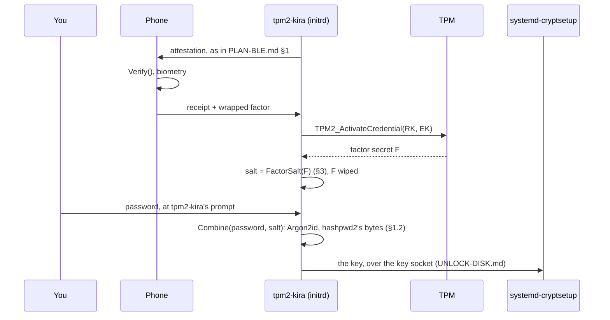

# PLAN — Factor Release for External Key Derivation

> **Status:** in implementation on `feat/hashpwd` (2026-10-07). Done: the
> combiner inside tpm2-kira (`cmd/combine.go`, byte-identical with
> hashpwd2), the release key under the slot's approval
> (`attest/releasekey.go`), wrap, unwrap and the salt derivation
> (`cmd/factor.go`), the phone's part (Evidence tags 15-17, the kept
> factor in the record, Release after the accepted receipt; both apps),
> the coordinator opening the release before the separator, the provider
> answering with the derived key (`diskKey`), and `factor enrol`. Open:
> the hardware run, `factor status`/`rotate`/`unenrol`, and the Debian
> script. The review of 2026-10-07 changed §1.2,
> §3.2, §5, §6 and §7 from the first draft; HISTORY.md keeps the draft's
> shape.
> **Depends on:** [PLAN-REMOTEATTESTATION.md](PLAN-REMOTEATTESTATION.md)
> phases 1–5, the release key from
> [PLAN-REMOTEUNLOCKING.md](PLAN-REMOTEUNLOCKING.md) §5.1 (its phase 1 spike),
> and a transport: [PLAN-BLE.md](PLAN-BLE.md) for a phone, or TCP for a server.
>
> This is the third consumer of the attestation core. The verifier does not
> hand out a passphrase. It hands out one **factor** of a passphrase, and a
> separate program combines it with something the user types.

---

## 1. The idea

At the passphrase prompt the machine attests to the phone, as in
[PLAN-BLE.md](PLAN-BLE.md). If the phone is satisfied, it returns a small
wrapped secret that only this machine's TPM can open. tpm2-kira unwraps it and
passes it — as a *salt* — to an external key-derivation tool. That tool asks
for the user's password and derives the LUKS key from both.



The combiner is [hashpwd2](https://github.com/mrwiora/hashpwd2)'s
derivation, inside tpm2-kira (§1.2).

### 1.1 Why a factor and not the passphrase

[PLAN-REMOTEUNLOCKING.md](PLAN-REMOTEUNLOCKING.md) releases the whole
passphrase, because nobody is at the rack. A laptop has a person in front of
it, and that person can hold a factor too. LUKS cannot require two keyslots at
once, so "phone **and** password" has to be built *before* cryptsetup, by
deriving one key from both.

| Released | Who can unlock |
|---|---|
| The passphrase | whoever satisfies the verifier and the TPM |
| A factor | whoever satisfies the verifier and the TPM **and** knows the password |

It also changes what a verifier compromise is worth. A phone that releases a
passphrase is the key to the disk. A phone that releases a factor is half of
one.

### 1.2 One program

The combiner is inside tpm2-kira (`cmd/combine.go`): hashpwd2's
derivation, byte for byte - Argon2id with its parameters (1 GiB, 16
passes, 4 lanes, 64 bytes), base64 without padding, the trailing newline
that is part of the key - checked against the hashpwd2 binary in a test.
A keyslot enrolled with hashpwd2 opens with tpm2-kira and the other way
round. The decision of 2026-10-07: the password, the salt and the derived
key never cross a process boundary, a shell variable or a file in `/run`;
the password is typed at tpm2-kira's prompt, the salt comes out of the
TPM in the same process, the key goes to `systemd-cryptsetup` through the
key socket (UNLOCK-DISK.md). What tpm2-kira still does not do is touch a
LUKS keyslot: enrolment writes the derived key once to a file on tmpfs
for `cryptsetup luksAddKey`, as hashpwd2's README does (§6).

Two costs come with hashpwd2's parameters and are accepted: the initrd
needs 1 GiB of free memory for the derivation, and it takes some seconds
(about 15 s on a 2015 laptop). The parameters are part of the contract
with every enrolled keyslot and do not change.

---

## 2. What is reused, and what is new

| Component | Source |
|---|---|
| AK, quotes, evidence, `Verify()`, policy, profiles, receipts | [PLAN-REMOTEATTESTATION.md](PLAN-REMOTEATTESTATION.md) — unchanged |
| Transport, encrypted session, enrolment with SAS, the mobile app | [PLAN-BLE.md](PLAN-BLE.md) |
| Release key (RK) and its PolicyOR | [PLAN-REMOTEUNLOCKING.md](PLAN-REMOTEUNLOCKING.md) §5.1 — the `PolicySigned` key is the verifier's approval key, here the phone's |
| **The factor and its wrap** | new, §3 |
| **The release message** | new in the core, shared with remote unlocking, §4 |
| **The provider interface** | new, §5 |

---

## 3. The factor

```
at enrolment, on the booted machine:
    F          = random 32 bytes
    credential = TPM2_MakeCredential(ek_pub, secret = F, name = rk_name)
    send to verifier: { credential }                 # never F
    emit once, for keyslot enrolment: factor(F, label)   (§6)
    wipe F

at unlock, in the initrd:
    receive { credential }
    F = TPM2_ActivateCredential(activateHandle = RK, keyHandle = EK, credential)
    emit factor(F, label)
    wipe F

factor(F, label) := hex( HKDF-SHA256(ikm = F, salt = "",
                         info = "tpm2-kira/factor/v1" ‖ lp(label), len = 32) )
```

- `F` is 32 bytes, so it fits `TPM2_MakeCredential` directly. The AES-GCM layer
  of [PLAN-REMOTEUNLOCKING.md](PLAN-REMOTEUNLOCKING.md) §5.2 is not needed.
- `F` itself is never output. The `label` (default `luks`) lets one enrolment
  serve several volumes with unrelated factors, and keeps a factor handed to
  one consumer from being the secret behind another.
- The machine does not keep `F` or the credential. After enrolment the factor
  exists only inside a blob on the verifier that one specific TPM can open.

The properties of [PLAN-REMOTEUNLOCKING.md](PLAN-REMOTEUNLOCKING.md) §5.2 carry
over unchanged, and the third one is again the reason for the design: **a
relayed quote does not earn a factor.** Sending `F` through the encrypted BLE
session after a good quote would be simpler and would lose exactly that
(§8.2).

### 3.1 The factor is static

Unlike a token that computes a fresh response, `F` is a fixed value. Every
successful boot puts it in the initrd's memory. Anyone who captures it once —
root on the running system during the initrd, a cold-boot attack — keeps it.
What they still lack is the password, and the combiner's cost per guess.

Rotation (`factor rotate`) creates a new `F` and therefore a new LUKS key: the
user must enrol the new key through the combiner and remove the old keyslot.
tpm2-kira prints those steps; it does not perform them.

---

### 3.2 The release key

The object the credential is made for (`attest/releasekey.go`). It lives
in the slot's blob beside the boot key, and its policy is the slot's own,
extended by one step:

```
RK.authPolicy = H( TOTPKey.authPolicy ‖ TPM_CC_PolicyCommandCode ‖ TPM_CC_ActivateCredential )
TOTPKey.authPolicy = PolicyAuthorize(signing key, policyRef)       (SECURITY-BACKGROUND.md §4)
```

`TPM2_ActivateCredential` needs the ADMIN role on the object; with
`adminWithPolicy` set, that is a policy session whose command code is
`ActivateCredential`. The session is the one the TOTP key computes codes
with - PolicyPCR over the sealed selection, PolicyNV over the generation,
the approval signature, PolicyAuthorize - and then `PolicyCommandCode`.
So the factor unwraps exactly where a code computes: in the boot state
the signing key approved at seal or reseal, and in no other. There is no
second branch: a boot the signing key has not approved gets no factor,
and the recovery passphrase (§7.3) is the way in. The first draft's
`PolicyOR` with a `PolicySigned` branch for the phone is dropped: an
approval from the phone would open the factor in a boot state the
machine's own signing key never saw, which is the one thing the design
must not allow (§8.4).

Verified on swtpm (`cmd/factor_swtpm_test.go`): the credential opens to
the same F in the approved state; not on another TPM; not with the slot's
policy alone (the command code is required); not after a PCR of the
selection moved.

## 4. The release message

The core gains one message, sent by the verifier after a receipt with
`verdict = ok`, inside the same session:

```
Release := {
    kind        uint8       // 1 = passphrase (remote unlocking), 2 = factor
    slot        uint8
    credential  []byte      // TPM2_MakeCredential output
    ciphertext  []byte      // kind 1 only
    approval    []byte      // optional: signature for the RK's PolicySigned branch
}
```

It is defined once, in `attest/`, for both this plan and
[PLAN-REMOTEUNLOCKING.md](PLAN-REMOTEUNLOCKING.md) — a factor-only or
unlocking-only variant inside the core would be the design failure that plan's
§2 warns about. A `Release` for kind 2 is a few hundred bytes; over BLE it is
instant ([PLAN-BLE.md](PLAN-BLE.md) §4.3).

### 4.1 One branch

| Boot state | What the phone does | What the TPM does |
|---|---|---|
| the signing key's approval holds (PCRs and generation as sealed) | verifies, unlocks its key, returns `credential` with the receipt | opens it |
| PCRs changed (an update not yet resealed, or something else) | shows the diff ([PLAN-BLE.md](PLAN-BLE.md) §6.3); whatever the person decides, the credential it returns | refuses (§3.2) |

The phone cannot approve a boot state the machine's signing key has not;
it can only hand the credential back, and the TPM decides. A reviewed
change is approved where every change is: by `reseal` on the unlocked
system, which the post hook runs after each image build. The phone's
`approval` field of the first draft is gone.

---

## 5. The answer

There is no provider interface: the factor is consumed where it is
produced. `tpm2-kira run` serves the volume's key to `systemd-cryptsetup`
on `/run/tpm2-kira/unlock.sock` (UNLOCK-DISK.md). With a factor enrolled,
its answer for a volume is:

```
1.  the phone's verdict is in, and it returned the credential (§4)
2.  F     = unwrapFactor(credential)            TPM, release key under the slot's policy
3.  salt  = FactorSalt(F, label)                 64 hex characters; F wiped
4.  pw    = the password typed at tpm2-kira's prompt
5.  key   = Combine(pw, salt)                    Argon2id, hashpwd2's bytes; pw and salt wiped
6.  write key to systemd-cryptsetup; wipe
```

Without a credential (no phone, no verdict, the TPM refused), step 4 is
the only step: the prompt asks for the passphrase as it does without a
factor, the answer is tried as it is, and a wrong one falls back to
systemd's own prompt (UNLOCK-DISK.md §4). The person therefore has, at
the same prompt, the everyday password - which only works together with
the factor - and the recovery passphrase of §7.3. Whether the factor was
released is said on the console before the prompt, so a boot that the
phone did not approve is recognisable before anything is typed.

The derivation string of the salt, `tpm2-kira/factor/v1`, and hashpwd2's
parameters are the contract with every enrolled keyslot; a change to
either is a new string and a re-enrolment.

## 6. Enrolment

On the booted, unlocked system, with a phone enrolled (`attest enrol`):

```
tpm2-kira factor enrol [--nvram N] [--label STR] --out PATH
```

1. Refuse unless the user confirms a second LUKS keyslot exists (§7.3).
2. Create the release key under the slot's policy if the slot has none
   (blob version 12 carries it), draw F, wrap it for this TPM's EK and the
   release key's name, hand the credential to the phone over the enrolled
   session; the phone stores it with the machine's record.
3. Prove the round trip before anything depends on it: ask the phone for
   the credential back, open it in the TPM, compare with F.
4. Ask for the password at the prompt, derive the key, write it to
   `--out` (tmpfs only, root-owned parent, mode 0600) and print the next
   steps; nothing else is kept:

```
Key written to /run/tpm2-kira/luks.key

Next steps - tpm2-kira does not touch your keyslots:
    cryptsetup luksAddKey /dev/nvme0n1p2 /run/tpm2-kira/luks.key
    cryptsetup open --test-passphrase /dev/nvme0n1p2 --key-file /run/tpm2-kira/luks.key
    rm /run/tpm2-kira/luks.key
```

## 7. Boot integration

### 7.1 No software hold is needed

[PLAN-BLE.md](PLAN-BLE.md) §7.4 is blunt that `enforced` mode is a local
software gate, worth what the measured boot chain is worth. Factor release
does not need it: **the enforcement is the missing factor.** Delete the gate
from the initramfs and the primary keyslot still cannot be opened.

Factor release therefore runs with the gate in `lazy` mode. The boot is never
held by software, and a failed release ends at the ordinary console prompt
rather than an emergency shell.

### 7.2 No units

The key socket already orders everything: `tpm2-kira-unlock.socket` is
`Before=cryptsetup-pre.target`, the request arrives after the separator,
and `tpm2-kira run` answers it (§5). No derivation unit, no key file in
`/run/cryptsetup-keys.d`, no `keyfile-erase`. The Debian `keyscript=`
variant is the same answer written to stdout; not built.

### 7.3 The fallback keyslot is now the target

A tampered initramfs cannot obtain the factor, but it can print "phone not
reached" and show a passphrase prompt. Whatever is typed there is captured. So:

- The fallback keyslot holds a **long recovery key that is not typed in
  daily use**, not a second everyday passphrase.
- Before typing it, the user checks the **TOTP code**
  ([PLAN-REMOTEATTESTATION.md](PLAN-REMOTEATTESTATION.md) §1.2). This is the
  path the OTP stays for: no phone app, no radio, and still a proof that the
  PCRs match.
- Exit codes 4 and 5 (§5.2) print a warning that names this explicitly.

---

## 8. Threat model

### 8.1 What this adds

| Attacker has | Result |
|---|---|
| The laptop | No factor on it. Password guessing is infeasible: the salt is an unknown 256-bit value. |
| The laptop and the password | Still needs the phone's blob, and a TPM in an approved state to open it. |
| The laptop and the locked phone | The blob is behind the app's storage; an approval needs biometry. |
| A tampered boot chain, user present | The phone sees the changed PCRs. No factor is released, and the password prompt never appears. |
| A relay to the genuine machine | The blob opens only in that machine's TPM (§3). |
| A patched client that skips the protocol | Has no factor. |
| The phone's blob, copied | Useless without that TPM. |

The fourth row is what a hardware token cannot give: a token answers any
machine that asks.

### 8.2 What it does not fix

| Non-guarantee | Why |
|---|---|
| Root on the running, unlocked system | The disk is open. Unchanged. |
| A captured factor | It is static (§3.1). The password and the combiner's cost remain; rotation is manual. |
| A compromised phone **plus** physical possession of the laptop | The approval key can open the RK's `PolicySigned` branch in any PCR state. The attacker then has the factor and must still guess the password — this is the case where the combiner's Argon2id cost is the last line. |
| Bus sniffing of `F` | `F` crosses the TPM bus in the clear unless parameter encryption is used on `TPM2_ActivateCredential`. It must be; same task as [PLAN-REMOTEUNLOCKING.md](PLAN-REMOTEUNLOCKING.md) §9.2. |
| Firmware-TPM flaws | The unwrap is as trustworthy as the TPM. |
| A phished recovery key | §7.3. |

### 8.3 Availability

A flat battery, a lost phone or a broken adapter means the primary keyslot
does not open. The recovery keyslot (§7.3) is mandatory. A hardware token
(FIDO2 `hmac-secret`) feeding the same combiner into a *separate* keyslot is a
reasonable everyday fallback; it is independent of this plan and needs nothing
from tpm2-kira.

---

### 8.4 Only the tpm2-kira that sealed or resealed the slot

The release key's policy is the slot's approval (§3.2), and the approval
is a signature over the PCR values the signing key computed for one
image - on a UKI system PCR 11, which `systemd-stub` extends with the
measurement of the initrd, and the initrd contains the tpm2-kira binary.
So "the tpm2-kira that resealed the slot" is not a claim the binary makes
about itself; it is what the stub measured and what the signing key
approved. A different binary in the image changes PCR 11, the approval
no longer verifies, and neither a code nor the factor comes out. Nothing
in tpm2-kira measures tpm2-kira: a self-measurement into a free PCR would
be made by the thing it is meant to check, and a replaced binary would
extend the old binary's hash. The measuring is done by the firmware and
the stub, which is where it can be trusted; Secure Boot over the UKI
adds who signed the image (PCR 7). On a GRUB system the same holds with
PCR 9 (the initrd file) instead of PCR 11, and the reseal after each
rebuild is what keeps the approval on the current image.

## 9. CLI

```
tpm2-kira factor enrol    [--nvram N] [--label STR] --out PATH
tpm2-kira factor status   [--nvram N] [--json]
tpm2-kira factor rotate   [--nvram N] [--label STR] --out PATH
tpm2-kira factor unenrol  [--nvram N]              # does not touch keyslots
```

There is no `factor release`: the release is `run`'s answer on the key
socket (§5).

---

## 10. Testing

| Layer | How |
|---|---|
| Interface contract (§5.1) | golden test: stdout is 65 bytes matching `^[0-9a-f]{64}\n$`; on every failure path stdout is empty and the exit status is the documented one |
| Derivation | fixed `F` and label → fixed factor; different labels → unrelated factors |
| Wrap / unwrap | swtpm round trip; wrong EK, wrong RK Name, extended PCR |
| Relay resistance | two swtpm instances: blob for A does not open on B |
| `--out` rules | refused on a non-tmpfs target and on a lax parent directory |
| Combiner contract (§5.3) | run against hashpwd2 in CI: empty factor ⇒ non-zero exit, no key file |
| Full boot | QEMU + swtpm + a CLI verifier: attestation, release, password via the ask-password agent, unlocked root |
| Failure matrix | each exit status of §5.2 ends at a usable console prompt with the right warning |
| Secret hygiene | grep the initrd's memory and `/run` for `F` and the factor after unlock |

---

## 11. Milestones

| Phase | Deliverable | Done when |
|---|---|---|
| 1 | Factor wrap / unwrap on the RK; `PolicySigned` with an externally produced ECDSA signature | the §4.1 note is answered on swtpm and one real TPM |
| 2 | `factor enrol` / `factor release` with a throwaway CLI verifier over an in-memory transport | the §5.1 golden test passes |
| 3 | `Release` message in the core; hashpwd2 changes of §5.3 landed there | the combiner-contract test passes |
| 4 | Release over BLE from the mobile app | a phone unlocks a real machine together with a typed password |
| 5 | Example unit, script and hooks for both distributions; failure warnings | the §10 failure matrix passes under QEMU |

Phase 1 depends on the same go/no-go as
[PLAN-REMOTEUNLOCKING.md](PLAN-REMOTEUNLOCKING.md) §12 phase 1.

---

## 12. Open questions

1. **One RK or two** on a machine that uses both remote unlocking and factor
   release? Separate keys keep the two verifiers' approval keys apart; a
   shared one saves an enrolment.
2. **Backing up the blob.** The credential opens only on one TPM, so copying
   it to a second phone costs little — but every copy weakens "something you
   have". Tied to the anchor-rotation question in
   [PLAN-REMOTEATTESTATION.md](PLAN-REMOTEATTESTATION.md) §15.5: a second
   phone also needs its approval key in the RK policy.
3. **A non-static factor.** The phone could compute a response from a key in
   its secure hardware instead of storing a blob. That removes §3.1, and
   removes the TPM binding with it unless the two are layered. Not obviously
   better; decide after phase 4.
4. **Kernel keyring as a second handoff**, next to stdout and `--out`. Avoids
   a file in `/run`; needs keyring support in the combiner.
5. **Does the server path want factors too?** A workstation in an office
   could take its factor from the server and still require a typed password.
   The `Release` message already allows it.
