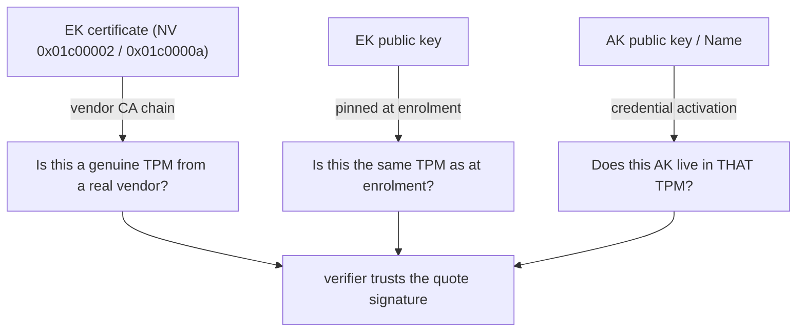

# PLAN — Remote Attestation Core

> **Status:** draft / design. Nothing in here is implemented yet.
> **Scope:** the reusable attestation core (`attest/`). Transport-independent,
> verifier-independent, UI-independent.
>
> Two consumers are planned on top of it:
> [PLAN-BLE.md](PLAN-BLE.md) — a phone verifies the machine over Bluetooth LE
> before the passphrase prompt — and
> [PLAN-REMOTEUNLOCKING.md](PLAN-REMOTEUNLOCKING.md) — a server verifies the
> machine and hands out the LUKS passphrase.
>
> This document defines what both share. If a change here would only ever help
> one of them, it belongs in that plan instead.

---

## 1. Why add this at all

tpm2-kira today proves boot integrity by *equality of a shared secret*: the TPM
releases a TOTP seed only when the PCRs match, so a matching code means the PCRs
matched. That is a real proof, and it stays (see §1.2). But it has four limits,
and each one is a thing remote attestation fixes:

| Limit of the TOTP comparison | What attestation does instead |
|---|---|
| **A human compares six digits.** Tired people at 07:00 accept "close enough", and nothing records that the check happened. | A verifier compares cryptographic material and produces a signed, logged verdict. |
| **The predicate is bit-equality of PCRs, and nothing else.** A boot can be entirely legitimate and still fail, or be subtly wrong and still pass (PCR 7 with Secure Boot off — see SECURITY-BACKGROUND.md §8). | The verifier sees the *values*, the event log, the firmware version and the TPM reset counter, and applies a policy it can change without re-sealing anything. |
| **After a kernel update you are simply locked out of the check.** The PCR branch fails, no code appears, and the documented advice is "type the passphrase anyway". That trains users to ignore the one signal the tool exists to give. | The attestation key is **not** PCR-bound (§4), so a changed machine can still attest — honestly, reporting its new values. A verifier can show the diff and let a human approve it. The check degrades into a decision, not into silence. |
| **The decision is made on the machine being judged.** | The decision moves off the machine. That is the property that makes [remote unlocking](PLAN-REMOTEUNLOCKING.md) possible at all: the passphrase need not exist on the box. |

### 1.1 What attestation is not

It is not a stronger door on the TPM. `TPM2_Quote` releases nothing and gates
nothing; it only signs a statement about the current PCR values. Every
enforcement decision built on it is a decision made by software that reads the
verdict — which is why §11 spends as much space on what the gate is worth as
this section spends on what the evidence is worth.

### 1.2 The OTP stays

The TOTP path is not replaced and not deprecated. It needs no phone, no radio,
no server and no battery, and it is the fallback whenever any of those are
missing. Attestation is added *beside* it. Which one is displayed, and whether
either is required, is per-machine configuration — see
[PLAN-BLE.md](PLAN-BLE.md) §7.

---

## 2. Roles and vocabulary

| Term | Meaning here |
|---|---|
| **Attester** | The machine with the TPM: tpm2-kira. Produces evidence. Never decides. |
| **Verifier** | Whoever judges the evidence: the phone ([BLE](PLAN-BLE.md)) or the server ([remote unlocking](PLAN-REMOTEUNLOCKING.md)). |
| **Relying party** | Whoever acts on the verdict. Usually the attester itself (it opens or holds its own gate), sometimes the server (it releases or withholds a passphrase). |
| **EK** | Endorsement Key. Unique per TPM, created from the Endorsement Primary Seed, often accompanied by a vendor certificate. The TPM's identity. |
| **AK** | Attestation Key. A restricted signing key that signs quotes. The TPM will only sign TPM-generated structures with it, which is what makes a quote trustworthy. |
| **Evidence** | Quote + PCR values + optional event log + metadata. Signed by the AK. |
| **Receipt** | The verifier's signed verdict, sent back to the attester. |
| **Profile** | A named set of expected PCR values, one per known-good system state. |

The role split matters for one reason: **the attester must contain no code that
can decide it is trustworthy.** Everything under `attest/verify*` runs on the
verifier and is never consulted to authorise a local action, except when
checking a receipt's signature.

---

## 3. Identity: EK, AK, and why both

A quote is worth exactly as much as the verifier's knowledge of the key that
signed it. Three layers, each answering a different question:



- **EK certificate (optional).** Many discrete TPMs ship an EK certificate in NV
  index `0x01c00002` (RSA) or `0x01c0000a` (ECC P-256), chaining to a vendor CA.
  Where present it upgrades pinning from "the same thing as last time" to "a
  genuine TPM". Firmware TPMs (fTPM, Pluton) frequently have none — so this is
  read and reported, never required.
- **EK pinning (required).** The verifier stores the EK public key at enrolment.
  This is trust-on-first-use, and the first use is the one moment a human is
  physically present and can confirm what they are enrolling — see
  [PLAN-BLE.md](PLAN-BLE.md) §5 for the out-of-band confirmation that protects it.
- **Credential activation (required).** The AK's public part alone proves
  nothing: anyone can generate a key and claim it is in a TPM. The verifier
  runs `TPM2_MakeCredential` in software — encrypting a random secret to the EK
  public key, bound to the AK's Name — and the attester must return that secret
  via `TPM2_ActivateCredential`. Only a TPM holding both the EK and an AK with
  that exact Name can complete it.

### 3.1 AK shape and lifecycle

| Property | Choice | Why |
|---|---|---|
| Algorithm | ECDSA P-256 / SHA-256, with RSA-2048 / RSASSA as fallback | Matches the key types SECURITY-BACKGROUND.md §7 already establishes as universally loadable |
| Attributes | `Restricted`, `Sign`, `FixedTPM`, `FixedParent`, `SensitiveDataOrigin`, `UserWithAuth` | `Restricted` is the load-bearing one: the TPM then refuses to sign anything that is not a TPM-generated structure with the `TPM_GENERATED_VALUE` magic, so an AK signature cannot be produced over attacker-chosen bytes |
| Parent | the existing deterministic storage primary (`CreatePrimaryKey`, `cmd/tpm_utils.go`) | Re-derived on every boot already; no new persistent handle, no handle exhaustion |
| Persistence | `TPM2B_PUBLIC` + `TPM2B_PRIVATE` stored in the attestation blob (§10), `TPM2_Load`ed on use | Mirrors how the sealed object is already handled. No `TPM2_EvictControl`, so nothing to clean up on uninstall |
| Auth | empty auth value, **no policy** | See §4 |

The EK itself is created on demand with the TCG EK template and is never
persisted by tpm2-kira. Note the trap: the standard EK template has an
`authPolicy` of `TPM2_PolicySecret(TPM_RH_ENDORSEMENT)`, so *using* the EK for
`TPM2_ActivateCredential` requires a policy session satisfied by endorsement
hierarchy auth — an empty auth value on a typical system, but a session, not a
password. Implementations that forget this fail with `TPM_RC_AUTH_UNAVAILABLE`.

---

## 4. The AK must not be PCR-bound

It is tempting to give the AK a PolicyPCR auth policy, by analogy with the
sealed object. **Do not.** It would destroy the feature:

1. A PCR-bound AK can only sign when the machine is already in the expected
   state. A tampered machine then produces *no* quote — indistinguishable from
   a flat phone battery, a broken adapter, or a dead TPM. The verifier learns
   nothing it did not already know from the absent TOTP code.
2. The value of a quote is that it is **honest about a bad state**. The TPM
   signs whatever the PCRs actually are. Gating the signature on the PCRs being
   right reduces attestation back to the seal/unseal model and drops every
   advantage listed in §1.
3. It breaks the update path. After a kernel update, an unbound AK still
   attests, reporting new values that an operator can review and approve.
   A bound AK goes silent exactly when a human most needs information.

The AK is therefore a plain signing key usable in any system state. It signs
statements; it authorises nothing. All authority lives in the verifier's policy
and, for unlocking, in the passphrase the verifier withholds.

**Consequence to hold on to:** an attacker with root on a *running, matching*
system can produce valid quotes, because the TPM will honestly report that the
PCRs match — they do. Attestation does not fix SECURITY-BACKGROUND.md §8's
"root access on a running, measured system". It was never going to.

---

## 5. Evidence

```
Evidence := {
    schema          uint16          // = 1
    device_id       [16]byte        // random, assigned at enrolment
    ak_name         []byte          // TPM2B_NAME of the signing AK
    quoted          []byte          // TPM2B_ATTEST as returned by TPM2_Quote
    signature       []byte          // TPMT_SIGNATURE over `quoted`
    pcr_values      []{index, alg, digest}
    pcr_alg         uint16          // TPM_ALG_SHA256 | TPM_ALG_SHA1
    eventlog        []byte          // optional, may be omitted or sent by hash
    eventlog_sha256 [32]byte        // always present when eventlog is referenced
    boot_context    BootContext     // see below
    app_version     string
}

BootContext := {
    blob_version        uint32      // sealed blob format version in use
    nvram_index         uint32
    measure_point       string      // MeasurePointExtends, verbatim from the blob
    secureboot_state    uint8       // enabled / disabled / setup-mode / unknown
    seal_pcr_selection  []uint8
    uptime_ms           uint64
}
```

`quoted` decodes to a `TPMS_ATTEST` and the verifier must check every field of
it rather than trusting the ones it happens to care about:

| Field | Check | Catches |
|---|---|---|
| `magic` | equals `TPM_GENERATED_VALUE` (`0xFF544347`) | a signature produced by a non-restricted key over attacker-chosen bytes |
| `type` | equals `TPM_ST_ATTEST_QUOTE` | a quote-shaped reading of some other attestation structure |
| `extraData` | equals the qualifying data the verifier expects (§6.2) | replay of an older quote |
| `attested.quote.pcrSelect` | equals the selection the policy demands | a quote over a *different, weaker* PCR set |
| `attested.quote.pcrDigest` | equals the composite recomputed from `pcr_values` | `pcr_values` lying about what was quoted |
| `clockInfo.resetCount` | ≥ the highest value seen for this device | a quote captured before a TPM reset attack, or replayed from an earlier boot |
| `clockInfo.restartCount`, `.safe` | recorded, `safe == true` required by default | a TPM whose clock state is not trustworthy |
| `firmwareVersion` | matches the pinned value, or the change is surfaced | a TPM firmware downgrade |

The quote carries only a *digest* of the selected PCRs, never the values, which
is why `pcr_values` travels alongside and is checked against the digest rather
than believed.

### 5.1 The event log is optional and expensive

A firmware event log is 30–200 KB. Over BLE that is seconds to tens of seconds
([PLAN-BLE.md](PLAN-BLE.md) §4.3). It is also not needed to decide the common
case: if the PCR values match a known profile exactly, the log adds nothing the
digest did not already say.

So: the attester always sends `eventlog_sha256`, and sends the log body only
when the verifier asks for it — which it does when the values do *not* match a
profile, and a human needs to see *what changed*. Verifiers cache logs by hash.

The log is read from `DefaultEventlogPath` only, never from a path supplied by
a blob or by the peer — the rule HISTORY.md already records for
`EventlogInfo.EventlogPath` applies here unchanged.

---

## 6. The protocol

Two exchanges: **enrolment**, once, with a human present; and **attestation**,
on every boot. Both run over a `Transport` (§9) that the core does not define.

### 6.1 Enrolment

```mermaid
sequenceDiagram
    participant A as Attester (tpm2-kira)
    participant V as Verifier (phone / server)

    Note over A,V: channel established and confirmed out of band<br/>(BLE: numeric comparison — PLAN-BLE.md §5)

    A->>V: EnrolOffer { device_id, friendly_name, ek_pub, ek_cert?, ak_pub, ak_name,<br/>pcr_selection, pcr_values, eventlog_sha256, boot_context, app_version }
    V->>V: validate ek_cert chain if present; derive ak_name from ak_pub and compare
    V->>A: Challenge { credential_blob, encrypted_secret }   // TPM2_MakeCredential in software
    A->>A: TPM2_ActivateCredential(AK, EK)
    A->>V: ChallengeResponse { secret }
    V->>V: secret matches → AK is in the TPM that holds this EK
    V->>V: generate receipt signing keypair (verifier_sk, verifier_pk)
    V->>A: EnrolAccept { verifier_pk, verifier_id, policy_id, receipt_ttl, anchor_sig? }
    A->>A: write attestation blob (§10); record verifier_pk as the pinned anchor
    A->>V: EnrolConfirm { anchor_digest }
    V->>V: store profile "enrolment baseline" from pcr_values
```

Notes:

- The verifier keeps `ek_pub`, `ak_name`, `device_id` and the baseline profile.
  The attester keeps `verifier_pk` — this is the **anchor**, and where it is
  stored is the single most consequential decision in the whole design (§10.2).
- `TPM2_MakeCredential` is pure computation (KDFa, a seed encrypted to the EK,
  an HMAC over the AK Name). It is implemented **in the shared Go core** so the
  phone and the server run identical code, and so no TPM is needed on the
  verifier side.
- Enrolment happens on the booted, unlocked system — never in the initrd. It
  writes NVRAM and needs the signing key, exactly like `seal`.

### 6.2 Attestation

```mermaid
sequenceDiagram
    participant A as Attester
    participant V as Verifier

    A->>V: Hello { device_id, schema, nonce_a, capabilities }
    V->>V: look up device; reject unknown device_id
    V->>A: Request { nonce_v, pcr_selection, want_eventlog, policy_id }
    A->>A: qd = SHA-256("tpm2-kira/qd/v1" ‖ nonce_a ‖ nonce_v ‖ cb ‖ pcr_selection)
    A->>A: TPM2_Quote(AK, qualifyingData = qd, pcr_selection)
    A->>V: Evidence { ... }  (§5)
    V->>V: Verify(evidence, policy, pinned) → Verdict   (§7)
    V->>A: Receipt { verdict, device_id, ak_name, qd, quote_digest,<br/>policy_id, issued_at, expires_at, signature }
    A->>A: verify signature with the pinned anchor; check qd equals its own; act
```

Three properties to keep, because dropping any one of them breaks something
specific:

1. **Both sides contribute a nonce.** `nonce_v` makes the quote fresh for the
   verifier. `nonce_a` makes the *receipt* fresh for the attester — without it
   a replayed receipt from an earlier successful boot would open the gate.
2. **`cb` is the channel binding**: a value that identifies the transport
   session and is unforgeable by anyone outside it — the handshake hash of the
   BLE session ([PLAN-BLE.md](PLAN-BLE.md) §5.2), or a TLS exporter for the
   server case. It ties the quote to *this* conversation, which is what stops
   an intermediary from re-using a quote it observed on another one.
3. **The receipt covers `qd` and the quote digest**, so a receipt cannot be
   moved onto a different quote.

### 6.3 Canonical signing inputs

Every signature in the protocol is over a domain-separated, length-prefixed
byte string. No structure is ever signed via its transport encoding.

```
receipt_tbs := "tpm2-kira/receipt/v1" ‖ u8(verdict) ‖
               lp(device_id) ‖ lp(ak_name) ‖ lp(qd) ‖ lp(sha256(quoted)) ‖
               lp(policy_id) ‖ u64(issued_at) ‖ u64(expires_at) ‖ lp(verifier_id)

lp(x) := u32(len(x)) ‖ x            // little-endian, as in cmd/blob.go
```

`issued_at` / `expires_at` are Unix seconds. The attester cannot check them
against a trustworthy clock in the initrd (§11.4), so their role is to bound
misuse elsewhere, not to protect the gate; the gate relies on `qd`.

---

## 7. Verification is a pure function

```go
// attest/verify.go — no TPM, no network, no filesystem, no clock reads.
func Verify(ev *Evidence, pol *Policy, pin *PinnedIdentity, now time.Time) *Verdict
```

This signature is a design rule, not a convenience:

- It must run **unchanged on the phone, on the server and in tests**. That is
  what makes one implementation of the security check possible across three
  platforms (§9.2).
- It must not import `go-tpm/tpm2/transport`, or anything else that talks to a
  device. Parsing `TPMS_ATTEST` and checking a signature needs no TPM.
- Test vectors are files, not hardware. A golden corpus of evidence blobs —
  good, replayed, wrong-selection, wrong-magic, forged-digest, downgraded-alg —
  is checked into the repo and is the primary regression suite.

```
Verdict := {
    ok           bool
    profile      string        // which known-good profile matched, if any
    reasons      []Reason      // machine-readable, every failed check
    pcr_diff     []{index, expected, actual, description}
    warnings     []Warning     // e.g. secure boot off, no EK cert, resetCount jumped
}
```

`reasons` is plural on purpose. A verifier that stops at the first failure
tells a user "PCR 4 differs" when in fact four registers changed and the
firmware version moved too — which is the difference between "my kernel
updated" and "this is not my laptop".

---

## 8. Policy and profiles

```
Policy := {
    id                  string
    pcr_selection       []uint8
    pcr_alg             uint16
    profiles            []Profile
    require_secureboot  bool
    require_ek_cert     bool
    allow_reset_count_increase bool
    max_quote_age       duration
    firmware_version    *uint64      // pinned when set
}

Profile := {
    name        string      // "baseline", "kernel 6.12.8", "firmware 1.34"
    values      map[uint8][]byte
    valid_from  time.Time
    valid_until *time.Time  // set for pre-registered future states
    uses_left   *uint32     // set for pre-registered future states
    added_by    string
    note        string
}
```

Two things this buys that bit-equality against a sealed blob cannot:

**Several known-good states at once.** A machine that alternates between two
firmware settings, or a fleet on two kernel versions, needs one profile each —
not a re-seal per transition.

**Pre-registering the *next* state.** Before rebooting into a new kernel, the
operator computes what PCR 11 will be from the unified kernel image on disk —
tpm2-kira already does this natively in `cmd/ukipredict.go` — and registers it
as a profile with `uses_left = 1` and a short `valid_until`. The machine then
attests successfully on the first boot into the new image, with no human at the
console. This is the mechanism that makes unattended reboots possible in
[PLAN-REMOTEUNLOCKING.md](PLAN-REMOTEUNLOCKING.md) §6, and it is worth noticing
that it reuses a component that exists today for an entirely different reason.

A pre-registered profile is a deliberate, scoped weakening: for one boot,
inside a time window, the machine may present values nobody has yet observed.
It must be logged as such and must never be the *only* profile.

---

## 9. Package layout and dependency rules

```
attest/
├── evidence.go     # wire types + canonical TLV encoding (shared by all peers)
├── identity.go     # EK/AK templates, AK create/load, credential activation   [needs TPM]
├── quote.go        # TPM2_Quote, evidence assembly                            [needs TPM]
├── makecred.go     # TPM2_MakeCredential in software                          [pure]
├── verify.go       # Verify(): the whole security decision                    [pure]
├── policy.go       # Policy, Profile, profile matching                        [pure]
├── receipt.go      # receipt signing (verifier) and checking (attester)       [pure]
├── session.go      # protocol state machine, nonce handling, channel binding  [pure]
├── transport.go    # interface only
└── testdata/       # golden evidence corpus
```

### 9.1 The rules

1. `verify.go`, `policy.go`, `receipt.go`, `makecred.go`, `session.go`,
   `evidence.go` **must not import** `go-tpm/tpm2/transport`, `net`, `os`, or
   any BLE package. `go build` tags are not the mechanism — an import-graph
   test is (`TestCoreHasNoDeviceDeps` walks the package imports and fails).
2. `attest/` **must not import** `cmd/`. Data it needs from the sealed blob is
   passed in as plain values. The dependency points one way: `cmd/` → `attest/`.
3. No transport, no BLE, no HTTP, no D-Bus and no UI ever appears under
   `attest/`. Those live in `transport/ble/`, `transport/tcp/`, and in the
   mobile app.
4. Everything the verifier decides is expressed as data (`Policy`), never as
   code branches inside the attester.

### 9.2 One verifier implementation, three platforms

The mobile app does **not** re-implement verification in Kotlin and Swift.
`attest/` is compiled for mobile with `gomobile bind` (an `.aar` for Android, an
`.xcframework` for iOS) and the app calls into it. Reasons:

- A security check written twice is a security check that differs once.
- The golden corpus in `attest/testdata/` then tests the phone's verifier too.
- Credential activation (`makecred.go`) is fiddly TPM-specific crypto that
  nobody should write three times.

The cost is a ~5–10 MB native library per platform and a build step per
release. Accepted. UI-layer choice and the BLE plumbing around it belong to
[PLAN-BLE.md](PLAN-BLE.md) §8.

### 9.3 Dependency budget

The project has two direct dependencies today and builds with `CGO_ENABLED=0`.
That is a property worth keeping for a binary that goes into an initramfs.

- `go-attestation` is already vendored, but only its **event log parser** is
  used. Its `attest.TPM` abstraction is *not* adopted: it pulls in a larger
  surface and platform code that the static build does not need. AK creation,
  `TPM2_Quote` and `TPM2_ActivateCredential` are driven directly on `go-tpm`,
  which is already a direct dependency. **To verify during phase 1:** that
  `go-attestation`'s parser alone stays CGO-free as used.
- Session encryption needs X25519, HKDF, ChaCha20-Poly1305 — `golang.org/x/crypto`,
  one new dependency, widely reviewed. Rolling this by hand is not on the table.
- No CBOR, no protobuf: the TLV encoder in `evidence.go` is shared *source*,
  compiled into every peer, so there is no second implementation to keep in
  step. Revisit only if a third-party verifier in another language is ever
  needed — that is the one thing this choice makes expensive, and it should be
  recorded as such.

---

## 10. On-device storage

### 10.1 The attestation blob

A second NVRAM object, separate from the sealed blob, because it has a
different lifecycle: enrolment changes it, sealing does not.

| | Sealed blob (today) | Attestation blob (new) |
|---|---|---|
| Index range | `0x01803010`–`0x0180301F` (slots 0–15) | `0x01803020`–`0x0180302F` (slots 0–15, same slot numbers) |
| Written by | `seal`, `reseal` | `attest enrol`, `attest rotate` |
| Contains | sealed object, PCR digests, key paths | AK public + private, EK cert cache, device id, verifier id, policy id, anchor material |
| Protection | signed payload envelope, `Private` is TPM-wrapped | signed payload envelope, same scheme |

It reuses `cmd/blob.go`'s conventions exactly — little-endian length prefixes,
explicit maximum sizes on every variable-length field, a detached signature by
the same signing key over `[version ‖ payloadLen ‖ payload]`, and **no
migration between versions**. A blob with an unknown version is an error that
tells the user to enrol again.

Nothing secret is in it. The AK private area is TPM-wrapped and useless off the
chip, exactly like the sealed object's, and there is no TOTP seed here at all.

### 10.2 Where the anchor lives — the decision that matters

The **anchor** is the verifier's public key. Whoever controls it controls the
gate, because a receipt signed by an attacker's key is a verdict of "trusted".
NVRAM alone cannot hold it: SECURITY-BACKGROUND.md §9 note 3 establishes that
any process with TPM access can `TPM2_NV_UndefineSpace` a slot and redefine it
with a policy of its own. Deleting the anchor is a denial of service; *replacing*
it would be a full bypass.

Two placements, with honestly different worth:

| Placement | Where | Authenticated by | Survives a PCR change? | Verdict |
|---|---|---|---|---|
| **`image`** | a file inside the initramfs / UKI (`/etc/tpm2-kira/verifier.pub`) | Secure Boot's signature over the image, plus PCR 11 measuring it | **yes** | Required for enforced mode |
| **`sealed`** | material in the attestation blob, its SHA-256 **inside the sealed object** next to the TOTP seed | the TPM's PolicyOR — a planted blob fails the digest check | no: unsealing needs matching PCRs | Fallback only |

The `image` anchor is the right one. It is authenticated by the same signature
that authenticates the kernel, it needs no unseal, and — decisively — it still
works *after* the PCRs change, which is precisely when a human needs a verifier
to look at the diff and approve it. A `sealed` anchor is unreadable exactly
when it is most needed.

The `sealed` anchor exists for machines with no Secure Boot and no signed
image, where the `image` anchor would be a file any root user could rewrite.
Enforced mode refuses to enable with only a `sealed` anchor unless
`--allow-sealed-anchor` is passed, and says why.

### 10.3 Binding the configuration

Attestation mode (`off` / `lazy` / `enforced`), the timeout and the policy id
live in `/etc/tpm2-kira/attest.conf` inside the initramfs. On a system that
seals PCR 11 (UKI) or PCR 9 (Debian/GRUB), editing that file changes a measured
value and the change is caught. On a system that seals neither — `--pcrs "0,7"`
is a documented and reasonable selection — the file is *not* measured, and
`enforced` could be downgraded to `lazy` by editing a text file.

So the SHA-256 of the effective configuration is carried **inside the sealed
object**, alongside the TOTP seed. A mismatch between the sealed digest and the
file on disk is reported and, in enforced mode, fails closed.

This extends the sealed payload from "a TOTP seed" to a small structure, which
means a **sealed blob format version bump to 9** and a re-seal + authenticator
re-enrolment for existing users. Consistent with the project's stated
no-backwards-compatibility policy; it must still be called out in HISTORY.md
and in the release notes.

```
SealedPayload v9 := {
    totp_secret     []byte      // as today
    device_id       [16]byte    // zero when not enrolled
    anchor_digest   [32]byte    // SHA-256 of the pinned verifier public key, zero when none
    config_digest   [32]byte    // SHA-256 of the canonicalised attest.conf, zero when none
}
```

---

## 11. Threat model

### 11.1 What attestation adds

| Threat | How the evidence catches it |
|---|---|
| Boot chain modified between boots | PCR values differ from every profile; the diff names the registers |
| An old, good quote replayed | `extraData` must equal a qualifying data derived from a fresh verifier nonce |
| A receipt from an earlier boot re-presented to the gate | the receipt covers `nonce_a`, chosen by the attester this boot |
| TPM reset / PCR replay attack | `clockInfo.resetCount` must not go backwards; a jump is surfaced |
| AK generated in software, not in a TPM | credential activation at enrolment; `Restricted` attribute; `TPM_GENERATED_VALUE` magic |
| A different machine's TPM substituted | EK pinning and, where an EK certificate exists, a vendor chain |
| TPM firmware downgrade | `firmwareVersion` in the quote is pinned or surfaced |
| A user who waves through a mismatched code | the comparison is mechanical, and the verdict is logged |
| Legitimate change mistaken for tampering | the AK is not PCR-bound, so the machine attests its new state and a human approves a diff instead of being locked out |

### 11.2 What it does not

| Non-guarantee | Why |
|---|---|
| **Root on a running, matching system** | The TPM honestly reports matching PCRs, because they match. Root can request quotes at will. Unchanged from SECURITY-BACKGROUND.md §8. |
| **The box in front of you is the box that attested** | A quote attests *a TPM*. An attacker's laptop can relay the exchange to the genuine machine elsewhere — the classic cuckoo attack — and present a valid verdict for hardware you are not touching. §11.3. |
| **The local gate cannot be removed** | A gate is software in the initramfs. Whoever can edit the initramfs can delete it. That edit changes the PCRs only if the image is measured, so the gate is worth exactly what the measured boot chain protecting it is worth. [PLAN-BLE.md](PLAN-BLE.md) §7.4. |
| **Bus interposition** | Quote signatures are made inside the TPM and an interposer cannot forge them, but it can observe traffic and, on a machine without session encryption, tamper with commands. Unchanged. |
| **A compromised verifier** | A phone or server that signs a "trusted" receipt for anything opens every gate anchored to it. Anchor rotation and the blast radius are the verifier's problem — [PLAN-REMOTEUNLOCKING.md](PLAN-REMOTEUNLOCKING.md) §8. |

### 11.3 The relay (cuckoo) problem, stated honestly

For the **BLE gate** it is largely uninteresting: the attacker's fake machine
would have to run a gate it controls, and an attacker who can do that can also
just not run the gate. The gate is a check the honest machine performs on
itself; relaying it deceives nobody who matters.

For **remote unlocking** it is the central attack, because there the verifier
hands out a secret. A relayed quote from the genuine machine would earn an
attacker the passphrase. The mitigation is not proximity and not the network
channel: the passphrase is released via `TPM2_MakeCredential` against the
device's pinned EK, bound to the AK Name, so only the TPM that produced the
quote can unwrap it. See [PLAN-REMOTEUNLOCKING.md](PLAN-REMOTEUNLOCKING.md) §5.
Channel binding (§6.2) is a second, weaker layer on top.

### 11.4 Time

The initrd has no trustworthy clock. The RTC may be wrong, and on many machines
it is. Nothing in the attester's decision path may therefore depend on wall
time: receipt freshness is established by `nonce_a`, not by `expires_at`.
Verifiers *do* have clocks and use them. This also rules out PKI certificate
validation on the attester side, which is one of the reasons both transports
pin public keys instead ([PLAN-BLE.md](PLAN-BLE.md) §5,
[PLAN-REMOTEUNLOCKING.md](PLAN-REMOTEUNLOCKING.md) §3.1).

---

## 12. CLI surface

```
tpm2-kira attest enrol      [--transport ble|tcp] [--nvram N] [--pcrs SPEC] [--name STR]
tpm2-kira attest status     [--nvram N] [--json]
tpm2-kira attest quote      [--nvram N] [--nonce HEX] [--out FILE]   # produce evidence, no peer
tpm2-kira attest verify     --evidence FILE --policy FILE [--json]   # offline, no TPM
tpm2-kira attest rotate-ak  [--nvram N]
tpm2-kira attest unenrol    [--nvram N]
```

`attest quote` and `attest verify` exist so evidence can be produced on one
machine, carried on a stick and judged on another. They are also how the golden
corpus is generated and how a failing field deployment is debugged.

### 12.1 One documented exception to the exit-0 rule

README.md states that tpm2-kira always exits 0, deliberately, so a TPM failure
cannot break a boot chain. That rule is right for a tool that *displays* a code
and wrong for one that *gates* a boot: a gate that exits 0 on failure is not a
gate.

Therefore: `attest verify`, and the gate command defined in
[PLAN-BLE.md](PLAN-BLE.md) §7, **exit non-zero on failure**, and this is stated
in their help text and in README.md next to the existing rule. Every other
command keeps the existing behaviour. Getting this wrong silently converts
enforced mode into a decoration, so it is an explicit test case.

---

## 13. Testing

| Layer | How | Needs |
|---|---|---|
| `Verify()` | golden corpus in `attest/testdata/`: good, replayed, wrong selection, wrong magic, non-quote attest type, forged `pcr_values`, downgraded PCR bank, `resetCount` going backwards, expired profile, exhausted pre-registered profile | nothing |
| Encoding | round-trip and fuzz over the TLV decoder, with the same maximum-size limits `cmd/blob.go` uses | nothing |
| AK + quote | swtpm, as the existing integration tests already do | swtpm |
| Credential activation | swtpm; `MakeCredential` in Go, `ActivateCredential` on the simulated TPM | swtpm |
| Import graph | `TestCoreHasNoDeviceDeps` asserts §9.1 rule 1 mechanically | nothing |
| Protocol state machine | in-memory transport pair; adversarial peer that replays, reorders, truncates and stalls | nothing |
| Mobile verifier | the same corpus, run through the `gomobile` binding in CI | gomobile toolchain |

The corpus is the important one. Every bug found in the field should arrive in
`testdata/` before it is fixed.

---

## 14. Milestones

| Phase | Deliverable | Done when |
|---|---|---|
| 1 | AK create/load/persist in the attestation blob; `attest status` | swtpm test creates an AK, reloads it across process restarts |
| 2 | `TPM2_Quote` + evidence assembly; `attest quote --out` | evidence file produced on real hardware |
| 3 | `Verify()` + policy + golden corpus; `attest verify` | every corpus case passes, import-graph test green |
| 4 | `MakeCredential`/`ActivateCredential`; enrolment state machine over an in-memory transport | enrolment completes end to end in tests |
| 5 | Receipts, anchors, sealed payload v9, config binding | a receipt opens a gate in a test harness; a swapped anchor does not |
| 6 | `gomobile` binding + corpus run in CI | the same corpus verifies from the Android and iOS bindings |

Phases 1–5 are prerequisites for both [PLAN-BLE.md](PLAN-BLE.md) and
[PLAN-REMOTEUNLOCKING.md](PLAN-REMOTEUNLOCKING.md); neither should start before
phase 3 is green.

---

## 15. Open questions

1. **AK algorithm default.** ECDSA P-256 is the better fit for the project's
   existing key guidance, but some fTPMs are slow or quirky with ECC quotes.
   Decide after testing on real hardware; the blob stores the algorithm either way.
2. **One AK per slot, or one per machine?** Slots exist for separate purposes;
   an AK is a machine identity. Current inclination: one AK per slot, so slots
   stay independent and can be enrolled to different verifiers — at the cost of
   several enrolments on a multi-slot machine.
3. **Does `go-attestation`'s event log parser stay CGO-free** under the build
   configuration the initramfs needs? It does today for the eventlog path;
   confirm before phase 2 pulls in more of it.
4. **Binary size in the initramfs.** Adding BLE plus the crypto stack to a
   9 MB static binary matters for small `/boot` partitions. Measure; if it is a
   problem, consider a build tag that drops the transport from the early-boot
   build rather than splitting the binary.
5. **Multiple verifiers / anchor rotation.** A second phone, or replacing a
   lost one. Probably a list of anchors with a quorum of 1, plus a documented
   rotation ceremony — deferred out of the first implementation but the blob
   format should reserve room for a list from day one.
6. **PCR bank.** Quotes and profiles are SHA-256; a `--sha1` machine
   (README.md) would need a SHA-1 quote. Supported in the format, warned about
   loudly, and probably refused for enforced mode.
