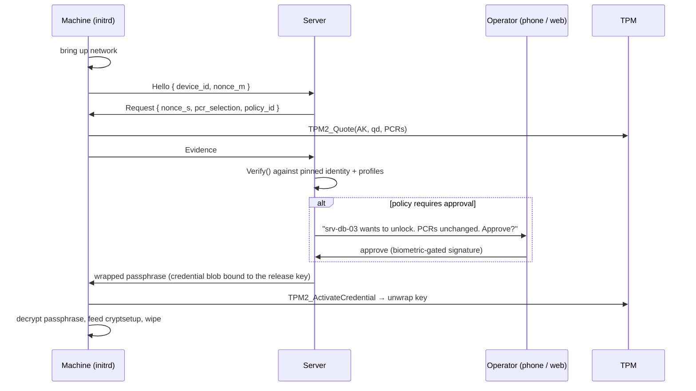
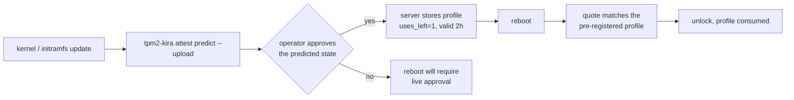

# PLAN — Remote Unlocking

> **Status:** draft / design. Nothing in here is implemented yet.
> **Depends on:** [PLAN-REMOTEATTESTATION.md](PLAN-REMOTEATTESTATION.md)
> phases 1–5, and reuses the encrypted session from
> [PLAN-BLE.md](PLAN-BLE.md) §5.2 over TCP instead of BLE.
>
> This is the second consumer of the attestation core, and the one where the
> gate stops being advisory: the passphrase is not on the machine at all.

---

## 1. The idea

A machine boots, proves to a central server what state it is in, and — if the
state is acceptable and, optionally, a human has approved this particular
reboot — receives its LUKS passphrase and unlocks itself. Nobody walks to the
rack. Nobody types anything.



### 1.1 Why this is a different kind of gate

The BLE gate ([PLAN-BLE.md](PLAN-BLE.md) §7.4) is software in the initramfs
declining to proceed; delete the software and the gate is gone. Here the
machine **does not have the secret**. No amount of tampering with the initramfs
produces a passphrase that was never on the disk, and §5 puts the final unwrap
inside the TPM under a policy, so even intercepting the server's answer is not
enough.

That is the whole argument for building it: the same evidence, the same
verifier code, the same profiles — but the decision is enforced by withholding
a secret rather than by asking software to behave.

---

## 2. What is reused, and what is new

| Component | Source |
|---|---|
| AK, quotes, evidence, `Verify()`, policy, profiles, receipts | [PLAN-REMOTEATTESTATION.md](PLAN-REMOTEATTESTATION.md) — unchanged |
| Encrypted, mutually authenticated session with channel binding | [PLAN-BLE.md](PLAN-BLE.md) §5.2, over TCP instead of an ATT stream |
| Verdict explanation and the approval UI | the mobile app from [PLAN-BLE.md](PLAN-BLE.md) §6, with a second screen |
| **Release key (RK) and the passphrase wrap** | new, §5 |
| **Approval model and maintenance windows** | new, §6 |
| **The server** | new, §7 |
| **Handing the passphrase to cryptsetup** | new, §8 |

If any of the first three rows needs a change to serve this plan, the change
belongs in the core, phrased generically. A `if remoteUnlocking {}` branch
inside `attest/` is a design failure.

---

## 3. Network in an initramfs

| | Arch / mkinitcpio | Debian / initramfs-tools |
|---|---|---|
| Mechanism | `systemd-networkd` in the image (`sd-network` hook), or the `net` hook | the kernel's `ip=` boot parameter, or a `NETWORK` config in the image |
| Drivers | NIC module plus firmware, resolved at build time like the Bluetooth firmware in [PLAN-BLE.md](PLAN-BLE.md) §3.1 | the same |
| Addressing | DHCP by default; static configuration must be supported for machines whose DHCP server is behind the door they are trying to open | the same |
| Ordering | after the measure point, before `cryptsetup-pre.target` | inside `init-premount` |

Two failure modes deserve their own handling because they are common and
confusing: a NIC whose firmware is missing from the image (fail with the
firmware's filename, not with "network unreachable"), and DHCP that never
answers (a bounded retry with visible progress, then the documented fallback).

### 3.1 There is no trustworthy clock

The initrd's wall clock may be arbitrarily wrong, so **X.509 validation is not
available** on the machine side: a certificate's `notAfter` cannot be checked
against a clock the machine does not have.

The server's identity is therefore a **pinned public key**, recorded at
enrolment, exactly as the phone's anchor is
([PLAN-REMOTEATTESTATION.md](PLAN-REMOTEATTESTATION.md) §10.2). The transport
is the project's own encrypted session over TCP, not TLS, which also avoids
carrying a TLS stack and a trust store into the initramfs. The server may sit
behind TLS for its operator-facing API; the machine-facing protocol does not
use it.

The server, which does have a clock, enforces every time-based rule: quote
freshness, approval windows, profile expiry.

---

## 4. Identity and enrolment

Enrolment runs once, on the booted machine, with an operator present. It
extends [PLAN-REMOTEATTESTATION.md](PLAN-REMOTEATTESTATION.md) §6.1 with three
additional steps:

1. **Create the release key (RK)** — §5.1 — and send its public area and Name.
2. **Hand over the passphrase, wrapped.** The operator supplies the LUKS
   passphrase (or tpm2-kira generates one and adds it to a free keyslot with
   `cryptsetup luksAddKey`). It is wrapped to the TPM immediately (§5.2) and
   only the wrapped form is sent. **The plaintext never leaves the machine.**
3. **Register the policy**: PCR selection, the baseline profile, the approval
   mode, and who may approve.

The machine records the server's pinned public key and the server's address in
the attestation blob; the server records the EK, the AK Name, the RK Name, the
profile and the wrapped passphrase.

### 4.1 The rule that is not optional

> **Always keep a second LUKS keyslot with a passphrase a human holds, stored
> offline.**

Enrolment refuses to proceed without confirming this, and prints it again at
the end. A machine whose only key material is behind a network service is a
machine that a network outage, a certificate mistake, a lost database or a
DNS error turns into a brick. This is a stronger availability risk than the
security risk it removes, and it must be stated first, not in a footnote — §9.3.

---

## 5. Releasing the passphrase

This section is the load-bearing one. Everything else is plumbing.

### 5.1 The release key

A second TPM key, separate from the AK, so that the core's rule — *the AK signs
statements and authorises nothing*
([PLAN-REMOTEATTESTATION.md](PLAN-REMOTEATTESTATION.md) §4) — stays true.

| Property | Value |
|---|---|
| Parent | the same deterministic storage primary |
| Purpose | target of `TPM2_ActivateCredential`; never signs anything |
| `userWithAuth` | true, empty auth — so the key can be loaded freely |
| `adminWithPolicy` | true, with the policy below — `TPM2_ActivateCredential` requires ADMIN-role authorisation, which a policy session must then satisfy |
| `authPolicy` | `PolicyOR(` `PolicyPCR(sealed selection) ∧ PolicyCommandCode(ActivateCredential)` `,` `PolicySigned(server key) ∧ PolicyCommandCode(ActivateCredential)` `)` |

Which is deliberately the **same shape as the sealed object's PolicyOR**
(SECURITY-BACKGROUND.md §4): a measurement branch for the normal case and a
signature branch for the exceptional one. The difference is who holds the
signing key — here it is the server, and the signature *is* the approval.

What that buys:

- **The unwrap is gated by the TPM, not by software.** A machine in an
  unexpected state cannot unwrap the passphrase even if it obtains the wrapped
  blob, because the PCR branch fails.
- **Approval becomes a hardware-enforced authorisation.** When the server signs
  the `nonceTPM` for `TPM2_PolicySigned`, it is not sending a flag that
  software checks; it is satisfying a policy the TPM evaluates. An approval
  cannot be faked by patching the client.
- **The update path still works.** After a kernel update the PCR branch fails —
  and the server's approval branch opens it, once, for a reviewed change.

> **To verify in phase 1:** that `TPM2_ActivateCredential`'s ADMIN-role
> requirement on `activateHandle` behaves as described above on swtpm and on at
> least two real TPM vendors, and that `PolicyCommandCode` composes with
> `PolicyOR` the way this table assumes. This is the design's keystone; it gets
> a dedicated integration test before anything else is built on it.

### 5.2 Wrapping the passphrase

`TPM2_MakeCredential` can only carry a secret up to the size of a digest — 32
bytes for SHA-256. A passphrase is not that. So:

```
at enrolment, on the machine:
    K            = random 32 bytes
    ciphertext   = AES-256-GCM(K, passphrase, aad = device_id ‖ rk_name)
    credential   = TPM2_MakeCredential(ek_pub, secret = K, name = rk_name)
    send to server: { credential, ciphertext }          # never K, never the passphrase

at unlock, on the machine:
    receive { credential, ciphertext }
    K          = TPM2_ActivateCredential(activateHandle = RK, keyHandle = EK, credential)
    passphrase = AES-256-GCM-open(K, ciphertext, aad)
```

Properties that follow, each one worth the complexity:

| Property | Why it holds |
|---|---|
| The server never learns the passphrase | it only ever receives `credential` and `ciphertext`; `K` is inside a blob encrypted to the EK |
| A stolen server database yields nothing | every entry can only be opened by one specific TPM |
| **A relayed quote does not earn a passphrase** | the credential is encrypted to *that* EK and bound to *that* RK Name. The cuckoo attacker of [PLAN-REMOTEATTESTATION.md](PLAN-REMOTEATTESTATION.md) §11.3 can relay a quote and receive the blob — and cannot open it |
| A captured blob on its own is useless | opening it needs the TPM **and** either matching PCRs or a fresh server signature |

That third row is the reason this design is not simply "TLS plus a quote".
Channel binding alone would leave the relay attack open; binding the secret to
the hardware closes it.

The release key and this wrap are shared with
[PLAN-FACTORRELEASE.md](PLAN-FACTORRELEASE.md), which releases a 32-byte factor
instead of a passphrase and so needs no AES-GCM layer. Both use the one
`Release` message defined there (§4); the "server key" of §5.1 is, generically,
the verifier's approval key.

### 5.3 Handling the plaintext

Once `ActivateCredential` returns, a passphrase exists in the initrd's memory
and must be treated accordingly: allocated in `mlock`ed memory, never written
to a file or an environment variable, passed to cryptsetup over a pipe or a
`memfd`, and zeroed immediately after — including the intermediate `K` and the
GCM buffers. Go makes some of this awkward; a small `secretbuf` type with an
explicit `Wipe()` and a finalizer-free discipline is preferable to being clever
about it.

---

## 6. Approval

### 6.1 Modes

Per device, set at enrolment and changeable on the server:

| Mode | Behaviour |
|---|---|
| `auto` | A valid quote matching a profile releases the passphrase. No human. |
| `approval` | Every unlock waits for a human approval, whatever the quote says. |
| `approval-on-change` | Automatic while the state matches a profile; a human is asked as soon as it does not. **The recommended default.** |
| `window` | Automatic inside an operator-declared maintenance window, `approval` outside it. |

`approval-on-change` is recommended because it puts the human exactly where a
human adds value: a boot that looks like every previous boot gains nothing from
a sleepy tap, while a boot whose PCRs moved is precisely the event worth
looking at.

### 6.2 What the approver sees

The same three-state presentation as [PLAN-BLE.md](PLAN-BLE.md) §6.3, plus the
things only a server knows: when this machine last booted, how often it has
failed lately, whether five other machines in the fleet changed the same way in
the last hour (a fleet-wide update — reassuring) or whether this one machine
changed alone at 03:00 (not reassuring).

That contrast is the strongest argument for a central verifier over a phone
sitting next to one laptop, and it should be visible in the first screen, not
buried in a log.

### 6.3 Unattended reboot after an update

The chicken-and-egg problem: a kernel update changes the PCRs, so the machine
cannot attest, so it cannot unlock, so nobody can log in to fix it.

Resolved with **pre-registered profiles**
([PLAN-REMOTEATTESTATION.md](PLAN-REMOTEATTESTATION.md) §8): before rebooting,
the machine computes the PCR values its *next* boot will present — for PCR 11
this is exactly what `cmd/ukipredict.go` already does from the unified kernel
image on disk — and uploads them as a candidate profile with `uses_left = 1`
and a short `valid_until`. The reboot then attests cleanly, once, against a
value an operator approved in advance while the machine was still reachable.



Where a value cannot be predicted — on Debian PCR 8/9 are predicted from
the running boot's log and the files on disk (`cmd/grub_predict.go`), which
covers updates but not a menu choice, an edited command line or a grubenv
rewrite — the honest answer is that unattended reboots need live approval,
and the documentation should say which PCR selections buy unattended reboots
and which do not.

---

## 7. The server

### 7.1 Shape

A single Go service. It does four things and should resist doing more: hold
device records, verify evidence with `attest.Verify`, ask humans when policy
says to, and release wrapped blobs.

```
devices    : device_id, name, ek_pub, ek_cert?, ak_pub, ak_name, rk_name,
             policy_id, approval_mode, enrolled_at, last_seen, reset_count_high
profiles   : device_id, name, values, valid_from, valid_until, uses_left, added_by, note
secrets    : device_id, slot, credential, ciphertext, created_at     # opaque to the server
approvals  : request_id, device_id, evidence_digest, state, approver, decided_at, reason
audit      : append-only; every request, verdict, approval and release
```

The operator API is ordinary HTTPS. The machine-facing endpoint speaks the
project's own session protocol over TCP (§3.1) and is the only endpoint that
needs to be reachable from the machines.

### 7.2 Keys the server holds

| Key | Use | Where it should live |
|---|---|---|
| Session static key | authenticating the server to machines | on the host; rotation is a re-enrolment |
| **Approval signing key** | `TPM2_PolicySigned` for the RK's recovery branch (§5.1) | **an HSM or a KMS**, use gated on an approved request |

The approval signing key is the powerful one: with it, any wrapped blob can be
unwrapped on the device that owns it, regardless of PCR state. It deserves the
same protection the sealing key gets in SECURITY-BACKGROUND.md §12, and more,
because it covers a fleet rather than one machine.

### 7.3 Rate limiting and alerting

A failed attestation is not an error to swallow; it is the product. The server
should treat "device X presented a state matching no profile" as an alert with
the same weight a SIEM gives a failed root login — and should rate-limit
per-device request rates, lock a device after repeated failures, and require an
explicit operator action to unlock it again.

---

## 8. Handing the passphrase to cryptsetup

| | Arch / systemd initramfs | Debian / initramfs-tools |
|---|---|---|
| Mechanism | the systemd password agent protocol: watch `/run/systemd/ask-password/ask.*`, reply on the socket named in the file | a `keyscript=` entry in `/etc/crypttab`, invoked by `local-top/cryptroot` |
| Ordering | the agent must be running before `systemd-cryptsetup@.service` asks | the keyscript is called synchronously when needed |
| Fallback | if no passphrase arrives, the normal console prompt stays available | the keyscript exits non-zero and cryptsetup falls back to asking |

The console prompt must remain reachable in both cases. A remote-unlock
deployment where the keyboard stops working is one bad deploy away from a
site visit, and §4.1's second keyslot needs somewhere to be typed.

---

## 9. Threat model

### 9.1 What this adds over the BLE gate

| Threat | Mitigation |
|---|---|
| Stolen machine, attacker has physical possession | The passphrase is not on it. Without the server's cooperation there is nothing to unwrap, and the PCR branch of the RK policy fails on a modified boot chain. |
| Attacker tampers with the boot chain and reboots | The quote reports the new state; the server declines, or a human sees the diff. The machine stays locked. |
| Attacker relays a quote from the genuine machine | The wrapped blob is bound to that machine's EK and RK Name; the relay cannot open it (§5.2). |
| Attacker patches the client to ignore the verdict | There is no verdict to ignore — the client that skips the protocol simply has no passphrase. |
| Slow, quiet compromise of one machine in a fleet | Central verification sees one machine diverge from many identical ones (§6.2) and logs it. |

### 9.2 What it does not fix

| Non-guarantee | Why |
|---|---|
| Root on a running, unlocked machine | The disk is already open. Attestation has never addressed this and still does not. |
| A compromised server | It cannot read passphrases (§5.2), but it can withhold them from everyone, and with the approval key it can authorise unwraps on devices an attacker physically holds. Hence the HSM in §7.2 and human approval in §6. |
| A malicious approver | A person who taps "approve" on an unexplained PCR diff defeats the control. The UI's job is to make that tap feel as significant as it is. |
| Evil maid with unlimited time and a TPM interposer | Unchanged from SECURITY-BACKGROUND.md §8. |
| Bus sniffing of the unwrapped key | `K` and the passphrase cross the TPM bus in the clear unless TPM parameter encryption is used on those commands — which it **should** be, and is a concrete task, not a caveat. |

### 9.3 Availability is the dominant risk

Be blunt about this in the user-facing documentation:

> If the server is unreachable, your machines do not boot.

Network outage, expired credential, database restore, a bad deploy, a DNS
change, a firewall rule — each of these becomes a fleet-wide outage of machines
that will not come back without someone standing in front of them. Against
that:

1. §4.1's offline keyslot, non-negotiable, tested on a schedule rather than
   assumed to work.
2. The server runs in more than one place, and the machine-facing endpoint is
   deliberately the simplest part of it.
3. A documented, rehearsed manual unlock procedure. A procedure nobody has ever
   executed is not a procedure.

---

## 10. CLI and configuration

```
tpm2-kira unlock enrol   --server HOST:PORT [--nvram N] [--passphrase-from-stdin|--generate]
tpm2-kira unlock status  [--json]
tpm2-kira unlock try     [--timeout 60s]        # the initrd path, also runnable by hand
tpm2-kira unlock rotate  [--new-passphrase]     # rewrap, add a keyslot, retire the old one
tpm2-kira unlock unenrol                        # remove the device; does not touch keyslots
tpm2-kira attest predict --upload               # pre-register the next boot's PCR values (§6.3)
```

`/etc/tpm2-kira/control.conf` holds the server address, the timeout and the
fallback behaviour; like `control.conf` its digest is bound into the sealed
object ([PLAN-REMOTEATTESTATION.md](PLAN-REMOTEATTESTATION.md) §10.3), so a
machine that does not measure its initramfs still detects an edited server
address.

`unlock try` follows the exit-status exception in
[PLAN-REMOTEATTESTATION.md](PLAN-REMOTEATTESTATION.md) §12.1: it exits non-zero
when it did not obtain a passphrase.

---

## 11. Testing

| Layer | How |
|---|---|
| RK policy (§5.1) | swtpm: activate under the PCR branch; extend a PCR and assert it fails; activate under the server-signed branch; assert `PolicyCommandCode` prevents the session being reused to sign |
| Wrap / unwrap | round trip through swtpm, including a wrong RK Name and a wrong EK |
| Relay resistance | two swtpm instances: quote from A, blob for A, attempt to open on B |
| Server verification | the golden corpus from the core plan, plus profile expiry, `uses_left` exhaustion and `resetCount` regression |
| Approval flows | all four modes in §6.1, including approval arriving after the machine gave up |
| Full boot | QEMU + swtpm + a server in a container: cold boot to unlocked root with no console input |
| Failure matrix | server down, server unreachable, wrong pinned key, stale profile, denied approval, network without DHCP, missing NIC firmware — every one ends at a usable console prompt |
| Secret hygiene | a test that greps the initrd's memory and filesystem for the passphrase after unlock |

The relay-resistance test is the one that proves the central claim of §5.2 and
should be written before the code it tests.

---

## 12. Milestones

| Phase | Deliverable | Done when |
|---|---|---|
| 1 | RK policy spike on swtpm and two real TPMs | the §5.1 verification note is answered yes or the design changes |
| 2 | Wrap / unwrap, `unlock enrol` on a booted system | a passphrase survives a round trip through the TPM |
| 3 | Server skeleton: devices, profiles, secrets, `Verify`, `auto` mode | a machine unlocks itself over TCP with no human |
| 4 | Network in the initramfs, both distributions | cold boot to unlocked root under QEMU |
| 5 | Approval: modes, the mobile screen, notifications | `approval-on-change` demonstrated end to end |
| 6 | Maintenance windows, predicted profiles, `attest predict --upload` | an unattended reboot after a kernel update succeeds |
| 7 | Operations: audit, alerting, rate limits, HSM-backed approval key, runbooks | the §11 failure matrix passes and the manual procedure has been rehearsed |

Phase 1 is a genuine go/no-go. If the release key cannot be given that policy
on real hardware, the fallback is a channel-bound release without the hardware
unwrap guarantee — which is materially weaker (the relay attack returns) and
should be presented as such rather than shipped quietly.

---

## 13. Open questions

1. **Does the RK policy work as designed on real TPMs?** §5.1. Everything else
   here is downstream of the answer.
2. **One server or a quorum?** A single approval key is a single point of
   compromise; requiring two of three approvers is better and considerably more
   work. Probably a later phase, but the data model should not preclude it.
3. **What happens to a machine that is rebooting while the server is being
   upgraded?** Retry with backoff, or fail into the console prompt? Leaning:
   bounded retry with visible progress, then the prompt, because a human at the
   console is a better outcome than a machine looping.
4. **Should the BLE path and the server path coexist on one machine?** A
   laptop that unlocks from a phone at home and from the server in the office
   is an attractive story and a policy-precedence problem. The blob format
   should allow more than one verifier from the start. The phone side of that
   story is [PLAN-FACTORRELEASE.md](PLAN-FACTORRELEASE.md).
5. **Passphrase rotation at scale.** `unlock rotate` on one machine is easy; a
   fleet-wide rotation with keyslot management, partial failures and rollback
   is a project of its own.
6. **Does the server need to see the event log?** It is the only verifier with
   the storage to keep every log and diff them over time, which would catch
   changes that do not move a sealed PCR at all. Valuable, and a large amount
   of data — decide after §11's full-boot test shows the real sizes.
