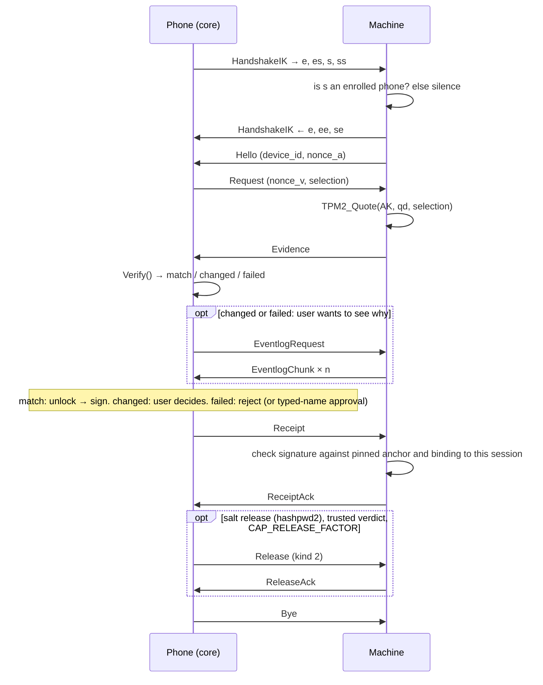

# tpm2-kira BLE Attestation Protocol — Interface Definition

> **Protocol version 1, schema 2.** Status: implemented on the machine side
> (`attest/`, `transport/frame/`, `transport/ble/`) and in the phone core
> (`mobile/kiracore/`). This document is the contract between a tpm2-kira
> machine and a phone app. The key words MUST, MUST NOT, SHOULD and MAY are
> used as in RFC 2119.
>
> Background and rationale: [PLAN-REMOTEATTESTATION.md](PLAN-REMOTEATTESTATION.md),
> [PLAN-BLE.md](PLAN-BLE.md), [PLAN-FACTORRELEASE.md](PLAN-FACTORRELEASE.md).
> App build instructions: [mobile/AGENT-PROMPT-ANDROID.md](mobile/AGENT-PROMPT-ANDROID.md),
> [mobile/AGENT-PROMPT-IOS.md](mobile/AGENT-PROMPT-IOS.md).

---

## 1. Overview

### 1.1 What the protocol does

A phone verifies, **before the disk passphrase is typed**, that a Linux
machine booted into a known-good state. The machine's TPM signs a quote over
its PCRs; the phone checks the quote against what it recorded when the
machine was enrolled and returns a signed verdict (a *receipt*).

The protocol serves two purposes, both over the same session:

| Purpose | When | Status |
|---|---|---|
| **Attestation** | Always. The phone shows *match* / *changed* / *failed*, the user decides on changes, the machine's console shows the signed verdict. | Implemented |
| **Salt release** | Additionally, when the machine uses [hashpwd2](https://github.com/mrwiora/hashpwd2) to derive the LUKS key. After a trusted receipt, the phone sends a TPM-bound *factor*; the machine unwraps it and hands it to hashpwd2 as the salt (PLAN-FACTORRELEASE.md). | Message defined (§7.3.7); machine replies "unsupported" in this version |

Attestation stands on its own. Salt release is an optional step on top of a
trusted receipt and never replaces it.

### 1.2 Layers

```
┌────────────────────────────────────────────────────────────┐
│ Protocol messages (TLV, §7)        Hello, Evidence, Receipt │  ┐
├────────────────────────────────────────────────────────────┤  │ implemented ONCE,
│ Records (§5) + Noise session (§6)  XX at enrolment, IK after│  │ in Go, shared by
├────────────────────────────────────────────────────────────┤  │ machine and phone
│ Framing (§4)                       fragments ⇄ records      │  ┘ (mobile/kiracore)
├────────────────────────────────────────────────────────────┤
│ GATT (§3)                          RX write, TX notify      │  ┐ implemented by
├────────────────────────────────────────────────────────────┤  │ the app (native
│ BLE link, no pairing (§3.6)        advertising (§2)         │  ┘ BLE APIs)
└────────────────────────────────────────────────────────────┘
```

**The phone app MUST NOT re-implement the upper three layers.** It links the
Go core (`mobile/kiracore`, built with `gomobile bind`) and only moves bytes
between the BLE stack and the core, and events between the core and the UI
(§10). Every check that decides whether a boot is trustworthy runs in the
core, byte for byte the code the machine's test suite runs. The wire format
below is specified fully so that implementations can be reviewed, debugged
and tested — not as an invitation to write a second verifier.

### 1.3 Roles

| | Machine (tpm2-kira) | Phone (app) |
|---|---|---|
| BLE role | GATT **peripheral**, advertises | GATT **central**, scans and connects |
| Noise role | responder | initiator |
| Attestation role | attester: produces evidence, never decides | verifier: decides, signs receipts |
| Long-term keys | AK and EK in the TPM; X25519 static key; advertising key | X25519 static key; anchor key (ECDSA P-256, hardware, fresh user authentication per signature) |

---

## 2. Discovery and advertising

### 2.1 Advertising data (31 bytes max)

| AD type | Content |
|---|---|
| `0x01` Flags | `0x06` (LE General Discoverable, BR/EDR not supported) |
| `0x07` Complete list of 128-bit service UUIDs | the service UUID (§3.1) |

Nothing else: **no local name, no device id, no manufacturer data.** The
machine uses a new non-resolvable private address every time it starts.

### 2.2 Scan response: service data (13 bytes)

AD type `0x21` (Service Data – 128-bit UUID) for the service UUID, payload:

```
ServiceData := u8 flags ‖ prand[4] ‖ tag[8]                 (13 bytes)
tag         := HMAC-SHA256(adv_key, "tpm2-kira/adv/v1" ‖ prand)[0:8]
```

| flags bit | Meaning |
|---|---|
| `0x01` ENROL | the machine runs `attest enrol` and waits for a new phone; `tag` is all zero |
| `0x02` ATTEST | the machine serves attestation requests (`attest gate`) |

`adv_key` (32 bytes) is sent to the phone at enrolment (EnrolOffer field 16)
and stored in the machine record. `prand` is random per boot.

The phone SHOULD use `kiracore.MatchAdvertisement(serviceData, record)` to
label a scan result with the machine's name before connecting. Without
`adv_key` the bytes are indistinguishable from random: an observer learns that
*a* tpm2-kira machine is booting nearby, not *which*.

`adv_key` and the machine's Noise private key are stored in the attestation
blob, which anyone who can talk to the TPM can read. Such a reader can
recognise the machine and imitate its Bluetooth endpoint, but cannot produce
a quote; this is accepted (SECURITY.md, "what it does not protect against").

Scan responses need active scanning. When the platform does not deliver the
service data (iOS in the background), the phone MAY connect and try each
enrolled machine's record in turn; a wrong record fails the IK handshake
(§6.2) without revealing anything.

### 2.3 Which advertisements to show

| flags | Show? |
|---|---|
| ATTEST, tag matches an enrolled record | yes, by the machine's name |
| ATTEST, no match | **no** — it is someone else's machine |
| ENROL | only while the user has started "Enrol a machine" in the app |

---

## 3. GATT profile

### 3.1 UUIDs

| | UUID | Properties |
|---|---|---|
| Service | `883f0100-9727-459b-a589-a62200c064c0` | primary |
| RX characteristic | `883f0101-9727-459b-a589-a62200c064c0` | Write Without Response, Write — phone → machine |
| TX characteristic | `883f0102-9727-459b-a589-a62200c064c0` | Notify — machine → phone (CCCD present) |
| INFO characteristic | `883f0103-9727-459b-a589-a62200c064c0` | Read |

The machine also exposes the Generic Access service (`0x1800`) with Device
Name `tpm2-kira` and Appearance `0x0000`. There is no Generic Attribute
service; handles are fixed for a given protocol version but the phone MUST
discover them, not hard-code them.

### 3.2 INFO value (8 bytes)

```
Info := u8 protocol(=1) ‖ u8 mode ‖ u16le schema(=1) ‖ u32le capabilities
mode: 1 = enrolment, 2 = attestation
```

The phone SHOULD read INFO after discovery and refuse to continue (with a
"please update the app / tpm2-kira" message) if `protocol` ≠ 1 or `schema`
is newer than `kiracore.SchemaVersion()`. Capability bits are listed in §7.4.

### 3.3 Connection procedure (phone)

1. Connect. Request an ATT MTU of 517 (Android: `requestMtu(517)`; iOS
   negotiates on its own, typically 185). The machine agrees to at most
   247, so the result is the smaller of the two: one ATT PDU then fits one
   251-byte LE data packet, which old controllers handle more reliably
   than L2CAP fragmentation. Use the value the OS reports, never 517.
2. Discover the service, then its characteristics and the TX CCCD.
3. Read INFO (§3.2).
4. Enable notifications on TX (write `0x0001` to the CCCD) and wait for the
   write to complete.
5. Compute `maxFragment = ATT_MTU − 3` (iOS:
   `maximumWriteValueLength(for: .withoutResponse)`) and call
   `session.SetMaxFragment(maxFragment)`.
6. Call `session.Start()` and write its fragments.

The machine accepts writes before notifications are enabled, but it cannot
answer until they are; enabling them first avoids a stall.

### 3.4 Writes and notifications

- Each fragment is written to RX as **one** ATT Write Request (preferred)
  or Write Without Response, in order, at most `maxFragment` bytes. Write
  Requests pace the phone to the machine's controller: a burst of
  unacknowledged writes made an Intel 7265 drop the link (supervision
  timeout) on the first multi-fragment record from the phone.
- Each TX notification value is one fragment; pass it unchanged to
  `session.OnNotification`.
- The phone MUST preserve order and MUST NOT drop or merge writes. On iOS,
  respect `canSendWriteWithoutResponse` / `peripheralIsReady(toSendWriteWithoutResponse:)`;
  on Android, wait for `onCharacteristicWrite` before the next write.

### 3.5 Sizes

| ATT MTU | Fragment (MTU−3) | Payload per fragment |
|---|---|---|
| 23 (minimum) | 20 | 15 |
| 185 (typical iOS) | 182 | 177 |
| 247 (machine maximum, Android) | 244 | 239 |

### 3.6 No pairing

The BLE link is an untrusted byte pipe. **No pairing, no bonding, no
encryption at the link layer.** The machine answers every SMP Pairing Request
with Pairing Failed (Pairing Not Supported) and rejects all L2CAP signalling
requests. The phone MUST NOT call `createBond()` or require encrypted
characteristics. All confidentiality and authentication come from the Noise
session (§6).

### 3.7 One connection at a time

The machine stops advertising while a phone is connected and accepts one
connection at a time. After a session ends it disconnects and, if still
waiting, advertises again.

---

## 4. Framing

Records (§5) can be larger than one BLE write. They are split into fragments:

```
Fragment := u16le total_len ‖ u8 flags ‖ u16le seq ‖ payload
```

| Field | Rule |
|---|---|
| `total_len` | length of the whole record (1–65535), repeated in every fragment of that record |
| `flags` | bit 0 `START` marks the first fragment of a record; bits 1–7 MUST be 0 |
| `seq` | fragment counter **per direction**, starting at 0 for each connection, incremented by one per fragment, wrapping at 65536 |
| `payload` | at least 1 byte |

Receivers MUST treat any of the following as fatal and drop the connection:
a gap, repeat or reordering of `seq`; a continuation without a start; a start
before the previous record completed; a changed `total_len`; payload beyond
`total_len`; reserved flag bits; `total_len` above the receiver's limit (checked
before allocating). Nothing is repaired — the link is reliable and ordered, so
an error means something is wrong.

`kiracore.Session` does all of this; the app never parses fragments.

---

## 5. Records

The first byte of every record:

| Kind | Name | Content |
|---|---|---|
| `0x01` | HandshakeXX | a Noise XX handshake message (enrolment) |
| `0x02` | HandshakeIK | a Noise IK handshake message (attestation) |
| `0x03` | Transport | a Noise transport message whose plaintext is one protocol message (§7) |
| `0x04` | PlainError | an **unauthenticated** Error message (§7.3.13), only before the handshake completes (e.g. "this machine is waiting for enrolment"). Shown as a hint, never trusted. |

---

## 6. Session security

### 6.1 Noise

| | Enrolment | Attestation |
|---|---|---|
| Protocol name | `Noise_XX_25519_ChaChaPoly_SHA256` | `Noise_IK_25519_ChaChaPoly_SHA256` |
| Prologue | `tpm2-kira/v1` | `tpm2-kira/v1` |
| Initiator | phone | phone |
| Pre-known keys | none | the phone knows the machine's static key (machine record `machine_noise_pub`) |
| Handshake payloads | empty | empty |

Implementation per the Noise specification, revision 34. The Go
implementation interoperates with the reference `noiseprotocol` library for
both patterns, including the handshake hash.

Transport messages: max 65535 bytes ciphertext; the protocol limits a message
to 65000 bytes plaintext (§7.1). Nonces are implicit; a failed decryption is
fatal.

### 6.2 Who may connect

In IK the machine learns the phone's static key from the first message and
**does not answer unless it belongs to an enrolled phone**. A phone that tries
the wrong machine record fails the handshake (the responder cannot decrypt).
Neither side reveals anything to a stranger.

### 6.3 Channel binding

After the handshake both sides hold the Noise handshake hash `h` (32 bytes).
It is the channel binding value **`cb`**: the quote's qualifying data commits
to it (§9.1), so a quote observed on one session is useless on another.

### 6.4 Enrolment confirmation (short authentication string)

XX authenticates nothing at first contact, so enrolment is confirmed by a
human comparing six digits on both screens. A plain hash of `cb` would be
grindable by a man in the middle (two handshakes, ~10⁶ X25519 operations to
collide six digits), so a commit-then-reveal exchange runs first:

```
machine → phone   SASCommit { commit = SHA-256("tpm2-kira/sas-commit/v1" ‖ cb ‖ nonce_m) }
phone   → machine SASNonce  { nonce_p }               (sent only after the commit arrived)
machine → phone   SASReveal { nonce_m }               (phone checks the commitment)
both              SAS = u32be(SHA-256("tpm2-kira/sas/v1" ‖ cb ‖ nonce_p ‖ nonce_m)[0:4]) mod 1 000 000
```

displayed as six digits with leading zeros. A man in the middle must fix its
inputs in at least one session before seeing the other side's, so its success
chance is 10⁻⁶ per attempt, each attempt needing a human to confirm.

The machine user presses **y** at the console; the phone user taps
**Matches**, which sends `SASConfirm`. Either side rejecting aborts the
enrolment and nothing is stored.

---

## 7. Messages

### 7.1 Encoding

```
Message := u8 type ‖ u8 version(=1) ‖ Field*
Field   := u16le tag ‖ u32le length ‖ value[length]
```

- Tags strictly ascending; duplicates are an error.
- Integers inside values are little-endian, fixed width (u8, u16, u32, u64).
- `bool` is one byte, 0 or 1.
- Unknown tags are skipped (forward compatibility for optional fields).
- A missing required field, an oversize field or a wrong-size integer is an error.
- Nested structures (BootContext) use the field layout without the 2-byte header.
- **Lists** (`PCRValueList`) are a byte string: `u16le count ‖ (u32le len ‖ entry)*`.
  A `PCRValue` entry is `u8 index ‖ digest`.
- Maximum message size: 65000 bytes.

Signatures never cover this encoding; they cover the canonical strings of §9.

### 7.2 Message types

| Type | Name | Direction | Phase |
|---|---|---|---|
| `0x01` | Hello | M → P | attestation |
| `0x02` | Request | P → M | attestation |
| `0x03` | Evidence | M → P | attestation |
| `0x04` | EventlogRequest | P → M | attestation (optional) |
| `0x05` | EventlogChunk | M → P | attestation (optional) |
| `0x06` | Receipt | P → M | attestation |
| `0x07` | Release | P → M | salt release (optional) |
| `0x08` | ReceiptAck | M → P | attestation |
| `0x09` | ReleaseAck | M → P | salt release (optional) |
| `0x20` | SASCommit | M → P | enrolment |
| `0x21` | SASNonce | P → M | enrolment |
| `0x22` | SASReveal | M → P | enrolment |
| `0x23` | SASConfirm | P → M | enrolment |
| `0x24` | EnrolOffer | M → P | enrolment |
| `0x25` | Challenge | P → M | enrolment |
| `0x26` | ChallengeResponse | M → P | enrolment |
| `0x27` | EnrolAccept | P → M | enrolment |
| `0x28` | EnrolConfirm | M → P | enrolment |
| `0x7E` | Bye | either | end of session |
| `0x7F` | Error | either | abort |

### 7.3 Fields

`R` = required, `O` = optional. Sizes are maxima unless marked *exact*.

#### 7.3.1 Hello (0x01)

| Tag | Name | Type | | Notes |
|---|---|---|---|---|
| 1 | schema | u16 | R | 2 |
| 2 | device_id | bytes[16] exact | R | assigned at enrolment |
| 3 | nonce_a | bytes[32] exact | R | attester's nonce, fresh per session |
| 4 | capabilities | u32 | O | §7.4 |
| 5 | app_version | string ≤64 | O | |

#### 7.3.2 Request (0x02)

| Tag | Name | Type | | Notes |
|---|---|---|---|---|
| 1 | nonce_v | bytes[32] exact | R | verifier's nonce |
| 2 | pcr_alg | u16 | R | `0x000B` SHA-256, `0x0004` SHA-1 |
| 3 | pcr_selection | bytes ≤24 | R | PCR indices, strictly ascending, each < 24 |
| 4 | want_eventlog | bool | O | send the event log right after Evidence |
| 5 | policy_id | string ≤64 | O | |
| 6 | boot_ephemeral_pub | bytes[65] exact | R | the phone's one-time P-256 key, uncompressed (§7.6) |
| 7 | boot_sealed | bytes[24] exact | R | the code sealed to the machine's boot key (§7.6) |

#### 7.3.3 Evidence (0x03)

| Tag | Name | Type | | Notes |
|---|---|---|---|---|
| 1 | schema | u16 | R | |
| 2 | device_id | bytes[16] exact | R | |
| 3 | ak_name | bytes ≤68 | R | TPM2B_NAME contents of the AK |
| 4 | quoted | bytes ≤1024 | R | marshalled `TPMS_ATTEST` (TPM byte order) |
| 5 | signature | bytes ≤600 | R | marshalled `TPMT_SIGNATURE` |
| 6 | pcr_alg | u16 | R | |
| 7 | pcr_values | PCRValueList | R | one entry per selected PCR, ascending |
| 8 | eventlog_sha256 | bytes[32] exact | O | present when the machine has an event log |
| 9 | boot_context | BootContext | O | informational, not TPM-signed |
| 10 | app_version | string ≤64 | O | |
| 11 | eventlog_size | u32 | O | bytes |
| 12 | boot_key_state | u8 | O | 0 not tried · 1 proved · 2 refused by the TPM · 3 could not try · 4 locked until the next boot (§7.6) |
| 13 | boot_proof | bytes[32] exact | O | present with state 1 |
| 14 | boot_signature | bytes ≤600 | O | TPMT_SIGNATURE by the boot key over `"tpm2-kira/boot-signature/v1" ‖ qd ‖ SHA-256(quoted)`; present with state 1 |
| 15 | factor_credential | bytes ≤1024 | O | a wrapped factor the phone is asked to keep (`factor enrol` on the booted system; never at boot): `TPM2_MakeCredential` credentialBlob for the machine's EK and release key. Kept, replacing any kept one, when the verdict is accepted (not on reject); returned in a Release after the accepted receipt of this and every later session |
| 16 | factor_secret | bytes ≤1024 | O | with 15: `TPM2_MakeCredential` secret |
| 17 | factor_label | string ≤64 | O | with 15: the factor's label, default `luks` |

BootContext (nested): 1 `blob_version` u32 · 2 `nvram_index` u32 ·
3 `measure_point` string ≤512 · 4 `secureboot_state` u8 (0 unknown, 1 enabled,
2 disabled, 3 setup mode) · 5 `seal_pcr_selection` bytes ≤24 · 6 `uptime_ms` u64 ·
7 `initrd_state` u8 (absent/0 unknown, 1 measured, 2 no initrd) · 8 `initrd_pcrs`
bytes ≤24 — the PCRs this boot's event log shows measuring the initrd. Like the
rest of BootContext it is not TPM-signed and can only add a warning.

#### 7.3.4 EventlogRequest (0x04)

1 `eventlog_sha256` bytes[32] R · 2 `offset` u32 O.

#### 7.3.5 EventlogChunk (0x05)

1 `eventlog_sha256` bytes[32] R · 2 `offset` u32 R · 3 `total` u32 R (≤ 1 MiB) ·
4 `data` bytes ≤32768 R. Chunks arrive in order, contiguous from the requested
offset; the core checks the final SHA-256.

#### 7.3.6 Receipt (0x06)

| Tag | Name | Type | | Notes |
|---|---|---|---|---|
| 1 | verdict | u8 | R | §7.5 |
| 2 | device_id | bytes[16] exact | R | |
| 3 | ak_name | bytes ≤68 | R | |
| 4 | qd | bytes[32] exact | R | the qualifying data of the quote (§9.1) |
| 5 | quote_digest | bytes[32] exact | R | SHA-256 of `quoted` |
| 6 | policy_id | string ≤64 | O | |
| 7 | issued_at | u64 | R | Unix seconds (phone clock) |
| 8 | expires_at | u64 | R | Unix seconds |
| 9 | verifier_id | string ≤64 | R | |
| 10 | signature | bytes ≤128 | O | DER ECDSA P-256 over SHA-256(`receipt_tbs`) — required unless verdict = reject |

#### 7.3.7 Release (0x07) — salt release, optional

Sent by the phone after the ReceiptAck of a trusted verdict (ok or
approved) that the machine accepted (result 1), in the same session, when
the phone keeps a factor for the machine (Evidence tags 15-17). The phone
then waits for the ReleaseAck and sends Bye. A machine that takes no
factor answers status 2 and the session still ends well; the TPM, not the
phone, decides whether a released factor opens.

| Tag | Name | Type | | Notes |
|---|---|---|---|---|
| 1 | kind | u8 | R | 1 passphrase (remote unlocking), 2 factor (hashpwd2 salt) |
| 2 | slot | u8 | R | |
| 3 | credential_blob | bytes ≤1024 | R | `TPM2_MakeCredential` credentialBlob, made at factor enrolment |
| 4 | encrypted_secret | bytes ≤1024 | R | `TPM2_MakeCredential` secret |
| 5 | ciphertext | bytes ≤4096 | O | kind 1 only |
| 6 | approval | bytes ≤600 | O | unused: the release key has no branch the phone could open (PLAN-FACTORRELEASE.md §4.1) |
| 7 | label | string ≤64 | O | factor label, default `luks` |

The phone never holds the factor itself — only this blob, which only the
enrolled machine's TPM can open. The machine derives the salt as in §9.7.

#### 7.3.8 ReceiptAck (0x08)

1 `result` u8 R · 2 `message` string ≤256 O. Results: 1 accepted · 2 bad
signature (anchor mismatch) · 3 binding mismatch · 4 reject noted · 5 malformed.

#### 7.3.9 ReleaseAck (0x09)

1 `status` u8 R · 2 `message` string ≤256 O. Statuses: 1 ok · 2 unsupported ·
3 TPM refused · 4 no trusted receipt. Never carries the secret.

#### 7.3.10 SASCommit / SASNonce / SASReveal (0x20–0x22), SASConfirm (0x23)

The first three carry one field: 1 = bytes[32] exact (commit, nonce_p,
nonce_m). SASConfirm has no fields.

#### 7.3.11 EnrolOffer (0x24)

| Tag | Name | Type | | Notes |
|---|---|---|---|---|
| 1 | schema | u16 | R | |
| 2 | device_id | bytes[16] exact | R | |
| 3 | friendly_name | string ≤64 | R | shown in the app |
| 4 | ek_pub | bytes ≤1024 | R | marshalled `TPMT_PUBLIC` of the EK (TCG template, ECC P-256 or RSA-2048) |
| 5 | ek_cert | bytes ≤4096 | O | vendor EK certificate (DER), when the TPM has one |
| 6 | ak_pub | bytes ≤1024 | R | marshalled `TPMT_PUBLIC` of the AK |
| 7 | ak_name | bytes ≤68 | R | |
| 8 | pcr_alg | u16 | R | |
| 9 | pcr_selection | bytes ≤24 | R | |
| 10 | pcr_values | PCRValueList | R | baseline |
| 11 | quoted | bytes ≤1024 | R | baseline quote, qualifying data = `enrol_qd` (§9.1) |
| 12 | signature | bytes ≤600 | R | |
| 13 | eventlog_sha256 | bytes[32] exact | O | |
| 14 | boot_context | BootContext | O | |
| 15 | app_version | string ≤64 | O | |
| 16 | adv_key | bytes[32] exact | R | §2.2 |
| 17 | ek_cert_chain | bytes ≤16384 | O | the TPM's intermediates for `ek_cert`, concatenated DER (Intel PTT: NV `0x01C00100`) |
| 18 | measure_point_values | PCRValueList | O | the PCR values expected at the boot check; same PCRs as `pcr_values` |
| 19 | boot_key_pub | bytes ≤1024 | R | TPMT_PUBLIC of the boot key (§7.6) |
| 20 | boot_key_certify | bytes ≤1024 | R | TPMS_ATTEST of `TPM2_Certify(boot key)` by the AK, qualifying data as for `quoted` |
| 21 | boot_key_certify_sig | bytes ≤600 | R | TPMT_SIGNATURE over tag 20 |
| 22 | signing_pub | bytes ≤1024 | R | TPMT_PUBLIC of the machine's signing key: the boot key's policy is its approvals (§7.6) |
| 23 | policy_ref | bytes 1-64 | R | the slot's policy reference (§7.6) |

**Baseline.** `pcr_values` is what the running system's registers hold at
enrolment, proven by `quoted`. The gate, however, quotes inside the initramfs,
at tpm2-kira's measure point, and systemd extends some PCRs after that (PCR 11
with its `leave-initrd`, `sysinit` and `ready` phases; PCR 9 by
`systemd-tpm2-setup`), so for those `pcr_values` can never match a boot check.
The machine therefore predicts the measure-point values with the same code
the TOTP seal uses (event log replay, the unified kernel image, the
measure-point extends) and sends them as `measure_point_values`. The phone
pins those as the "enrolment baseline" profile (`added_by` =
`enrolment (values at the boot check)`; they carry systemd's `os-separator`,
like the registers of the running system they are checked against) and still
verifies `quoted` over
`pcr_values` for the AK proof. The prediction is not TPM-signed, so the phone
ties it to the quote: every value MUST equal the quoted one, except PCR 11,
where the quoted value MUST be reachable from the predicted one by extending
an ordered subset of systemd-pcrphase's words `enter-initrd`, `leave-initrd`,
`sysinit`, `ready` (digest = bank hash of the word). PCRs are one-way, so a
prediction that passes is an earlier state of the real register: a machine
cannot pin a baseline for a boot it has not done. Anything else, or a field
not listing exactly the PCRs of `pcr_selection` in order, aborts the
enrolment. Without the field the phone pins `pcr_values` (`added_by` =
`enrolment`), as before.

The phone verifies `ek_cert` against vendor roots built into the core
(`attest/ekroots/`, one directory per vendor listed with pinned SHA-256 values in `vendors.json`; currently Intel PTT — `attest/ekroots/README.md` says how to add a vendor) with `ek_cert_chain` as
intermediates, and requires the certificate's key to be `ek_pub`. The result
is shown to the user before binding ("TPM verified: Intel PTT" or "not
verified as genuine hardware") and stored in the record; it never blocks
enrolment. Revocation is not checked.

#### 7.3.12 Challenge (0x25), ChallengeResponse (0x26)

Challenge: 1 `credential_blob` bytes ≤1024 R · 2 `encrypted_secret` bytes ≤1024 R
— `TPM2_MakeCredential(ek_pub, secret = 32 random bytes, name = ak_name)`,
computed in software by the core.
ChallengeResponse: 1 `secret` bytes ≤64 R — the result of
`TPM2_ActivateCredential(AK, EK)`.

#### 7.3.13 EnrolAccept (0x27), EnrolConfirm (0x28)

EnrolAccept: 1 `verifier_id` string ≤64 R · 2 `verifier_name` string ≤64 O ·
3 `anchor_pub` bytes ≤256 R (SubjectPublicKeyInfo DER, ECDSA P-256) ·
4 `policy_id` string ≤64 O · 5 `receipt_ttl` u32 O (seconds) ·
6 `anchor_sig` bytes ≤128 R (DER ECDSA over SHA-256(`enrol_accept_tbs`)) ·
7 `anchor_attestation` bytes ≤16384 O — the anchor key's attestation certificate
chain (Android Key Attestation), concatenated DER, leaf first, made with the
challenge `SHA-256("tpm2-kira/anchor-attest/v1" ‖ cb)`.

The machine checks field 7 against pinned Google attestation roots
(`attest/phoneroots/`): the leaf is for `anchor_pub`, the challenge is this
session's, the key was generated in StrongBox or the TEE, needs an unlock for
every use, and the phone booted locked and verified; on the booted machine it
also consults Google's revocation list. `attest enrol --verify-phone
warn|require|off` (default `warn`: show and ask) decides what an unverified
phone means; a refusal is sent as Error code 8 (policy) and nothing is
stored. `--verify-tpm` does the same for the machine's own EK certificate
before enrolment starts.

EnrolConfirm: 1 `anchor_digest` bytes[32] exact R (§9.4) · 2 `slot` u8 O.

#### 7.3.14 Bye (0x7E), Error (0x7F)

Bye has no fields. Error: 1 `code` u16 R · 2 `message` string ≤256 O.

| Code | Meaning |
|---|---|
| 1 | protocol violation |
| 2 | unknown device |
| 3 | not enrolled |
| 4 | confirmation code rejected |
| 5 | TPM failure |
| 6 | credential activation failed |
| 7 | storage failure |
| 8 | policy (e.g. selection refused) |
| 9 | timeout |
| 10 | user aborted |
| 11 | unsupported |

### 7.4 Capability bits (Hello field 4, INFO)

| Bit | Name |
|---|---|
| 0 | `CAP_EVENTLOG` — the event log can be requested |
| 1 | `CAP_RELEASE_FACTOR` — Release kind 2 (hashpwd2 salt) is configured |
| 2 | `CAP_RELEASE_PASSPHRASE` — Release kind 1 is configured |

### 7.5 Verdict codes

| Code | Name | Meaning | Signed? |
|---|---|---|---|
| 1 | ok | matched a known-good profile | yes |
| 2 | approved | did not match; a human reviewed the diff and approved this boot | yes |
| 3 | reject | the phone does not trust this boot | MAY be unsigned |
| 16 | bypass | reserved for break-glass tokens (PLAN-BLE.md §7.6) | — |

A reject needs no proof: believing a false "no" costs a check, never trust.
Rejects are therefore sent without an unlock prompt.

**No verdict is sent before the person has answered.** Also a boot that
matches a profile waits for a decision (`4` continue): the app shows the
result and the code of §7.6 first.

### 7.6 The boot key and its code

The machine holds a second TPM key besides the AK, the *boot key*: ECC P-256,
for signing and key agreement (an unrestricted key with no fixed scheme),
created in the TPM, not duplicable, `userWithAuth` clear, under the policy
that also guards the machine's TOTP code: `PolicyAuthorize` by the machine's
signing key with the slot's policy reference. The TPM uses it only in a boot
state that key has approved.

*Enrolment.* The machine sends the key's public area and a `TPM2_Certify`
statement by the AK (EnrolOffer tags 19-21). The phone MUST check that the
statement verifies under the AK, is a certify statement with magic
`TPM_GENERATED`, carries the session's enrolment qualifying data, and names
exactly the public area sent; and that the public area is an ECC P-256 key
with `fixedTPM`, `fixedParent`, `sensitiveDataOrigin` and `decrypt` set,
`restricted` and `userWithAuth` clear, and as policy digest exactly
`H(H(0^32 ‖ TPM_CC_PolicyAuthorize ‖ Name(signing_pub)) ‖ policy_ref)` (tags
22 and 23): approvals by that signing key, nothing else, can unlock it. It pins
the public point and the signing key's Name (machine record fields
`boot_key_pub`, `signing_key_name`).

*Attestation.* With `qd` the session's qualifying data (§8), the phone

1. generates a P-256 key pair `(e, E)` and computes `Z = ECDH(e, boot_key_pub)`
   (the x coordinate, 32 bytes);
2. derives 64 bytes with HKDF-SHA256(secret `Z`, salt `qd`, info
   `"tpm2-kira/boot-key/v1" ‖ E ‖ boot_key_pub`), both points uncompressed:
   bytes 0-31 are `k_enc`, 32-63 `k_mac`;
3. draws a code of 8 characters from `ABCDEFGHJKLMNPQRSTUVWXYZ23456789`;
4. sends `E` and `AES-256-GCM(k_enc, nonce = 0^12, plaintext = code, aad = qd)`
   in the Request (tags 6 and 7).

The machine computes `Z` with `TPM2_ECDH_ZGen` under the boot key's policy.
If the TPM lets it, the machine derives the keys, opens the code, shows it to
the person at its console, signs `SHA-256("tpm2-kira/boot-signature/v1" ‖ qd
‖ SHA-256(quoted))` with the same key (`TPM2_Sign`, ECDSA/SHA-256, under the
same policy), and answers with `boot_key_state` 1, `boot_proof =
HMAC-SHA256(k_mac, "tpm2-kira/boot-proof/v1" ‖ qd)` and `boot_signature`. If
the TPM refuses, it answers with state 2 and neither. On the booted system,
where `tpm2-kira cap` has locked the slot until the next boot (a check by
hand, or a remote salt's enrolment, PLAN-FACTORRELEASE.md §6), it answers with state 4 and
neither: not a refusal of the boot state, but the key's unavailability by
design. The code is never sent back.

The phone verifies both - the proof with its own key, the signature with the
pinned point - and reports the outcome in the verdict (both must hold for
`proved`; `signing_key` then names the signing key whose approval the TPM
enforced):
`boot_key` is `proved` (with `code`, shown as `ABCD-EFGH`), `refused`,
`failed`, `unused`, `locked` (state 4: the running system, no code until
the next boot), or `invalid` when a proof was sent that does not verify,
which is a hard failure (`boot_proof_invalid`). The person compares the code
with the machine's screen before answering. A refusal is not a failure by
itself: the quote's diff says what changed; `locked` is not one either, and
says nothing about the boot's approval - only the quote speaks then.

**Matching a profile.** A quoted PCR matches a profile's value when the two
are equal, or, for PCRs 0-7, 9, 12, 13 and 14 only, when one is the other
extended once with the bank's digest of the word `os-separator`. The machine
asks before `systemd-pcrosseparator.service` has run, while the enrolment
baseline, and a machine asked by hand later, show the registers after it;
that unit extends this constant into those PCRs of every boot, so both
values describe the same measured boot. The rule holds in both directions
because a profile may have been recorded at either moment, and per PCR
because a quote may be taken while the unit runs. PCR 11 matches when one
value is the other extended by systemd's phase words in order (`enter-initrd`,
`leave-initrd`, `sysinit`, `ready`, any ordered subset): the running system
of the boot the profile knows, which a check after boot sees. PCRs listed as
changed in a diff are those that do not match under these rules.

---

## 8. Exchanges

### 8.1 Enrolment (machine runs `tpm2-kira attest enrol`, booted system)

```mermaid
sequenceDiagram
    participant P as Phone (core)
    participant M as Machine

    P->>M: HandshakeXX  → e
    M->>P: HandshakeXX  ← e, ee, s, es
    P->>M: HandshakeXX  → s, se
    M->>P: SASCommit
    P->>M: SASNonce
    M->>P: SASReveal
    Note over P,M: both show six digits; user confirms on both
    P->>M: SASConfirm
    M->>P: EnrolOffer (EK, AK, baseline quote, adv_key)
    P->>P: check EK/AK attributes, AK Name, baseline quote vs enrol_qd
    P->>M: Challenge (MakeCredential to EK, bound to AK Name)
    M->>M: TPM2_ActivateCredential(AK, EK)
    M->>P: ChallengeResponse
    P->>P: secret matches → the AK is in that TPM
    Note over P: create anchor key in Secure Enclave / StrongBox (user auth per use)
    P->>M: EnrolAccept (anchor_pub, anchor_sig)
    M->>M: verify anchor_sig; store attestation blob (NV, PolicySigned)
    M->>P: EnrolConfirm (anchor_digest)
    P->>P: store machine record
    P->>M: Bye
```

### 8.2 Attestation (machine runs `tpm2-kira attest gate`)



### 8.3 Ordering rules

- Each side sends exactly the next message the diagrams allow. Anything else
  is a protocol error (Error code 1) and ends the session.
- The machine sends Hello immediately after its handshake message.
- EventlogChunk messages may arrive any time between Evidence and ReceiptAck.
- After ReceiptAck the phone MAY send Release (if allowed) and MUST end with Bye.
- Either side may send Error at any time; the session then ends.

---

## 9. Canonical computations

`lp(x) := u32le(len(x)) ‖ x`. All strings are ASCII labels without terminator.

### 9.1 Qualifying data

```
qd       := SHA-256("tpm2-kira/qd/v1" ‖ nonce_a ‖ nonce_v ‖ cb ‖ u16le(pcr_alg) ‖ u8(n) ‖ indices[n])
enrol_qd := SHA-256("tpm2-kira/enrol-qd/v1" ‖ cb)
```

`nonce_a`, `nonce_v` and `cb` are 32 bytes each. `qd` is the quote's
`extraData`; the verifier rejects any quote whose `extraData` differs.

### 9.2 Receipt

```
receipt_tbs := "tpm2-kira/receipt/v1" ‖ u8(verdict) ‖ lp(device_id) ‖ lp(ak_name) ‖ lp(qd) ‖
               lp(quote_digest) ‖ lp(policy_id) ‖ u64le(issued_at) ‖ u64le(expires_at) ‖ lp(verifier_id)
signature   := ECDSA-P256-SHA256(anchor_key, receipt_tbs), DER
```

Android: `Signature.getInstance("SHA256withECDSA")` over `receipt_tbs`.
iOS: `SecKeyCreateSignature(key, .ecdsaSignatureMessageX962SHA256, receipt_tbs)`.
Both produce DER; **do not** pre-hash and **do not** convert to raw r‖s. The
core checks the signature before sending and reports a format error.

The machine never checks `issued_at`/`expires_at` (it has no trustworthy
clock in the initrd); freshness comes from `qd`, which covers its own nonce.

### 9.3 Enrolment acceptance

```
enrol_accept_tbs := "tpm2-kira/enrol-accept/v1" ‖ lp(device_id) ‖ lp(cb) ‖ lp(ak_name) ‖
                    lp(anchor_pub) ‖ lp(verifier_id) ‖ lp(policy_id)
```

### 9.4 Anchor digest

`anchor_digest := SHA-256("tpm2-kira/anchor/v1" ‖ anchor_pub)`

### 9.5 SAS — see §6.4.  9.6 Advertising tag — see §2.2.

### 9.7 Factor (salt for hashpwd2)

```
factor := hex( HKDF-SHA256(ikm = F, salt = "", info = "tpm2-kira/factor/v1" ‖ lp(label), L = 32) )
```

`F` is the 32-byte secret recovered by `TPM2_ActivateCredential` from a
Release. The 64 lowercase hex characters are the salt (PLAN-FACTORRELEASE.md §5.1).

### 9.8 Test vectors

Inputs: `cb = 00 01 … 1f`, `nonce_a = 20 … 3f`, `nonce_v = 40 … 5f`,
`nonce_p = 60 … 7f`, `nonce_m = 80 … 9f` (each 32 consecutive byte values),
selection SHA-256 {0, 2, 4, 7}, `device_id = a0 … af`,
`ak_name = 00 0b ‖ b0 … cf`, `quote_digest = c0 … df`, `policy_id = "default"`,
`issued_at = 1790000000`, `expires_at = 1790000300`, `verifier_id = "pixel-1"`,
`anchor_pub = 5a × 91`, `adv_key = e0 … ff`, `prand = 01 02 03 04`,
`F = f0 … ff` (16 bytes), `label = "luks"`, offline nonce `d0 … ef`.

| Value | Result |
|---|---|
| qd | `8233fca13c1522b8b5f715163dfc02d22617bc43fba8305290717e1976edfe8d` |
| enrol_qd | `46a8e194d0d031af05922c5866e8a5e037d0860c8f82a6451cf020e1f5da1ba1` |
| sas commit | `1e54a4dbd650ce9dc357e9eadf904cf5cbdd35c923f24bc4da85d40488af1efb` |
| SAS | `394551` |
| anchor_digest | `da0912c41cf5e85586e925cb47e7d00377338fc4cce96832f21b36808946fc27` |
| service data (flags ATTEST) | `020102030424213b87412e6e4e` |
| factor | `be5af6edaaa51a5d8243045ef04287fdba640410a8364f256fa39381b0491cf8` |
| offline qd | `efbd3a1a95d1e8b70f06136fac569b7333839eda17a3b86452fa3f27389f16c8` |

`receipt_tbs` (verdict ok):

```
74706d322d6b6972612f726563656970742f7631 01 10000000 a0a1a2a3a4a5a6a7a8a9aaabacadaeaf
22000000 000bb0b1b2b3b4b5b6b7b8b9babbbcbdbebfc0c1c2c3c4c5c6c7c8c9cacbcccdcecf
20000000 8233fca13c1522b8b5f715163dfc02d22617bc43fba8305290717e1976edfe8d
20000000 c0c1c2c3c4c5c6c7c8c9cacbcccdcecfd0d1d2d3d4d5d6d7d8d9dadbdcdddedf
07000000 64656661756c74 803bb16a00000000 ac3cb16a00000000 07000000 706978656c2d31
```

These values are asserted by `attest/vectors_test.go`.

---

## 10. The phone core API (`mobile/kiracore`)

Built with `gomobile bind`. Java/Kotlin package `kiracore`, Swift prefix
`Kiracore`. Only `String`, `[]byte`, `long`/`Int`, `Boolean` and opaque
objects cross the boundary; structured data is JSON.

### 10.1 Package functions

| Function | Purpose |
|---|---|
| `ProtocolVersion() int`, `SchemaVersion() int` | compare with INFO |
| `ServiceUUID`, `RXCharUUID`, `TXCharUUID`, `InfoUUID` (constants) | GATT UUIDs |
| `GenerateNoiseKey() []byte` | the phone's static X25519 private key; create once, store encrypted |
| `NoisePublicKey(priv) []byte` | |
| `AdvertisementFlags(serviceData) int` | `-1` if not 13 bytes |
| `MatchAdvertisement(serviceData, recordJSON) bool` | label scan results |
| `RecordSummary(recordJSON) string` | display fields of a stored record |
| `NewEnrolSession(configJSON, noisePriv) Session` | |
| `NewAttestSession(configJSON, noisePriv, recordJSON) Session` | |

`configJSON`: `{"verifier_id": "<stable random id, 1-64 bytes>", "verifier_name": "Pixel 9", "policy_id": "default", "receipt_ttl_seconds": 300}`.

### 10.2 Session

| Method | Call when |
|---|---|
| `SetMaxFragment(n)` | after MTU negotiation, before `Start` (n = MTU − 3, ≥ 20) |
| `Start() Step` | notifications on TX are enabled |
| `OnNotification(value) Step` | every TX notification |
| `ConfirmSAS(match) Step` | user compared the digits (`sas` event) |
| `ProvideAnchorKey(spkiDER) Step` | `need_anchor_key` event: key created |
| `PendingTBS() []byte` | bytes to sign for the current `need_signature` |
| `ProvideSignature(der) Step` | signature made (after the user unlocked the key) |
| `Decide(decision, confirmName) Step` | `verdict` event with `needs_decision` |
| `RequestEventlog() Step` | user wants to see what changed |
| `Eventlog() []byte` | after `eventlog` with `complete` |
| `Abort(reason) Step` | user cancels; send fragments, then disconnect |
| `Finished()`, `Succeeded()` | after each step |
| `RecordJSON() string` | current record |

Decisions: `1` approve once · `2` approve and remember as a new profile · `3` reject ·
`4` continue (a boot that matches; anything else needs `1` or `2`).
Approving a verdict whose `state` is `failed` additionally requires
`confirmName` equal to the machine's `friendly_name`, typed by the user.

**Step**: `FragmentCount()`, `Fragment(i)` — write these to RX, in order;
`EventCount()`, `Event(i)` — JSON events; `Err()` — non-empty if the call
failed. **Always write a Step's fragments, even when `Err()` is set**: a
failing step carries the Error message that tells the machine to stop.
Whether the session is over is `Finished()`, never `Err()`.

All Session methods are thread-safe and non-blocking. They never call back
into the app; the app reacts to the events of the returned Step.

### 10.3 Events

Every event is a JSON object with `type`. `tbs` is base64 (prefer `PendingTBS()`); `device_id` and all byte fields inside `record` are lowercase hex.

| `type` | Fields | App action |
|---|---|---|
| `sas` | `sas` (6 digits) | show large; buttons *Matches* / *Does not match* → `ConfirmSAS` |
| `need_anchor_key` | `device_id`, `friendly_name`, `ek_verified_by` (vendor, or absent), `ek_note` (why not verified), `initrd_coverage` (`covered` · `not_covered` · `no_initrd` · `unknown`), `initrd_pcrs`, `attestation_challenge` (hex) | show what is known about the machine and let the user decide to bind; then create the non-exportable P-256 key (§11.2) with `attestation_challenge` as its attestation challenge → `ProvideAnchorKeyAttested(spki, chain)` (or `ProvideAnchorKey` where the platform cannot attest) |
| `need_signature` | `purpose` (`enrol_accept`, `receipt`), `tbs`, `verdict_code` | unlock prompt (§11.2), sign `PendingTBS()` → `ProvideSignature` |
| `enrolled` | `record` | persist the record (encrypted) |
| `hello` | `device_id`, `friendly_name` | show "connected to …" |
| `verdict` | `verdict`, `needs_decision` (always true), `eventlog_available` | show §10.4 with `verdict.boot_key` and `verdict.code`; offer the decisions |
| `eventlog` | `received`, `total`, `complete` | progress |
| `receipt_ack` | `result`, `message` | show what the machine made of the receipt |
| `record_updated` | `record` | replace the stored record |
| `done` | — | disconnect; session succeeded |
| `error` | `code`, `message` | disconnect; show message |

### 10.4 The verdict object

```json
{
  "ok": false,
  "state": "changed",
  "profile": "",
  "reasons": [{"code": "no_profile_match", "detail": "…", "hard": false}],
  "warnings": [{"code": "firmware_changed", "detail": "…"}],
  "pcr_diff": [{"index": 4, "expected": "…hex…", "actual": "…hex…", "description": "Boot Manager Code and Boot Attempts"}],
  "diff_against": "enrolment baseline",
  "explanation": "PCR 4 changed. The bootloader changed, which a shim, GRUB or systemd-boot update causes; the Secure Boot policy is unchanged.",
  "reset_count": 12, "restart_count": 0, "clock_safe": true, "firmware_version": 1234,
  "boot_key": "proved", "code": "K7QM-2XHD"
}
```

| `state` | Display (PLAN-BLE.md §6.3) | Allowed decisions |
|---|---|---|
| `match` | ✅ "<name> — unchanged since <last_attested>." Signed after the user unlocks the key; no decision. | — |
| `changed` | ⚠️ `explanation` plus the diff | approve once · approve and remember · reject |
| `failed` | 🛑 "Attestation failed:" + every hard reason | reject; approving needs the typed machine name |

Reason codes (hard unless noted): `malformed`, `policy_invalid`,
`device_mismatch`, `ak_mismatch`, `bad_signature`, `bad_magic`, `bad_type`,
`qd_mismatch`, `reset_count_decreased`, `clock_unsafe`, `firmware_changed`,
`selection_mismatch`, `pcr_values_invalid`, `pcr_digest_mismatch`,
`secureboot_off`, `no_profile_match` (soft). Warning codes: `reset_count_jump`,
`clock_unsafe`, `firmware_changed`, `secureboot_off`.

The app SHOULD NOT show PCR hex by default; offer it behind "Details".

### 10.5 Machine record

Opaque JSON produced by the core (`version`, `device_id`, `friendly_name`,
EK/AK, `machine_noise_pub`, `adv_key`, `anchor_pub`, `policy` with profiles,
counters, timestamps, `ek_verified_by`). The app stores it encrypted and hands it back
unchanged. It contains no private key, but `adv_key` and `machine_noise_pub`
identify the machine, so treat it as private data.

### 10.6 Demo machine for tests (`mobile/kiratest`)

A second gomobile library, **for debug and test builds only**, runs the real
machine-side protocol over a software TPM, with the BLE link replaced by
method calls. It lets UI and instrumented tests reach every state without a
Linux box.

| Method | Purpose |
|---|---|
| `NewDemoMachine()` | a machine named `Thinkpad-X1` quoting PCRs 0, 2, 4, 7 |
| `StartEnrolment(mtu)` / `StartAttestation(mtu)` | serve one session |
| `Write(fragment)` | deliver one RX write from the app |
| `NextNotification(timeoutMs) []byte` | next TX notification, `nil` on timeout |
| `Outcome(timeoutMs) string` | the machine's outcome: `enrolled`, `receipt: verdict=ok authentic=true`, `error: …` |
| `LastSAS()` | the code the "console" showed |
| `NextBoot()`, `ChangePCR(i)`, `RollbackResetCount()` | produce `match`, `changed`, `failed` |
| `ServiceData()` | advertisement bytes for `MatchAdvertisement` tests |

It MUST NOT be linked into release builds: it is an attester whose TPM is a
software key.

---

## 11. Keys and storage on the phone

### 11.1 Static Noise key

One per installation, from `GenerateNoiseKey()`. Store encrypted
(Android: Keystore-wrapped AES key + EncryptedFile / DataStore; iOS: Keychain,
`kSecAttrAccessibleWhenUnlockedThisDeviceOnly`). Never sync, never back up.

### 11.2 Anchor key (receipt signing)

One per enrolled machine, created at the `need_anchor_key` event:

| | Android | iOS |
|---|---|---|
| Algorithm | EC P-256, `SHA256withECDSA` | `kSecAttrKeyTypeECSECPrimeRandom`, 256 |
| Storage | AndroidKeyStore, `setIsStrongBoxBacked(true)` where available, TEE otherwise | Secure Enclave, `kSecAttrTokenIDSecureEnclave` |
| User auth | `setUserAuthenticationRequired(true)`, per-use (`setUserAuthenticationParameters(0, KeyProperties.AUTH_BIOMETRIC_STRONG or KeyProperties.AUTH_DEVICE_CREDENTIAL)`), `setInvalidatedByBiometricEnrollment(true)`; requires API 30 | `SecAccessControl` `.privateKeyUsage` + `[.biometryCurrentSet, .or, .devicePasscode]`; a fresh `LAContext` per signature (no reuse duration) |
| Prompt | `BiometricPrompt` with a `CryptoObject`, `setAllowedAuthenticators(BIOMETRIC_STRONG or DEVICE_CREDENTIAL)` | LocalAuthentication via the key's access control (Face ID / Touch ID, passcode fallback) |
| Export to core | `publicKey.encoded` (X.509 SPKI DER) | raw 65-byte point from `SecKeyCopyExternalRepresentation` prefixed with the fixed 26-byte P-256 SPKI header |

P-256 SPKI header (hex): `3059301306072a8648ce3d020106082a8648ce3d030107034200`.

The key MUST be non-exportable and every signature MUST require a fresh user
authentication — a strong biometric (Android class 3, Face ID, Touch ID) **or
the device's screen-lock credential** (PIN, pattern, password, passcode). A
phone that is merely unlocked in someone else's hand must not be able to attest
a machine. Weak biometrics (Android class 2) MUST NOT be accepted, and an
authentication MUST NOT be reused for a later signature. Rejects are unsigned
and need no prompt (§7.5).

The screen-lock credential is accepted so that phones without biometrics, or
users who choose not to enrol them, can act as verifiers. The cost: whoever
knows the PIN — for instance from watching it being typed — can approve a boot
on a phone they hold, which a biometric-only key would prevent. An app MAY
offer a stricter biometric-only mode per machine.

On Android, a per-use key that accepts the device credential needs API 30
(Android 11); apps therefore require `minSdk 30`. Android keystore binds
`setInvalidatedByBiometricEnrollment` to the biometrics enrolled when the key
is created: on a phone without biometrics, enrolling a fingerprint later does
not invalidate the key. Removing the screen lock invalidates it on both
platforms.

Losing the phone means re-enrolling the machine (`tpm2-kira attest enrol`
again with the new phone; `attest unenrol` removes the old entry).

---

## 12. Limits and timing

| Limit | Value |
|---|---|
| Record | ≤ 65535 bytes |
| Protocol message | ≤ 65000 bytes |
| Event log transfer | ≤ 1 MiB, chunks ≤ 32 KiB |
| Attestation session (machine) | 2 minutes wall clock, 4 MiB received |
| Enrolment session (machine) | 5 minutes wall clock, 1 MiB received |
| Machine waiting for a phone | forever by default (`--timeout` for unattended machines) |

Typical attestation without event log: < 2 KB each way, under a second at
MTU 185. The event log (30–200 KB) takes seconds; request it only when a human
wants to see why a boot changed.

---

## 13. Requirements on the app (checklist)

1. Link `kiracore`; never decide trust in app code.
2. Write every Step's fragments, in order, even when `Err()` is set.
3. No BLE pairing or bonding; no encrypted characteristics.
4. Scan only with the service UUID filter.
5. Show only machines whose advertisement matches a stored record, except
   during an explicit enrolment.
6. Anchor keys: hardware-backed, non-exportable, a fresh user authentication
   (strong biometric or screen-lock credential) for every signature.
7. Never display PCR hex as the primary information; show the verdict state
   and `explanation`.
8. For `failed`, offer reject; approval only with the typed machine name.
9. Store records and the Noise key encrypted, excluded from backups.
10. Disconnect on `done` or `error`, and on `Finished()`.

---

## 14. Versioning

- `protocol` (INFO byte 0) changes for incompatible changes below the
  message layer (GATT, framing, records, Noise).
- `schema` (Hello, Evidence, EnrolOffer, INFO) changes for incompatible
  message changes. New optional fields do not change it.
- Every canonical label ends in `/v1`; a change to a computation changes its
  label.
- The machine record has its own `version`.

## 15. Not yet implemented (machine side)

| Item | Where specified |
|---|---|
| Releasing the hashpwd2 salt (factor enrolment, Release handling) | PLAN-FACTORRELEASE.md |
| No enforced mode: the passphrase can always be entered by hand; enforcement, where wanted, is a missing factor | UNLOCK-DISK.md §4, PLAN-BLE.md §7 |
| Bluetooth inside the initramfs: implemented (hooks, `control.conf` for the adapter), not yet tested on hardware | PLAN-BLE.md §3.1, phase 5 |
| Break-glass bypass tokens | PLAN-BLE.md §7.6 |

The app SHOULD be built so that a Release step can be added after the receipt
without restructuring the session flow.
