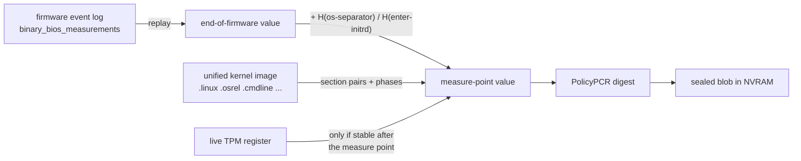
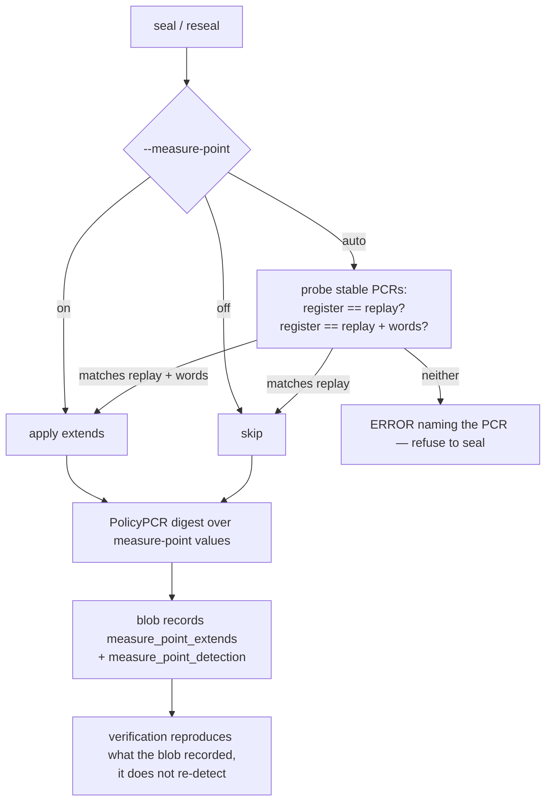

# TPM2-KIRA Security Background

This document describes the security architecture of tpm2-kira: how secrets are
protected, where data is stored, how authentication works, and what trust
boundaries exist.

---

## 1. Purpose

tpm2-kira keeps a TOTP key inside a TPM 2.0 and lets the TPM compute codes
with it only while the machine is in a known-good boot state, and only before
the disk is unlocked. If the boot chain changes (firmware update, bootloader
or kernel change, Secure Boot policy change), the TPM refuses to compute a
code. The owner, proven by possession of a signing private key, can approve
the new state; nobody, the owner included, can read the key back out of the
TPM after enrolment.

---

## 2. High-Level Architecture

```
┌──────────────────────────────────────────────────────────────┐
│                         TPM 2.0 chip                         │
│                                                              │
│  PCR registers            TOTP key object (HMAC, in blob)    │
│  PCR0, PCR7, PCR11 ...    authPolicy = PolicyAuthorize(      │
│                               signing key, policyRef)        │
│                                                              │
│  NV 0x01803010 + n   blob: key object, PCR values,           │
│                      generation G, approval signature        │
│  NV 0x01803810 + n   generation index: holds G               │
│                      (READ_STCLEAR: read-locked by `cap`)    │
└──────────────────────────────────────────────────────────────┘

┌──────────────────────────────────────────────────────────────┐
│                          Filesystem                          │
│  /etc/tpm2-kira/keys/seal.pub   signing public key       │
│  /etc/tpm2-kira/keys/seal.key   signing private key, or  │
│                                     a YubiKey reference      │
└──────────────────────────────────────────────────────────────┘
```

---

## 3. What Is Stored Where

### 3.1 TPM NVRAM (the "blob")

Each slot's NV index (default `0x01803010`; slot *n* is `0x01803010` + *n*)
stores one serialised `SealedBlob` (format version 14, §10). It holds the
slot's TOTP key or its phones, never both (*TOTP key or phones*, below).
Remote attestation is an optional part of the same blob,
and within that part the way a verifier reaches the machine is a typed
*method*: today phones over Bluetooth LE; a verification server over the
network would be another method next to it. The blob contains:

| Field               | Content                                                         | Sensitive? |
|---------------------|-----------------------------------------------------------------|------------|
| `Version`           | Blob format version (14)                                        | No         |
| `Public`            | TPMT_PUBLIC of the TOTP key object; empty while phones are enrolled | No     |
| `Private`           | TPM2B_PRIVATE of the TOTP key object (TPM-wrapped); empty with phones | **Yes**¹ |
| `PCRDigests`        | Per-PCR index, source (register/eventlog/uki) and digest        | No         |
| `TOTPAlgorithm`     | HMAC hash of the key: SHA-1, or SHA-256 on a TPM without SHA-1; 0 with phones | No |
| `Generation`        | The generation the approval requires                            | No         |
| `PolicyRef`         | Random per slot; qualifies its approvals for all its keys       | No         |
| `SigningPublic`     | TPMT_PUBLIC of the signing key                                  | No²        |
| `ApprovalSignature` | Signing key's signature over `H(approvedPolicy ‖ PolicyRef)`    | No         |
| `MeasurePointApplied` | Whether the eventlog PCRs' values include the measure-point extends³ | No |
| `Attestation`       | The optional remote-attestation part (fields below)             | Partly⁵    |
| `BlobSignature`     | Signature over everything above                                 | No⁴        |

The attestation part (`Attestation`), created by `attest enrol`. It describes
the machine as an attester, whatever the method:

| Field           | Content                                                              | Sensitive? |
|-----------------|----------------------------------------------------------------------|------------|
| `DeviceID`      | 16 random bytes naming this machine to its verifiers                 | No         |
| `FriendlyName`  | The machine's name as verifiers show it                              | No         |
| `AKPublic`      | TPMT_PUBLIC of the attestation key, which signs the quotes; its Name, which verifiers pin, is computed from it | No |
| `AKPrivate`     | TPM2B_PRIVATE of the attestation key (TPM-wrapped)                   | **Yes**¹   |
| `EKAlg`         | Which endorsement key template enrolment used (ECC or RSA)           | No         |
| `BootKeyPublic` | TPMT_PUBLIC of the boot key (§3.4)                                   | No         |
| `BootKeyPrivate`| TPM2B_PRIVATE of the boot key (TPM-wrapped)                          | **Yes**¹   |
| `ReleaseKeyPublic` | TPMT_PUBLIC of the release key (§3.7)                             | No         |
| `ReleaseKeyPrivate`| TPM2B_PRIVATE of the release key (TPM-wrapped)                    | **Yes**¹   |
| `PCRAlg`, `PCRSelection` | The PCR bank and registers that are quoted                  | No         |
| `Count`         | Value of the slot's record counter when the part last changed (§3.3) | No         |
| methods         | Who may ask for a quote, and over what: typed blocks, below          | Partly⁵    |

Method 1, phones over Bluetooth LE (`Phone`):

| Field           | Content                                                              | Sensitive? |
|-----------------|----------------------------------------------------------------------|------------|
| `NoisePrivate`  | The machine's static key for the encrypted channel to the phones     | **Yes**⁵   |
| `AdvKey`        | Key that lets an enrolled phone recognise the machine's advertising  | **Yes**⁵   |
| `Verifiers`     | Up to 8 phones: id, anchor public key (signs the phone's verdicts), channel public key, policy id; no name | No |

**TOTP key or phones.** A slot is checked one way at a time. Without a phone
its TOTP key shows a code at boot, compared with the authenticator. The first
phone enrolled for the slot retires the key: the phone's check (the quote,
the boot key's code, the person's confirmation on the phone, §13) covers what
the code proves and more, and a second, weaker path to the same verdict
would only be one more thing to keep, lose or leak. While a phone is enrolled
the boot screen shows the slot as "mobile attestation locked - please
connect" until the phone is in, then the phone's code, then the verdict.
When the last phone leaves, the slot gets a new TOTP key at once, made under
the slot's policy, so the approval in force covers it without a reseal; its
QR code is shown then. The slot's policy (`SigningPublic` and `PolicyRef`)
stays through all of it: the boot key and the release key are made under
it, not under the TOTP key, and keep working. The fallback, slot 1, keeps
its code: it is the check for a boot without the phone (a flat battery, a
lost phone, no Bluetooth in the initrd).

**Why a slot starts with a TOTP key: the phone is enrolled in a verified
boot.** Enrolment is trust on first use for the phone: it pins the
machine's attestation key and takes the boot state of the enrolling boot
as the baseline every later boot is compared with. Nothing the phone can
check itself says that this first state is clean; a boot chain that was
tampered with before the enrolment would be pinned as good. Only a check
made before the phone existed can say it, so the order is fixed:

1. The slot is sealed with a TOTP key (`control`'s part 1, or `seal`).
2. The machine boots through tpm2-kira's code screen. The code exists only
   while the PCRs are the ones the signing key approved, and the person
   compares it with the authenticator: this boot is verified.
3. In that boot the phone is enrolled (part 2, `attest enrol`), and with
   that the slot's TOTP key is retired.

`attest enrol` enforces what the machine can know of this (`requireVerifiedBoot`
in `cmd/attest.go`): the boot passed the code screen (`cap` read-locked
the generation indices, which happens only there), and, for a slot with a
TOTP key, the slot's PCRs at the code screen - recomputed from this boot's
event log, before the OS separator, with `enter-initrd` on PCR 11 - are
the approved ones, so the screen did show the slot's code. A boot that
fails either is refused: it was not verified, whatever happened at its
screen. What the machine cannot know, that someone compared the code, it
asks before the phone is involved. A further phone for a slot that
already has phones needs a boot an enrolled phone attested ("mobile
attestation passed"); the machine keeps no record of that verdict, so it
asks. The rule holds for `control` and for `attest enrol` by hand alike.

**What the machine keeps of a phone, and why no more.** The blob is readable
by anyone who can talk to the TPM (§9), so it holds only what the machine
needs to find and trust its phone:

- the phone's channel key, by which the machine recognises it in the
  encrypted handshake, and the id it signs its receipts with;
- the anchor key, which verifies the phone's verdicts;
- nothing that names the phone. The phone sends no name (it used to send
  its model), the machine numbers its phones ("phone 1", "phone 2") and
  says at boot only that "your phone" attested. The machine finds the phone
  by itself, in the handshake, so nobody needs to be told which phone to
  pick up; the person knows their phone.
- no Bluetooth address: the phone connects to the machine, which
  advertises with a new random address at every boot, and the phone's
  address is never stored.

And none of it links a phone across machines: the phone makes a new
channel key, id and anchor key for every machine it enrols with
(PROTOCOL-BLE.md §11.1, §11.2), so two machines comparing what they keep
find nothing in common. One phone still attests any number of machines,
each through its own record.

¹ The `Private` field is encrypted by the TPM's storage hierarchy. It cannot be
decrypted outside the TPM that created it, and the key in it can only be
*used* by that TPM, under the object's policy. It is never decrypted for
tpm2-kira: there is no `TPM2_Unseal`. The same holds for `AKPrivate` and
`BootKeyPrivate`.

² The key object's policy binds the signing key's **Name**, so a substituted
`SigningPublic` makes `PolicyAuthorize` fail; it is stored because the key
files are not reachable in the initrd.

³ Which extends were applied follows from the eventlog PCRs: the seal folds
the same words into each of them (§5.8), so the blob keeps one flag and `info`
spells the extends out from the selection. The blob holds nothing that only
describes how it was made (the tool's version, the event log's path, the time
of the calculation, the key files' paths): what is not needed to compute a
code, to reseal or to attest is not stored, since every byte counts against
the TPM's per-index limit (§10, *Size*). The signing key's files are found at
tpm2-kira's default paths or the ones given on the command line, never from
the blob (§5.5).

⁴ The blob carries a detached signature over `[version ‖ payloadLen ‖ payload]`,
made with the same signing key. Unsigned blobs are rejected outright. It
protects the *metadata* (PCR selection and sources, UKI paths) that `reseal`
acts on; the TPM enforces the rest by itself. It also covers the attestation
part: which verifiers are enrolled cannot be changed without the signing
key, and the Bluetooth gate verifies the signature in the initrd with a copy
of the signing *public* key that the initramfs hooks put into the image.

⁵ `NoisePrivate` and `AdvKey` are stored in the clear and, unlike the two
`Private` fields, are **not** protected by the TPM: the blob is readable by
anyone who can talk to the TPM (§9). Someone who reads them can recognise the
machine's advertisements and imitate its Bluetooth endpoint, but cannot produce
a quote, which only the TPM's attestation key can sign (SECURITY.md, "Remote
attestation with a phone: what it does not protect against").

### 3.2 The generation index

Each slot has a second NV index at blob index + `0x800` (`0x01803810` for slot
0). It holds an 8-byte big-endian generation `G`. Attributes:

- `OwnerRead`, `AuthRead` (empty auth): anyone can read it, as `PolicyNV` must.
- `PolicyWrite` with the same PolicySigned policy as the blob: only the
  signing key can write it.
- `READ_STCLEAR`: `TPM2_NV_ReadLock` makes it unreadable until the next TPM
  reset, i.e. reboot. Nothing else can undo the lock.

### 3.3 The record counter

A slot with an attestation part has a third NV index, at `0x01803820` + *n*: an
8-byte **counter** (`TPM_NT_COUNTER`), with `OwnerWrite`, `OwnerRead`,
`AuthRead` (empty auth) and `NoDA`.

It is a revision number for the attestation part, kept by the TPM. It does
**not** count attestations: nothing is written to the TPM's NV storage when
the machine boots or is attested. It moves only when the verifiers of the
slot change (`attest enrol`, `attest unenrol`), typically a handful of times
in a machine's life.

It answers a question a signature cannot: is this blob the *current* one? An
older blob, still naming a phone that was removed since, verifies just as well.
So the attestation part carries a `Count`, and the gate accepts the blob only
while `Count` equals the counter. `attest enrol` and `attest unenrol` write the
blob with the counter's next value and then increment the counter; `reseal`
and `seal` carry the part over with its `Count` unchanged.

A TPM counter can only be incremented. Deleting the index does not help
either: the TPM starts a new counter above the highest value any counter in
it ever had. The gate also insists that the index *is* a counter, since an
ordinary index at the same handle could hold any number. Whoever has the owner
hierarchy can raise the counter, which makes the genuine blob stale until the
user enrols again: a denial of the phone check, never an accepted blob.

### 3.3a The boot settings

One NV index per machine, `0x01803000` (the free start of the range, below
the slots), holds the switches the boot reads: today one, debug, which makes
the code screen and the phone check log every step and put the narrative on
the console. Format: `[version:1 = 1][flags:1]`, bit 0 debug; another
version or an unknown flag is refused. It exists only while a switch is on.
`control` writes it with the signing key (PolicySigned, as the slots'
blobs), so nobody else can turn on verbose output on the console; anyone
with TPM access can read it, and it holds nothing secret. It is not
measured and not signed beyond its write policy: it changes how much is
logged, never what is trusted. Keeping it in the TPM rather than on the
kernel command line or in the image means switching it changes neither the
image nor PCR 11.

### 3.4 The boot key

The attestation part holds a second TPM key, the *boot key*: an ECC P-256 key
for signing and key agreement, created inside the TPM (`sensitiveDataOrigin`,
`fixedTPM`, `fixedParent`), with `userWithAuth` clear and the **same policy as
the slot's TOTP key**: PolicyAuthorize by the signing key with the slot's policy
reference. So it is usable exactly when a TOTP code can be computed - in a
boot state the signing key approved, at the slot's current generation, before
`cap` - and one approval covers both keys; `reseal` needs to know nothing
about it. `seal` on an existing slot keeps the slot's policy reference when it
carries the attestation part over, so that the boot key stays under the new
TOTP key's approvals.

At enrolment the attestation key certifies it (`TPM2_Certify`, bound to the
session), and the phone pins its public point after checking the attributes
above and its policy: the machine sends the signing key's public area and the
slot's policy reference, the phone recomputes the PolicyAuthorize digest and
compares it with the certified key. So the phone knows, not merely assumes,
that the key lives in the TPM it has verified, cannot be used with a
password, and unlocks on nothing but that signing key's approvals. It pins
the signing key's Name with the point.

At every attestation the phone seals a fresh eight-character code to the
boot key (ECDH with a one-time key, HKDF-SHA256, AES-256-GCM, bound to the
session's qualifying data). `TPM2_ECDH_ZGen` under the slot's policy recovers
it. The machine shows the code on its screen, returns a MAC as proof, and
signs the session's qualifying data together with the quote's digest with
the same key (`TPM2_Sign`, under the same policy). The phone verifies the
MAC with its own key and the signature with the pinned point, shows the code
and the result, and signs nothing before the person confirms. The signature
is the transferable half: anyone with the pinned point can verify, now or
later, that this quote describes a state the signing key approved. The code never travels back, and in the initrd the radio worker
never sees it: the coordinator's TPM opens the challenge and hands the worker
the proof only.

What it adds to the quote: the TPM's own statement that this boot state is
an approved one, and a tie between the phone's session and the screen in
front of the person. A look-alike machine that forwards the Bluetooth session
to the real one cannot show the code. What it does not replace: when the TPM
refuses the key, only the quote says which registers differ; and the key
trusts what the signing key approved, where the phone's own profiles do not.

### 3.5 How several keys live in one slot, and what the TPM keeps

A slot is **data**, not a key inside the TPM: a few hundred bytes in an NV
index. The keys in it are stored the way TPM 2.0 stores every ordinary key -
outside the TPM, wrapped so that only this TPM can use them.

The TPM has almost no storage of its own. `TPM2_Create` returns two things
for a new key: the **public area** (algorithm, attributes, policy digest,
public key) and the **private area**, the private key encrypted and
integrity-protected by the TPM with a key derived from its storage primary
seed, which never leaves the chip. Those bytes can be kept anywhere; nobody
can read the private key out of them, and no other TPM can use them
(`fixedTPM`, `fixedParent`). To use the key, software hands both areas back
with `TPM2_Load`: the TPM decrypts the private area internally, checks it,
and returns a temporary handle. The key is used (`TPM2_HMAC`, `TPM2_Sign`,
`TPM2_ECDH_ZGen`) and flushed. The plaintext key exists only inside the TPM,
during that use. tpm2-kira never sees a private key: it moves wrapped bytes
and asks the TPM to use them.

So the slot's blob holds three independent key objects as wrapped bytes, in
one place:

```
NV index 0x01803010+n   (bytes, under one signature by the signing key)
├── TOTP part
│   ├── TOTP key          public area + wrapped private area   ← TPM key object
│   ├── approved PCR values, generation, policy reference
│   └── signing public key, approval signature
└── attestation part
    ├── attestation key   public area + wrapped private area   ← TPM key object
    ├── boot key          public area + wrapped private area   ← TPM key object
    └── phones (anchor keys, channel keys), revision
```

The TPM has no notion of "slot"; it is given one key at a time. The NV index
is used, rather than a file, only because the keys are needed in the initrd
before the disk is unlocked, and because its write policy (§9) and the
companion indices (§3.2, §3.3) are TPM mechanisms.

What ties the TOTP key and the boot key together is not where they are stored
but their **policy**. Each key's public area carries a policy digest, fixed
at creation and part of the key's Name; both carry the same one, PolicyAuthorize
by the signing key with this slot's policy reference (§4). Using either key
goes the same way:

1. read the blob from NV; re-create the storage primary (deterministic from
   the seed, the same key every time);
2. `TPM2_Load` the key wanted;
3. open a policy session: `PolicyPCR` on the current registers, `PolicyNV`
   on the generation index, then `PolicyAuthorize` with the approval
   signature from the blob, which the TPM verifies against the signing key;
4. if the session's digest equals the key's policy digest, the TPM runs
   `TPM2_HMAC` (the code), or `TPM2_Sign` and `TPM2_ECDH_ZGen` (the boot key).

The same session satisfies either key, which is why one reseal covers both,
and why a key with a different policy is a different key with a different
Name - the check the phone makes at enrolment (§3.4).

What the TPM itself keeps, and never gives out:

- **Storage Primary Seed**: generates the primary key deterministically.
- **Primary Key** (ECC P-256, restricted decrypt): re-derived on every use with
  `TPM2_CreatePrimary` from a fixed template; parent of the key objects and the
  salt key for the session that carries the TOTP key in at seal time.
- **The keys while loaded**: the TOTP key, a keyed-hash object with the HMAC
  scheme (the TPM computes `HMAC(key, counter)` in `TPM2_HMAC`; tpm2-kira
  receives only the 20- or 32-byte result and truncates it to six digits,
  RFC 4226); the attestation key; the boot key.

### 3.6 Filesystem (signing key pair)

`tpm2-kira setup` generates an ECDSA P-256 pair, or records a key in a YubiKey
PIV slot. Any RSA-2048 or ECC P-256/P-384 key works instead, including the
sbctl Secure Boot DB key, via `--pubkey` / `--privkey`.

`setup` writes both key files with mode `0400`. `seal` and `reseal` read a
key file only through `ReadSigningKeyFile` (`cmd/keyfile.go`), which refuses:

- a symlink (the file is opened with `O_NOFOLLOW`),
- anything but a regular file with exactly mode `0400`,
- a file not owned by root or by the user running tpm2-kira,
- a file in a directory that is group- or world-writable, or owned by
  someone else.

The checks run on the open descriptor and the key is parsed from the content
read through that same descriptor, so the file cannot be swapped between
check and use.

---

## 4. Authentication Model: PolicyAuthorize

### 4.1 The key object's policy

```
authPolicy = H( H(0…0 ‖ TPM_CC_PolicyAuthorize ‖ signingKeyName) ‖ policyRef )
```

It is fixed when the object is created and never changes. It says: *use this
key under whatever policy the signing key has approved for `policyRef`*.
`UserWithAuth` is clear, so there is no password path.

### 4.2 The approved policy

```
pcrPolicy      = H(0…0 ‖ TPM_CC_PolicyPCR ‖ PCR selection ‖ H(PCR values))
approvedPolicy = H(pcrPolicy ‖ TPM_CC_PolicyNV ‖ H(G ‖ offset 0 ‖ EQ) ‖ generationIndexName)
approval       = Sign_signingKey( H(approvedPolicy ‖ policyRef) )
```

The approval is stored in the blob. It is only valid while the PCRs hold the
sealed values **and** the generation index holds `G` and is readable.

### 4.3 Computing a code

```
1. PolicyPCR          TPM reads the live registers
2. PolicyNV           TPM reads the generation index, compares with G
                      (fails if the index is read-locked)
3. VerifySignature    TPM checks the approval against the session digest
                      → ticket (signing key loaded in the owner hierarchy:
                        PolicyAuthorize refuses the NULL ticket a
                        NULL-hierarchy key produces)
4. PolicyAuthorize    session digest := the key object's authPolicy
5. HMAC(counter)      TPM computes the code's HMAC
```

### 4.4 Where the guarantee is enforced

Every decision is made **inside the TPM**. `TPM2_PolicyPCR` derives the PCR
digest from its own registers; `TPM2_PolicyNV` reads the index itself;
`TPM2_VerifySignature` checks the approval; `TPM2_PolicyAuthorize` accepts
only the signing key whose Name is bound in the object. If any of these
differ by one bit, `TPM2_HMAC` is refused. The software comparisons tpm2-kira
makes first (PCR values, generation) only produce readable errors.

### 4.5 What the parts buy

- **The key never leaves the TPM.** No unseal exists. Neither root, nor
  another booted OS, nor a probe on the TPM bus can obtain the key. An attacker
  who satisfies the policy can make the TPM compute codes for chosen times,
  so a matching state still matters — but stolen access yields a list of
  codes for the times it was used, not the key forever.
- **Reseal does not need the key.** New PCR values are approved by signing;
  the object is unchanged, so no re-enrolment.
- **Revocation.** Each reseal raises `G`. Older approvals require an older `G`
  and stop working, so an attacker who kept an old blob cannot roll the
  machine back to an old kernel or initrd.
- **The cap.** `tpm2-kira cap`, run when the initrd is left, read-locks the
  generation index. `PolicyNV` fails until the next reboot, so nothing in the
  running OS can compute a code, root included. Deleting and recreating the
  index does not help: the policy binds the index's Name, and a recreated
  index has a different Name until it is written, which needs the signing key.
- **`policyRef` per object.** Approvals are bound to one key object. Without
  it, every approval ever made with the signing key — for any slot, or for an
  earlier seal — would fit every object.

### 4.6 What this does *not* guarantee

> The TPM computes codes when the PCRs match the approved values, the
> generation matches, and the index is not locked — or under any other state
> the signing key approves.

Anyone holding the signing private key can approve any state. The key is as
security-critical as the TPM policy. `/etc/tpm2-kira/keys/seal.key` sits on
the encrypted root filesystem, so it is not reachable in the initrd; with a
YubiKey, it is never on disk.

---

## 5. Operation Flows

### 5.1 Seal

```
1.  Load and check the signing key files; for a YubiKey, verify the PIN
2.  Pick the HMAC hash: SHA-1, or SHA-256 if the TPM has no SHA-1
3.  Generate the TOTP key (20 bytes for SHA-1, 32 for SHA-256)
4.  policyRef := 32 random bytes
5.  CreatePrimary; Create the HMAC key object with
    authPolicy = PolicyAuthorize(signing key, policyRef). The key is sent in
    a session salted with the primary key, with parameter encryption
6.  Approve and write (§5.3) with G = 1
7.  Show the key once, as base32 and QR code, for the authenticator
```

### 5.2 Reveal / run (initrd)

```
1.  Read the blob from NVRAM, deserialise (not verified: no key in the initrd)
2.  Read the generation index; compare with the blob's G         (advisory)
3.  Compare the blob's PCR digests with the live registers       (advisory)
4.  CreatePrimary, Load the key object
5.  Policy session as in §4.3, then TPM2_HMAC(time / 30)
6.  Truncate to six digits
7.  After the hold: answer systemd-cryptsetup's key requests on the
    unlock socket, one volume at a time, with what is typed at the prompt
```

A planted blob can only carry an object its author created, whose key does
not match the user's authenticator; the substitution shows as a failed
comparison, not a false pass.

Step 7 is where the disk's key enters, and it is deliberately
systemd-cryptsetup's own mechanism (crypttab(5), AF_UNIX key files, the
socket named as the volume's key file by `rd.luks.key=`) rather than a prompt of
tpm2-kira's that systemd knows nothing about: the volume is activated by
systemd-cryptsetup with its crypttab options, after the OS separator as
always, and only the source of the key moves. What tpm2-kira answers with
is the whole of its trust in the unlock: today the typed passphrase, so
the security is unchanged; with factor release a key derived from the
passphrase and the phone's factor. The request waits for as long as
tpm2-kira takes, which is what makes a hold real without a unit that
refuses to start; and a wrong or missing answer sends systemd-cryptsetup
to its own prompt for the remaining tries, so the passphrase can always
be entered by hand - there is no enforced mode (UNLOCK-DISK.md §4). The
provider trusts nothing about the requester beyond its uid and its peer
name, and gives nothing to a request for a token's saved key: it holds no
such keys.

#### Disk unlock: who does what

tpm2-kira does not open the disk. It never reads the LUKS header, derives
a key or speaks to device-mapper; it hands over bytes when asked, in the
place a key file would be. The transfer, step by step:

```
1.  tpm2-kira-unlock.socket creates /run/tpm2-kira/unlock.sock (root, 0600)
    before cryptsetup-pre.target; tpm2-kira.service adopts it (Sockets=,
    LISTEN_FDS).
2.  The kernel command line names that path as the volume's key file
    (rd.luks.key=<UUID>=/run/tpm2-kira/unlock.sock; or an x-initrd.attach
    line of /etc/crypttab does, in its key field), and the generator made
    systemd-cryptsetup@<volume>.service from it before any unit ran.
3.  systemd-cryptsetup@<volume>.service runs
      systemd-cryptsetup attach <volume> <device> /run/tpm2-kira/unlock.sock
    The key "file" is a socket: it binds an abstract client socket named
    NUL ‖ random ‖ "/cryptsetup/" ‖ <volume> and connects.
4.  tpm2-kira checks the peer's uid (its own: root) and reads the volume
    out of the peer name. Any other peer, and the token kinds
    (/cryptsetup-tpm2/, -fido2-salt/, -pkcs11/, which want a saved token
    key), are closed without data.
5.  The request waits until the hold has ended (READY), then, one at a
    time, the key source runs: today the prompt on /dev/console.
6.  tpm2-kira writes the raw bytes - no newline, no length, no framing;
    EOF ends the key - wipes its copy and closes.
7.  systemd-cryptsetup unlocks the keyslot with those bytes and maps the
    volume. A wrong passphrase is a wrong key file: systemd-cryptsetup
    drops the key file and asks for a passphrase itself, through its
    password agent on the console, for the remaining tries (3 in all);
    tpm2-kira is not told. Only then the unit fails. No answer at all
    (the connection closed without data) is treated the same.
```

What is systemd's, used as installed by sd-encrypt: `systemd-cryptsetup`,
its generator, `cryptsetup.target` and `cryptsetup-pre.target`, the
generated `systemd-cryptsetup@*.service` units, the dm-crypt modules and
udev rules, the crypttab in the image. What is tpm2-kira's: the socket
unit and the provider (`cmd/unlock.go`), whose key source is one function
of the volume name - factor release replaces that function, not the
transfer. The configuration is the administrator's
`rd.luks.key=` on the kernel command line.

The transfer is the one systemd offers for exactly this: a key provider
service. systemd's interactive path (the password agent on
`/run/systemd/ask-password`, which the console prompt uses) is also an
AF_UNIX socket under `/run`, in the other direction - the agent sends the
typed passphrase to the waiting `systemd-cryptsetup` as a datagram, and
the receiver drops datagrams from any sender that is not root. Here the
provider is the one that checks: a connection from another user than
tpm2-kira's own (root in the initrd) is refused before the peer name is
read. Both channels are root-only `/run` sockets that never touch a file
or the kernel keyring; the `password-cache` option, which would keep a
passphrase in the keyring for later volumes, does not apply to volumes
routed here.

Memory. `systemd-cryptsetup` locks its whole address space (`mlockall`,
through libcryptsetup's `crypt_memory_lock`) so that no page with key
material can be written to swap, keeps the key in libcryptsetup's guarded
buffers and erases them (`explicit_bzero`) when done; its password agent
erases the line it read as well. tpm2-kira does the equivalent for the
one buffer that matters: the passphrase is read into a single buffer of
cryptsetup's own limit (512 bytes, no growing slice that would leave
earlier copies to the garbage collector), that buffer is locked
(`mlock`), it is overwritten to its full capacity after the answer, on
Backspace and on cancel, and the process is not dumpable
(`PR_SET_DUMPABLE`), so a crash cannot write it to a core file. What
neither side can do: the kernel's socket buffer holds the bytes between
write and read (freed, not zeroed), and a hibernation image would hold
all of RAM, locked or not - neither exists in the initrd, which has no
swap. The whole of it, with what sd-encrypt is: `UNLOCK-DISK.md`.

### 5.3 Approve and write (seal and reseal)

```
1.  Compute the PCR values for the next boot (§5.6–5.8)
2.  pcrPolicy := PolicyPCR digest of those values
3.  Write G' = G + 1 to the generation index (PolicySigned)
    → from here every older approval is revoked
4.  approvedPolicy := PolicyNV(pcrPolicy, generation index == G')
5.  Sign the approval; update the blob; sign the blob; write it (PolicySigned)
```

If step 5 fails, the slot shows no code until a reseal succeeds; the blob is
stashed as described in §9.

### 5.4 Reseal

```
1.  Read the blob; load the signing key (--privkey or the default key, never
    a path from the blob) and verify the blob's signature with it
2.  Check the key is the one the key object trusts (SigningPublic)
3.  For a YubiKey: find it and verify the PIN, before anything is written
4.  Approve and write (§5.3) with the preserved or given PCR selection
```

Reseal never unseals, never uses the key object, and does not need the PCRs
to match. It works in the running OS while the generation index is
read-locked: the index's Name for `PolicyNV` is computed with the
`READLOCKED` bit cleared, which is what it is in the initrd.

### 5.5 Key resolution in reseal

```
Private key = --privkey flag  →  /etc/tpm2-kira/keys/seal.key
Public key  = --pubkey flag (must match)  →  derived from the private key
```

The blob names no key file. The blob is what the key is about to verify, and
anyone with TPM access can replace it (§9): a planted blob signed by its
author's key and naming that key would otherwise verify against itself, and
reseal would report success instead of tampering. So the key comes from the
command line or tpm2-kira's default location, and a slot sealed with a
non-default key always needs `--privkey` on reseal.

`resolveResealKeys` in `cmd/reseal.go` implements this.

### 5.6 The measure point

A PCR policy is checked against **live registers at the instant a code is computed**.
For tpm2-kira that instant is one specific point in the boot: the moment
`tpm2-kira run` reads the TPM in the initrd, before the LUKS passphrase prompt.
Everything sealing does must answer one question:

> What will PCR *i* be at the measure point of the *next* boot?

That is neither "what the firmware log says" nor "what the running system
shows". Both differ, in different directions:

```mermaid
sequenceDiagram
    participant FW as Firmware
    participant STUB as systemd-stub / EFI stub
    participant SD as systemd (initrd)
    participant KIRA as tpm2-kira
    participant OS as systemd (real root)

    FW->>FW: PCR 0-7 firmware events, then EV_SEPARATOR
    STUB->>STUB: PCR 11 section pairs, PCR 9 LoadOptions + initrd, PCR 12
    Note over FW,STUB: everything above appears in binary_bios_measurements

    SD->>SD: enter-initrd into PCR 11
    Note over SD,KIRA: not in the firmware log — systemd logs these separately

    KIRA-->>KIRA: MEASURE POINT: a fresh code per 30 s until Enter or 90 s; READY=1

    SD->>SD: os-separator into PCR 0-7, 9, 12, 13, 14
    Note over SD: one-way: the key's policy is unsatisfiable until the next boot

    OS->>OS: leave-initrd, sysinit, ready into PCR 11
    OS->>OS: machine-id into PCR 15
    OS->>OS: nvpcr-init x4 into PCR 9 (after the disk is unlocked)
    Note over OS: these make the post-boot register useless as a reference
```

Two consequences follow, and both caused real breakage:

1. **The firmware event log stops short of the measure point.** It describes
   the end of firmware. The systemd extends that follow are recorded in
   `/run/log/systemd/tpm2-measure.log`, a different file written by a
   different producer. Replaying only the firmware log under-counts.
2. **The live register at seal time is past the measure point** for any PCR
   that keeps being extended afterwards. PCRs 9, 11 and 15 do; PCRs 0–7, 12,
   13 and 14 stop, which is what makes them usable as a reference.

### 5.7 Reconstructing each PCR



Per source:

| Source | Reconstruction | Valid for |
|--------|----------------|-----------|
| `r` register | read the register as-is | PCRs that stop changing at the measure point |
| `e` eventlog | replay the firmware log, then apply the measure-point extends | PCRs 0–12 |
| `u` uki | replay systemd-stub's section measurements from the image, then the boot phases | PCR 11 |

> **The event log and the TPM banks are independent.** A machine can have a
> SHA-256 PCR bank but a firmware event log that only carries SHA-1 digests.
> The `e` source then has nothing to replay in the selected bank, and a naive
> replay returns the PCR's all-zero reset value — a plausible-looking digest
> that the machine will never produce. tpm2-kira counts the extends applied per
> PCR and refuses in that case rather than sealing it.
>
> The SHA-256 value cannot be derived from a SHA-1 log: PCR values in different
> banks are different values, and several event types (`EV_EFI_VARIABLE_*`,
> `EV_SEPARATOR`) have digests that are not simply a hash of the logged payload,
> so re-hashing the payloads would be wrong. On such a machine either use
> `--sha1` (needs a SHA-1 PCR bank on the TPM) or the register source. For
> PCRs 0–7 the register source is equivalent — they do not change between the
> measure point and seal time — so nothing is lost by using it there.

**Measure-point extends** (systemd hashes the literal word: no NUL terminator,
no machine-id, no salt, so these are universal constants, not per-host values):

| Word | Extended into | Unit | `sha256` |
|------|---------------|------|----------|
| `os-separator` | PCR 0–7, 9, 12, 13, 14 | `systemd-pcrosseparator.service` | `ff5b9d73dad709633ae76adf444012b57e913a12ed7403c3931145862f35f841` |
| `enter-initrd` | PCR 11 | `systemd-pcrphase-initrd.service` | `51e6b92f405d1f98d96e3de343d61d420ad6923b25de21d766f9298192f14fed` |

Extended *after* the measure point, and therefore never part of a sealed
policy: `leave-initrd`, `sysinit`, `ready` (PCR 11), `machine-id:<id>` (PCR 15),
`nvpcr-init:<name>:...` (PCR 9).

> **An initramfs without systemd has no measure-point extends.** On Debian's
> initramfs-tools the code is shown from an `init-premount` script, and none of
> the units above exist, so the measure point *is* end-of-firmware and
> `--measure-point=auto` resolves to `off`. There is also no UKI, so PCR 11 is
> empty and the `u` source does not apply; GRUB's measurements land in PCR 8
> (every command it runs, logged as `grub_cmd: ...`) and PCR 9 (the *contents*
> of every file it reads — grub.cfg, modules, kernel, initrd — plus
> `LOADED_IMAGE::LoadOptions`) instead.
>
> PCR 8 and 9 therefore change on **every** kernel or initramfs update. The
> `e` source predicts their next value from this boot's log: GRUB's and the
> stub's digest conventions are known (a file event is the file's SHA-256, a
> `grub_cmd` the command text's, the load options the UTF-16 of
> `BOOT_IMAGE=` plus the command line), so the entries of what changed on disk
> are replaced and the log replayed (`cmd/grub_predict.go`, with the
> `menuentry`/`submenu` commands rebuilt from the new grub.cfg, since GRUB
> measures them with their body). What it cannot foresee - a menu choice, an
> edited command line, a grubenv the boot rewrites - leaves a boot without a
> code and a reseal after it.

**UKI section measurement.** systemd-stub measures each present section twice,
in its own fixed order (`.linux`, `.osrel`, `.cmdline`, `.initrd`, `.ucode`,
`.splash`, `.dtb`, `.uname`, `.sbat`, `.pcrpkey`; `.pcrsig` is never measured
because it carries the signature over these measurements):

```
PCR11 = Extend(PCR11, H(section_name + "\0"))    # NUL-terminated ASCII
PCR11 = Extend(PCR11, H(section_bytes))
```

The firmware event log *renders* the name as UTF-16 (`".\0l\0i\0n\0u\0x\0\0\0"`),
which is the event payload — but the measured digest is over the ASCII form.
`H(".linux\0")` = `0da293e37ad5511c59be47993769aacb91b243f7d010288e118dc90e95aaef5a`.

> **Trap:** `section_bytes` is the **unpadded** content. PE sections are padded
> up to the file alignment, and Go's `debug/pe` exposes that padded length as
> `Section.Size` (it is `SizeOfRawData`); the content length is
> `Section.VirtualSize`. Measuring the padded length yields a PCR 11 value the
> machine will never present. See `docs/UKI-PCR11-PADDING.issue`.

`tpm2-kira seal` guards this by recomputing PCR 11 from the image and comparing
it against the current boot's event log, refusing to seal on mismatch
(`--verify-uki=false` overrides). `reseal` skips the check because it runs
when the image on disk is legitimately not the one that booted.

**Useful constants for diagnosis.** PCRs 2, 3 and 6 normally contain only the
firmware `EV_SEPARATOR`, so their value is machine-independent:

| State | sha256 |
|-------|--------|
| `EV_SEPARATOR` event digest | `df3f619804a92fdb4057192dc43dd748ea778adc52bc498ce80524c014b81119` |
| zero PCR + separator (end of firmware) | `3d458cfe55cc03ea1f443f1562beec8df51c75e14a9fcf9a7234a13f198e7969` |
| the same + `os-separator` (measure point) | `8d22c738fcd1730fb0789cb09c0f72a0012baa3ea867723b26772c9ca0ae6571` |

If PCR 2/3/6 hold neither of the last two, something is performing extra
extends — it is never a changed measurement.

### 5.8 Making the seal match the measure point



Three properties make this safe:

- **Refusal beats guessing.** A PCR whose register matches neither branch is
  not reconstructible on that host, and sealing would bind the policy to a
  value the machine will never produce. That is a silent failure at the next
  boot, so `auto` errors out instead.
- **Build-time beats run-time for the transition.** The mkinitcpio install
  hook inspects the image being built and records the verdict, because
  probing the *current* boot cannot know what the *next* one will do — exactly
  the case where these units first appear in the initramfs.
- **The blob is self-describing.** What was applied is stored, so verification
  recomputes the sealed values rather than re-deriving them from a system that
  may have changed. `tpm2-kira info` shows it.

Ordering is enforced so the measure point is deterministic:
`tpm2-kira.service` declares `After=systemd-pcrphase-initrd.service` and
`Before=systemd-pcrosseparator.service`, and is `Type=notify`. Without those
edges the measure point could land on either side of the extends, which would
make an identical machine pass or fail across identical boots.

Running *before* the separator is what makes the codes boot-time codes.
`tpm2-kira run` shows a fresh code every 30 seconds and asks whether it
matches the authenticator; Enter, or the end of the 90-second hold, sends
`READY=1` and the display exits; the separator runs after READY and extends
PCRs 0–7, 9, 12–14. Extends are one-way, so from then on no process in the
booted system can satisfy the key's policy: the key never left the TPM, the
display only ever held the code it was showing, and a runtime compromise
cannot turn into a forged code at the next boot. Holding the boot costs
nothing in security: during the hold only the measured initramfs runs, and
the codes on the screen are the design. `tpm2-kira cap` at
`initrd-switch-root` read-locks the generation index on top of that, which
also covers blobs whose policy holds after the separator.

The attestation gate (`tpm2-kira-attest.service`) stays *after* the
separator: a quote is not a secret, post-separator values are a fixed function
of pre-separator ones, and the gate advertises for a while during which it
could not hold the separator back. Its baseline is predicted for that point.

What the separator does not cover is the signing key: whoever can use it can
approve a new policy for the current state and compute codes at any time.
Keep it on a YubiKey (the intended setup), or at least off the machine; a key
file in `/etc/tpm2-kira/keys` is the fallback, and with it a runtime root
has that power.

---

## 6. Policy Digests: Software vs TPM Computation

The PolicyPCR digest is computed by the TPM in a trial session. The PolicyNV
and PolicyAuthorize digests are computed in software (`cmd/totpkey.go`):

```
PolicyNV:        H(prev ‖ 0x00000149 ‖ H(operandB ‖ offset:2 ‖ operation:2) ‖ indexName)
PolicyAuthorize: H( H(prev ‖ 0x0000016A ‖ keySignName) ‖ policyRef )
```

Software computation is required, not a convenience: after `cap`, the
generation index is read-locked, and its current Name carries the
`READLOCKED` bit. A reseal in the running OS must still produce the digest the
initrd will see, so it computes the Name from the index's public area with
that bit cleared.

A wrong digest cannot weaken anything — the TPM would simply refuse to
compute codes — but it would lock the user out. The integration tests check
every digest against real policy sessions on swtpm, including a reseal while
the index is read-locked followed by a reboot.

The PolicySigned digest that guards NV writes is computed by the TPM in a
trial session, with the signing key loaded via `TPM2_LoadExternal`.

---

## 7. Key Requirements and TPM Compatibility

### Supported key types

| Key Type   | LoadExternal  | Notes                              |
|------------|---------------|------------------------------------|
| RSA-2048   | ✓             | Universally supported              |
| RSA-4096   | TPM-dependent | Many consumer TPMs reject this     |
| ECC P-256  | ✓             | Recommended; compact and fast      |
| ECC P-384  | ✓             | Supported but less common          |

The TPM must load the signing public key to verify approvals
(`TPM2_VerifySignature`) and NV write authorisations (`TPM2_PolicySigned`).
`seal` loads it before creating anything, so a key the TPM cannot load is
refused up front.

### Key scheme

Keys are loaded into the TPM with an explicit signing scheme:

- RSA: `TPM_ALG_RSASSA` with `TPM_ALG_SHA256`
- ECC: `TPM_ALG_ECDSA` with `TPM_ALG_SHA256`

The scheme is part of the `TPMT_PUBLIC` structure and therefore part of the
key's **Name**. Changing the scheme changes the Name, which changes the key
object's `authPolicy` and the NV write policy, so it must be the same at seal,
reseal and boot.

---

## 8. Threat Model

### What the TPM protects against

| Threat                                      | Mitigation                                |
|---------------------------------------------|-------------------------------------------|
| Offline disk theft                          | The key object is TPM-wrapped; useless without the specific TPM chip |
| Boot chain tampering (evil maid)            | PCR values change → PolicyPCR fails → no code → user detects compromise |
| Copying the TOTP key                        | No unseal exists; the TPM computes codes and the key never leaves it after enrolment (§4.5) |
| Using the TPM from the running OS (root, `tss`) | `tpm2-kira cap` read-locks the generation index when the initrd is left; PolicyNV fails until reboot (§4.5) |
| Rollback to an older approved state         | Every reseal raises the generation; older approvals stop working |
| TPM bus sniffing at seal time               | The key goes into the TPM over a salted, parameter-encrypted session |
| Blob tampering in NVRAM                     | `Private` area is integrity-protected by TPM; tampering causes `TPM2_Load` to fail; a substituted signing key fails PolicyAuthorize |
| Planted blob steering `reseal`              | `reseal` verifies the blob with a key it takes from `--privkey` or the default location, never from the blob (§5.5) |
| Approving a new state without the owner     | Requires the signing private key (or the YubiKey and its PIN) |

### What the TPM does NOT protect against

| Threat                                       | Why                                        |
|----------------------------------------------|--------------------------------------------|
| A shell with the sealed PCRs intact, before the cap | Another OS, or a shell in the genuine initrd, while the PCRs still match: the TPM computes codes on request, including for future times. Choose PCRs that measure kernel, initrd and command line, and close the ways into a shell (README "Hardening the boot path") |
| Physical TPM interposer (active)             | The salt key's public area is not authenticated, so an *active* interposer could substitute it at seal time. Passive sniffing sees only HMAC results |
| Compromise of the signing private key         | Its holder can approve any state |
| TPM reset attacks (if PCRs can be replayed)   | Platform-specific; DRTM/measured launch can mitigate |
| Pre-recorded codes (clock set forward)        | The code is `HOTP(secret, time/30)` and the time comes from the RTC, which is neither measured nor protected. An attacker boots the untouched machine with the clock set to when the owner will next boot, notes the codes shown, then tampers with the boot chain and shows the recorded codes at that time; they match the authenticator. Inherent to time-based codes: only a counter- or challenge-based scheme removes it. A firmware setup password, a locked boot order and Secure Boot (so no other OS can be booted to set the clock) raise the cost; unexpected RTC drift is a sign |
| The authenticator app                         | It holds a copy of the key |

### PCR selections that attest less than they appear to

A policy is only as meaningful as the registers it binds. These selections look
protective but are not, and `seal`/`reseal` warn about each:

| Selection | Why it is weak |
|-----------|----------------|
| PCR 0 alone | PCR 0 measures firmware **code**, not this machine. Every device running the same firmware build holds the same value, so an attacker can reproduce it on their own hardware. Firmware *configuration* lives in PCR 1, which is not covered. |
| No PCR for kernel, initrd or command line (e.g. `0,7`, `0e,2e,4e,7e`) | Nothing before the passphrase prompt is attested after the bootloader. A replaced initrd, or a shell from an edited command line (`rd.break`, `break=`), runs with these PCRs intact: it can log the passphrase while the genuine code is shown, or have the TPM compute codes for future times. PCR 11 (UKI), PCRs 8+9 (GRUB) or 9+12 (systemd-boot) close this. |
| PCR 7 with Secure Boot disabled, or the platform in Setup Mode | PCR 7 records the Secure Boot state and policy. With Secure Boot off it faithfully records "disabled", and nothing verifies which bootloader or kernel runs — a matching PCR 7 does not mean the boot chain was checked. In Setup Mode the keys can be replaced without physical presence, so the attested policy is one any root user can rewrite. |

The Secure Boot state is read from `/sys/firmware/efi/efivars`. When it cannot
be read at all, tpm2-kira says so rather than staying silent.

### Trust boundaries

```
┌──────────────────────────────────┐
│  TRUSTED: TPM 2.0 chip           │
│  - TOTP key (never leaves)       │
│  - PCR register integrity        │
│  - PolicyAuthorize / PolicyNV    │
│  - Signature verification        │
└─────────────┬────────────────────┘
              │ /dev/tpmrm0 (kernel mediated)
┌─────────────┴────────────────────┐
│  PRIVILEGED: root userspace      │
│  - tpm2-kira binary              │
│  - Signing private key (fs)      │
│  - Codes only before `cap`       │
└─────────────┬────────────────────┘
              │
┌─────────────┴───────────────────┐
│  UNTRUSTED: non-root userspace  │
│  - Cannot access /dev/tpmrm0    │
│  - Cannot read private key      │
└─────────────────────────────────┘
```

---

## 9. NVRAM Index Security

`WriteToNVRAM` (`cmd/nvram.go`) defines the index as follows:

| Attribute | Set | Effect |
|---|---|---|
| `OwnerRead`, `AuthRead` | yes | any process that can talk to the TPM can read the blob |
| `OwnerWrite` | no | the owner hierarchy cannot write, even with owner auth |
| `AuthWrite` | no | the index's own (empty) auth value cannot write |
| `PolicyWrite` | yes | a write needs a policy session that satisfies `AuthPolicy` |
| `AuthPolicy` | PolicySigned digest of the signing key | only the signing key can authorise a write; the generation index uses the same policy (§3.2) |

Every write is therefore authorised by a signature from the signing private key,
verified by the TPM. The blob is written in 1024-byte chunks, each under a fresh
PolicySigned session: every session has a new `nonceTPM` to sign, and the index
Name changes after the first write sets `TPMA_NV_WRITTEN`, so it is re-read
before each chunk. HISTORY.md records the earlier, unauthenticated definition.

What this means in practice:

1. **Reading the blob is harmless.** The `Private` field is TPM-encrypted and
   reveals nothing without a valid policy session. The `Public` field, PCR
   digests, and signing public key are not secret.
2. **Overwriting the blob in place needs the signing private key.** Without it,
   `TPM2_NV_Write` fails the policy check.
3. **Deleting the index does not need the signing key.** `TPM2_NV_UndefineSpace`
   is authorised by the owner hierarchy, not by the index's policy. tpm2-kira
   uses the owner hierarchy with an empty auth value throughout — for
   `TPM2_CreatePrimary`, for defining the index and for `nvram delete` — so on
   a typical system any process with TPM access can delete a slot. That is a
   denial of service: the key object is gone, and the user must seal again
   and re-enrol the authenticator. Deleting the generation index is a denial
   of service too, until the next reseal recreates it.
4. **Delete-and-redefine lets an attacker plant a blob of their own**, under a
   write policy of their choosing. The index definition therefore does not
   authenticate the blob's content; the blob signature does (§3.1, note ⁴).
   `reseal` verifies it before acting on any field, with a key it does not take
   from the blob (§5.5). `info` verifies it too, and shows an unverified blob
   as untrusted without opening the paths it names. `reveal` does not verify it,
   since the signing key is not available in the initrd. A planted blob can
   carry the user's key object only with an approval signed by the user's key
   for the current generation; otherwise it can only carry an object the
   attacker created, whose codes do not match the user's authenticator, so
   the substitution shows up as a failed comparison, not as a false pass.
5. **The real access control is on the key object**, not the NVRAM index.
   Its `authPolicy` (PolicyAuthorize) is what prevents unauthorised use.
6. **tpm2-kira's own rewrites pass through the same gap.** There is no
   atomic replace: `reseal`, `attest enrol` and `attest unenrol` undefine
   the slot and define and write it again, and between the two the TPM
   holds no blob. Everything that can fail without touching the TPM -
   loading the signing key, a token's PIN, the signer itself on a dummy
   digest - is exercised before the undefine. If a step after it fails
   (the define refused, a chunk not written, the read-back differing), the
   blob that was about to be written is saved to
   `/etc/tpm2-kira/recovery/slot-0x<index>-<time>.blob`, mode 0600, and the
   error says so and cannot be mistaken for success. The file is as good
   as the index was: it holds the key object's public and private areas,
   the private one wrapped under this TPM's storage primary, which is
   re-derived from the owner seed, so only this TPM can load it and only
   under the object's policy. `nvram restore FILE` verifies the blob's
   signature with the signing key (never with a key the file names),
   requires the slot to be empty, approves the blob again for the PCRs it
   was sealed to at a new generation, writes it as reseal does, and
   removes the file. The codes are the ones from before.

Setting an owner-hierarchy password would close the delete path, but tpm2-kira
currently always presents an empty owner auth value, so it would stop working
on such a system. Supporting owner auth is outside the current design.

---

## 10. Blob Format (Version 14)

The blob is a binary-serialised structure with explicit length prefixes and
maximum size limits to prevent memory exhaustion during deserialisation.

One blob per slot, in three levels:

```
blob
├── TOTP part                  always: the key object, its policy and metadata
└── attestation part           optional: the machine as an attester
    ├── identity, attestation key, quoted PCRs, count
    └── methods                typed blocks; who may ask for a quote, and how
        └── 1  phones over Bluetooth LE
```

The attestation part is the same for every method: one attestation key, one
PCR selection and one count per slot. A method holds only what is particular
to its verifiers and their transport. A new kind of verifier, such as a server
reached over the network, is a new method type next to the phone; nothing
else in the blob changes for it. A blob with a method type this build does
not know is refused, since carrying it over would mean signing it again
unseen on the next `reseal`.

**Only this version is read.** There is no migration and no compatibility
with earlier formats: a blob of another version is an error that says to seal
again, which means a new TOTP secret and enrolling the authenticator and the
phones again.

The TOTP key is an HMAC key used inside the TPM, usable under a policy the
signing key approves (PolicyAuthorize, §4). No command is ever executed from
a blob, and the enrolment QR code is rendered in-process, since an external
`qrencode` would receive the TOTP secret on its command line, readable by
every local user in `/proc/<pid>/cmdline`.

```
Offset  Field                   Type        Notes
─────────────────────────────────────────────────────────────
0       Version                 uint32      Must be 14
4       Payload length          uint32      Signed region length
8       Public length           uint32      ≤ 2MB; 0 with phones (§3.1)
?       Public                  []byte      TPMT_PUBLIC of the TOTP key object
?       Private length          uint32      ≤ 2MB; 0 with phones
?       Private                 []byte      TPM2B_PRIVATE
?       PCR digest count        uint32      ≤ 100
        For each PCR digest:
          PCR index             uint32
          PCR source            uint8       0=register, 1=eventlog, 3=uki
                                            (2 was the removed predict source)
          Path length           uint16      Only if source=uki
          Path                  string      Only if source=uki (UKI location)
          Digest length         uint16      ≤ 1024
          Digest                []byte      Value at the MEASURE POINT
?       TOTPAlgorithm           uint16      TPM_ALG_SHA1 or TPM_ALG_SHA256; 0 with phones
?       Generation              uint64      Generation the approval requires
?       PolicyRef length        uint16      ≤ 64
?       PolicyRef               []byte
?       SigningPublic length    uint16      ≤ 2048
?       SigningPublic           []byte      TPMT_PUBLIC of the signing key
?       ApprovalSignature len   uint16      ≤ 1024
?       ApprovalSignature       []byte      TPMT_SIGNATURE over H(approvedPolicy ‖ PolicyRef)
?       MeasurePointApplied     uint8       0 or 1: the measure-point extends are in
                                            the eventlog PCRs' values; 1 only
                                            with eventlog PCRs
?       HasAttestation          uint8       0 or 1; 0 ends the payload
        If HasAttestation=1 (the attestation part, up to the end of the payload):
?         Attestation length    uint32      ≤ 16384; must end the payload exactly
?         DeviceID              [16]byte    Random, assigned at first enrolment
?         FriendlyName length   uint16      ≤ 64
?         FriendlyName          string      The machine's name for verifiers
?         AKPublic length       uint32      ≤ 4096
?         AKPublic              []byte      TPMT_PUBLIC of the attestation key
?         AKPrivate length      uint32      ≤ 4096
?         AKPrivate             []byte      TPM2B_PRIVATE (TPM-wrapped)
?         EKAlg                 uint16      TPM_ALG_ECC or TPM_ALG_RSA
?         BootKeyPublic length  uint32      ≤ 4096
?         BootKeyPublic         []byte      TPMT_PUBLIC of the boot key (§3.4)
?         BootKeyPrivate length uint32      ≤ 4096
?         BootKeyPrivate        []byte      TPM2B_PRIVATE (TPM-wrapped)
?         ReleaseKeyPublic length  uint32   ≤ 4096
?         ReleaseKeyPublic      []byte      TPMT_PUBLIC of the release key (§3.7); empty until a factor is enrolled
?         ReleaseKeyPrivate length uint32   ≤ 4096
?         ReleaseKeyPrivate     []byte      TPM2B_PRIVATE (TPM-wrapped)
?         PCRAlg                uint16      TPM_ALG_SHA256 or TPM_ALG_SHA1
?         PCRSelection length   uint16      ≤ 24
?         PCRSelection          []uint8     PCR indices that are quoted
?         Count                 uint64      Must equal the slot's record counter
?         Method count          uint8       Each type at most once
          For each method:
            Method type         uint8       1 = phones over Bluetooth LE
            Method length       uint32
            Method data         []byte      By type, below; must fill the length
          Method type 1, phones over Bluetooth LE:
            NoisePrivate        [32]byte    X25519 static key of the channel
            AdvKey              [32]byte    Advertising key
            Phone count         uint8       ≤ 8
            For each phone:
              ID length         uint16      ≤ 64
              ID                string
              AnchorPub length  uint16      ≤ 256
              AnchorPub         []byte      PKIX DER, ECDSA P-256: signs verdicts
              NoisePub          [32]byte    X25519 static key of the phone
              PolicyID length   uint16      ≤ 64
              PolicyID          string
─────────────────────── end of signed region ───────────────────────
?       Signature length        uint16      ≤ 1024, must be non-zero
?       Signature               []byte      Over [version ‖ payloadLen ‖ payload]
```

Everything except the trailing signature is covered by `SealedBlobPayload`, so
any field added there is automatically inside the signed region. A blob whose
signature is absent is rejected rather than treated as legacy.

The attestation part is the last thing in the payload, and its length must end
the payload exactly, as each method's length must be filled exactly by its
data: nothing can follow unsigned, and a truncated or padded part does not
parse.

**Who writes what.** `seal` creates the blob. `reseal` reads it, verifies it
with the signing key, changes the PCR digests, generation and approval, and
writes it back, attestation part included and unchanged. `seal` on an existing
slot keeps the attestation part if the same signing key wrote the old blob,
and drops it otherwise: it does not sign verifiers it cannot vouch for.
`attest enrol` and `attest unenrol` read the blob, verify it, change the
attestation part and write it back, TOTP part unchanged; if that write fails, the previous blob is
put back. Every write replaces the NV index (`TPM2_NV_UndefineSpace`, then
define and PolicySigned writes, §9).

**Size.** The blob has to fit one NV index, whose maximum the TPM reports as
`TPM2_PT_NV_INDEX_MAX` (2048 bytes on many, including Intel PTT). What fits
depends on the combination, and the signing key matters most: it is in the
blob once as `SigningPublic` and signs twice (the approval and the blob).
Measured on swtpm with four sealed PCRs:

| Signing key | TOTP part | Signing key + both signatures |
|-------------|-----------|-------------------------------|
| ECC P-256 (the default) | ~690 bytes | 88 + 72 + 72 |
| RSA 2048    | ~1250 bytes | 280 + 262 + 262 |
| RSA 4096    | ~2020 bytes (computed; swtpm cannot load the key) | 536 + 518 + 518 |

The attestation part adds about 720 bytes with one phone and about 170 for
each further phone, and the first phone retires the TOTP key, about 230
bytes (*TOTP key or phones*, §3.1). With an RSA 4096 key a slot without
phones still fits a 2048-byte TPM; with a phone it does not.

There is no fixed limit on phones beyond the format's eight: whether a blob
fits is decided for the blob at hand, against the TPM it is written to.
`WriteToNVRAM` compares the signed blob with `TPM2_PT_NV_INDEX_MAX` before the
old index is touched, and refuses with the number of bytes missing; the slot
keeps what it held. `seal` and `reseal` check the same before they raise the
generation, with the largest signatures the key can make, so a blob that
would not fit never costs the slot its approval. `attest enrol` checks before
the phone is involved only what is certain (a slot without phones gains at
least one), and the write decides for the phone that actually enrolled.

The stored PCR digests are **measure-point values**, not end-of-firmware values
and not the values a running system would report. `MeasurePointApplied` says
whether userspace extends were folded in, so verification reproduces exactly
what was sealed instead of re-deriving it — see §5.6–5.8.

All multi-byte integers are little-endian. Strings are UTF-8 without null
terminators.

---

## 11. Why No Password Fallback

Previous versions of tpm2-kira offered a password-based recovery mechanism.
This was removed because:

1. **Passwords are weak.** A password stored alongside the blob (or memorised
   by the user) has far less entropy than an asymmetric key pair.
2. **Passwords enable brute-force.** The TPM's dictionary attack lockout helps
   but does not eliminate the risk, especially for weak passwords.
3. **Key-based recovery composes with Secure Boot key management.** The default
   is a dedicated ECDSA P-256 pair created by `setup`, but pointing `--privkey`
   at the sbctl DB key means the same key that signs boot components also
   authorises TOTP re-sealing, with no additional secret to manage.
4. **`UserWithAuth = false`** on the key object means the TPM physically
   cannot accept password auth. The enforcement is in hardware, not software.

---

## 12. Operational Security Recommendations

1. **Protect the signing private key.** It is the recovery master key. Store
   it with restrictive permissions (`chmod 400`, owned by root, in a directory
   only root can write to; `seal` and `reseal` refuse anything else, §3.6).
   Consider keeping a backup in a secure offline location.
2. **Use RSA-2048 or ECC P-256.** These are universally supported by TPM 2.0
   hardware. RSA-4096 may not work on all TPMs.
3. **Monitor TOTP codes.** If the TOTP code is absent or wrong at boot, the
   boot chain may have been tampered with. Do not enter disk decryption
   passwords until the TOTP code is verified.
4. **Re-seal after planned changes.** After firmware updates, bootloader
   changes, or Secure Boot key rotations, run `tpm2-kira reseal` to approve
   the new PCR values.
5. **Keep the cap in the boot integration.** It is what keeps the running OS
   from computing codes; check that `tpm2-kira info` reports the generation
   index as read-locked after boot.
6. **NVRAM index range.** tpm2-kira uses blob indices `0x01803000–0x018037FF`
   and generation indices `0x01803800–0x01803FFF` (TPM2 owner-defined NV
   range). Avoid conflicts with other applications using the same range.

---

## 13. Trust between the phone and the machine: who signs what, and why the phone believes it

Remote attestation rests on a handful of signatures and one key agreement.
This section lists them in the order they are given, what each one proves,
and on what the phone's trust in it rests. The phone verifies everything
itself, in the Go core it shares with the machine (`attest/`); the app only
moves bytes and shows results.

### 13.1 Roots

There are exactly three roots of trust. Everything below is derived from
them.

| Root | Held by | Established how |
|---|---|---|
| The TPM's **endorsement key** (EK) and its vendor certificate | the TPM | Burnt in by the TPM vendor. The phone checks the certificate chain against vendor roots built into the core. Where a TPM has no certificate (Intel PTT on old machines), the phone says "not verified as genuine hardware" and the person decides whether to enrol. |
| The **pairing**: the person at both screens at enrolment | the person | A six-digit short authentication string (SAS) computed from the encrypted channel's binding and both sides' nonces, shown by the machine and the phone, confirmed on both. It defeats a man in the middle at enrolment; it is not a TOTP code. |
| The machine's **signing key** (`setup`; ideally on a YubiKey) | the machine's owner | Not known to the phone. The phone meets it only indirectly, through the boot key (§13.4): a boot state it has approved lets the TPM use that key. |

Everything the phone later trusts about a machine is *trust on first use*:
whatever it pins at enrolment, it holds the machine to afterwards. So enrol
only a machine whose current state you trust (`attest enrol` says so).

### 13.2 At enrolment

In order. "cb" is the channel binding of the Noise session, a value both
sides derive and nobody outside the session knows.

| # | Who | What is signed or proven | With which key | What it proves | Why the phone believes it |
|---|---|---|---|---|---|
| 1 | both | Encrypted channel (Noise IK) | fresh static keys, exchanged in the session | nobody reads or alters the messages | **Not yet trusted**: a man in the middle could sit here. Step 2 closes that. |
| 2 | both | SAS over (cb, nonce_phone, nonce_machine), with a commitment so neither side can pick its nonce after seeing the other's | nothing: compared by the person | both screens are ends of the *same* channel | the person saw the same six digits on both screens (root 2) |
| 3 | machine | EK public area and EK certificate | — | this is a real TPM from a known vendor | the certificate chain verifies to a vendor root in the core (root 1), or the person accepted "not verified" |
| 4 | phone → TPM | **Credential activation**: the phone encrypts a secret to the EK such that only a TPM holding that EK *and* an object with the AK's Name can recover it (`TPM2_MakeCredential` in software, `TPM2_ActivateCredential` in the TPM) | the EK | the attestation key (AK) lives in the TPM of step 3 | only that TPM can decrypt; the phone received its own secret back |
| 5 | machine | Baseline **quote** over the selected PCRs, qualifying data = H(enrol label ‖ cb) | the AK (restricted signing key) | these are the register values of the running system, in this session | the AK was tied to the TPM in step 4; the qualifying data ties the quote to this session |
| 6 | machine | **Boot-check prediction** (`measure_point_values`): the values the gate will see in the initrd | not signed | what to pin as the baseline | not signed, so the phone *checks* it against the quote of step 5: equal everywhere, and on PCR 11 the quote must be reachable from the prediction by systemd's phase words only (§5.6-5.8). A prediction that fails is not used |
| 7 | machine | **Certification of the boot key** (`TPM2_Certify`), qualifying data as in step 5, with the signing key's public area and the slot's policy reference | the AK | the boot key is an object of this TPM with exactly this public area: made inside the TPM, not duplicable, for signing and key agreement, usable only under the policy "approved by this signing key for this slot", never by a password (§3.4) | signed by the AK of step 4; the phone also checks every attribute of the public area, recomputes the policy digest from the signing key's Name and the policy reference, and checks that the certified Name is the Name of the public area it was sent. It pins the signing key's Name |
| 8 | phone | **EnrolAccept** over (device id, cb, AK Name, anchor public key, verifier id, policy id) | the phone's **anchor key**, generated in the phone's hardware keystore for this machine | this phone holds the anchor key, and binds it to this machine and this session | *this one is for the machine*: the machine pins the anchor public key and later accepts receipts signed by it only. Optionally the phone adds Android Key Attestation for the anchor, so the machine can see the key is in genuine secure hardware |
| 9 | machine | The slot's **blob**, with the phone enrolled (`BlobSignature`, §3.1 note 4), and the record counter raised (§3.3) | the signing key | the stored enrolment was written by this machine's owner and is the current one | checked by the machine itself at every boot, against a copy of the signing public key in the initramfs; not by the phone |

What the phone pins after step 8: the device id, the EK, the AK (public area
and Name), the baseline PCR values, the boot key's public point, the
machine's channel key and advertising key. What the machine pins: the
phone's anchor public key and channel key.

### 13.3 At every boot

| # | Who | What is signed or proven | With which key | What it proves | Why the phone believes it |
|---|---|---|---|---|---|
| 1 | both | Encrypted channel (Noise IK) with the *pinned* static keys | the keys of 13.2 step 1 | the peer is the enrolled machine / the enrolled phone, and nobody is in between | both sides refuse any other static key; nothing to compare any more |
| 2 | machine | **Hello** with a fresh nonce; phone answers a **Request** with its own nonce, the PCR selection, and the **boot challenge** (§3.4): a one-time key and the code sealed to the boot key | — | freshness and binding: `qd = H(label ‖ nonce_a ‖ nonce_v ‖ cb ‖ selection)` is new for every session and known only to its two ends | its own nonce is in it |
| 3 | machine | **Quote** over the selected PCRs with qualifying data `qd` | the AK | these are the registers *now*, in this session, as signed by the TPM pinned at enrolment; the quote also carries the TPM's reset counter and firmware version | the AK is pinned (13.2 step 4); `qd` makes a replay impossible; a reset counter that went backwards is a hard failure |
| 4 | machine | **Boot key proof**: the TPM recovers the code with `TPM2_ECDH_ZGen` under the slot's policy; the machine shows the code, returns `HMAC(k_mac, label ‖ qd)`, and **signs** `label ‖ qd ‖ SHA-256(quote)` with the same key (`TPM2_Sign`) | the boot key, usable only if the slot's policy holds: PCRs as approved by the signing key, current generation, before `cap` | *the machine's signing key has approved this boot state - the one in the quote of step 3*, and the screen in front of the person belongs to the machine whose TPM answered | the boot key was certified at enrolment (13.2 step 7), and its policy was checked to be that signing key's approvals; the signature verifies with the pinned point; the code and the MAC key derive from a shared secret only that key can compute; the code is compared by the person with the machine's screen. A proof or signature that does not verify is a hard failure; a refusal is reported as such and is not, by itself, a failure |
| 5 | phone | Comparison of the quoted values with its **profiles** (the baseline and whatever the person approved and remembered later) | — | match, or which registers changed and what that means | its own stored values; this is the one judgement no key on the machine can make for it |
| 6 | person | The decision: continue (match), approve once, approve and remember, or reject | — | a human looked at the result and the code | — |
| 7 | phone | **Receipt** over (verdict, device id, AK Name, `qd`, SHA-256 of the quote, policy id, issue and expiry time, verifier id) | the anchor key, unlocked by the phone's PIN or biometrics | *this phone* gave *this verdict* about *this quote* in *this session* | *for the machine*: the coordinator (§3.4, the process that holds the TPM) checks the signature against the pinned anchor and the binding against the quote it issued itself. A reject needs no signature: believing a false "no" costs a check, never trust |

### 13.4 Why the boot key does not replace the quote, and the quote does not replace the boot key

The quote (step 3) proves **what the registers are**; the phone judges them
against values *it* holds. Nothing on the machine, not even the signing key,
can make the phone call a changed boot "unchanged".

The boot key proof (step 4) proves **that the machine's signing key approved
this state**, and ties the session to the screen. It knows nothing about
which registers moved. A machine that cannot produce it is not necessarily
compromised: an update that was not resealed, or a check run after the code
screen, looks the same.

So the phone shows both, and decides from both: green when the signature of
the boot state is valid, red when it is not; match or changed from its own
comparison. A changed boot with a valid boot-key proof is a state the
machine's owner approved (a resealed update); a changed boot without one is
a state nobody approved yet; a matching boot without one means the machine
could not vouch for itself this time.

### 13.5 What is *not* trusted

- **The machine's console.** Everything it prints, including "ATTESTED", is
  advisory. The verdict is on the phone's screen.
- **The enrolment record on the machine** (the slot's blob): the phone never
  reads it. The machine checks it itself (§3.3, §9) so that a replaced
  record cannot make the gate serve a stranger's phone.
- **The boot-check prediction** (13.2 step 6): used only after the quote of
  the running system vouched for it.
- **The app.** It shows what the core tells it and passes the person's
  answer back. A bug in the app can mislead the person; it cannot make the
  core sign a receipt it would not sign.
