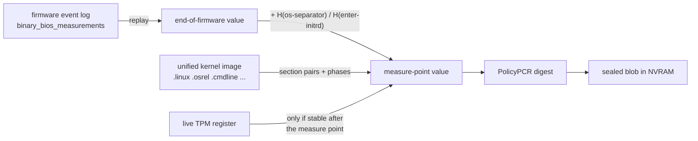
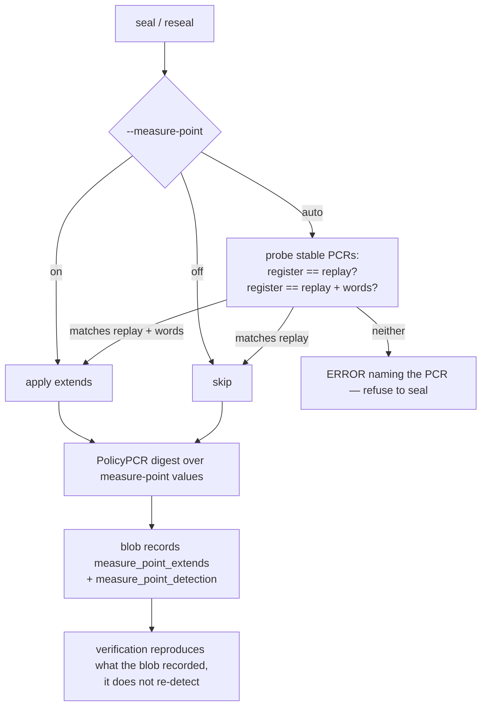

# TPM2-KIRA Security Background

This document describes the security architecture of tpm2-kira: how secrets are
protected, where data is stored, how authentication works, and what trust
boundaries exist.

---

## 1. Purpose

tpm2-kira keeps a TOTP key inside a TPM 2.0 and lets the TPM compute codes
with it only while the machine is in a known-good boot state, and only before
the disk is unlocked. If the boot chain changes (firmware update, bootloader
or kernel change, Secure Boot policy change), the TPM refuses to compute a
code. The owner, proven by possession of a signing private key, can approve
the new state; nobody, the owner included, can read the key back out of the
TPM after enrolment.

---

## 2. High-Level Architecture

```
┌──────────────────────────────────────────────────────────────┐
│                         TPM 2.0 chip                         │
│                                                              │
│  PCR registers            TOTP key object (HMAC, in blob)    │
│  PCR0, PCR7, PCR11 ...    authPolicy = PolicyAuthorize(      │
│                               signing key, policyRef)        │
│                                                              │
│  NV 0x01803010 + n   blob: key object, PCR values,           │
│                      generation G, approval signature        │
│  NV 0x01803810 + n   generation index: holds G               │
│                      (READ_STCLEAR: read-locked by `cap`)    │
└──────────────────────────────────────────────────────────────┘

┌──────────────────────────────────────────────────────────────┐
│                          Filesystem                          │
│  /var/lib/tpm2-kira/keys/seal.pub   signing public key       │
│  /var/lib/tpm2-kira/keys/seal.key   signing private key, or  │
│                                     a YubiKey reference      │
└──────────────────────────────────────────────────────────────┘
```

---

## 3. What Is Stored Where

### 3.1 TPM NVRAM (the "blob")

Each slot's NV index (default `0x01803010`; slot *n* is `0x01803010` + *n*)
stores one serialised `SealedBlob`: the slot's TOTP key and, once a phone is
enrolled for remote attestation, the phone enrolment as well. It is format
version 9 without an enrolment and version 10 with one (§10). It contains:

| Field               | Content                                                         | Sensitive? |
|---------------------|-----------------------------------------------------------------|------------|
| `Version`           | Blob format version: 9, or 10 when `Attest` is present          | No         |
| `AppVersion`        | tpm2-kira version that wrote the blob                           | No         |
| `Public`            | TPMT_PUBLIC of the TOTP key object                              | No         |
| `Private`           | TPM2B_PRIVATE of the TOTP key object (TPM-wrapped)              | **Yes**¹   |
| `PCRDigests`        | Per-PCR index, source (register/eventlog/uki) and digest        | No         |
| `TOTPAlgorithm`     | HMAC hash of the key: SHA-1, or SHA-256 on a TPM without SHA-1  | No         |
| `Generation`        | The generation the approval requires                            | No         |
| `PolicyRef`         | Random per key object; qualifies its approvals                  | No         |
| `SigningPublic`     | TPMT_PUBLIC of the signing key                                  | No²        |
| `ApprovalSignature` | Signing key's signature over `H(approvedPolicy ‖ PolicyRef)`    | No         |
| `EventlogInfo`      | Metadata about eventlog calculation (path, timestamps, counts, measure-point verdict) | No |
| `PublicKeyPath`     | Path of the signing public key, recorded for `info`             | No³        |
| `PrivateKeyPath`    | Path of the signing private key, recorded for `info`            | No³        |
| `Attest`            | The slot's phone enrolment, absent without one (fields below)   | Partly⁵    |
| `BlobSignature`     | Signature over everything above                                 | No⁴        |

The phone enrolment (`Attest`), written by `attest enrol`:

| Field           | Content                                                              | Sensitive? |
|-----------------|----------------------------------------------------------------------|------------|
| `AppVersion`    | tpm2-kira version that wrote the enrolment                           | No         |
| `DeviceID`      | 16 random bytes naming this machine to its phones                    | No         |
| `FriendlyName`  | The name shown on the phone                                          | No         |
| `AKPublic`      | TPMT_PUBLIC of the attestation key                                   | No         |
| `AKPrivate`     | TPM2B_PRIVATE of the attestation key (TPM-wrapped)                   | **Yes**¹   |
| `AKName`        | The attestation key's Name, which the phone pins                     | No         |
| `EKAlg`         | Which endorsement key template enrolment used (ECC or RSA)           | No         |
| `NoisePrivate`  | The machine's static key for the encrypted channel to the phone      | **Yes**⁵   |
| `AdvKey`        | Key that lets an enrolled phone recognise the machine's advertising  | **Yes**⁵   |
| `PCRAlg`, `PCRSelection` | The PCR bank and registers the phones check                 | No         |
| `Count`         | Value of the slot's record counter when the phones last changed (§3.3) | No       |
| `Verifiers`     | Up to 8 phones: id, name, anchor public key, channel public key, policy id | No   |

¹ The `Private` field is encrypted by the TPM's storage hierarchy. It cannot be
decrypted outside the TPM that created it, and the key in it can only be
*used* by that TPM, under the object's policy. It is never decrypted for
tpm2-kira: there is no `TPM2_Unseal`.

² The key object's policy binds the signing key's **Name**, so a substituted
`SigningPublic` makes `PolicyAuthorize` fail; it is stored because the key
files are not reachable in the initrd.

³ The key **paths** are a record for `info`. Nothing loads a key from them.
`reseal` must not: the blob is untrusted until a key has verified it, so a
planted blob naming its author's key would pass its own check (§5.4).
`info` prints them escaped and never opens them.

⁴ The blob carries a detached signature over `[version ‖ payloadLen ‖ payload]`,
made with the same signing key. Unsigned blobs are rejected outright. It
protects the *metadata* (PCR selection and sources, UKI paths) that `reseal`
acts on; the TPM enforces the rest by itself. It also covers the phone
enrolment: which phones are enrolled cannot be changed without the signing
key, and the Bluetooth gate verifies the signature in the initrd with a copy
of the signing *public* key that the initramfs hooks put into the image.

⁵ `NoisePrivate` and `AdvKey` are stored in the clear and, unlike the two
`Private` fields, are **not** protected by the TPM: the blob is readable by
anyone who can talk to the TPM (§9). Someone who reads them can recognise the
machine's advertisements and imitate its Bluetooth endpoint, but cannot produce
a quote, which only the TPM's attestation key can sign (SECURITY.md, "Remote
attestation with a phone: what it does not protect against").

Up to and including tpm2-kira 0.4.2.r46 the phone enrolment was an NV index of
its own (`0x01803020` + *n*). Those are no longer read; `nvram list` labels
them, and `attest enrol`, `attest unenrol` and `nvram delete` remove them.

### 3.2 The generation index

Each slot has a second NV index at blob index + `0x800` (`0x01803810` for slot
0). It holds an 8-byte big-endian generation `G`. Attributes:

- `OwnerRead`, `AuthRead` (empty auth): anyone can read it, as `PolicyNV` must.
- `PolicyWrite` with the same PolicySigned policy as the blob: only the
  signing key can write it.
- `READ_STCLEAR`: `TPM2_NV_ReadLock` makes it unreadable until the next TPM
  reset, i.e. reboot. Nothing else can undo the lock.

### 3.3 The record counter

A slot with a phone enrolment has a third NV index, at `0x01803820` + *n*: an
8-byte **counter** (`TPM_NT_COUNTER`), with `OwnerWrite`, `OwnerRead`,
`AuthRead` (empty auth) and `NoDA`.

It answers a question a signature cannot: is this blob the *current* one? An
older blob, still naming a phone that was removed since, verifies just as well.
So the enrolment carries a `Count`, and the gate accepts the blob only while
`Count` equals the counter. `attest enrol` and `attest unenrol` write the blob
with the counter's next value and then increment the counter; `reseal` and
`seal` carry the enrolment over with its `Count` unchanged.

A TPM counter can only be incremented. Deleting the index does not help
either: the TPM starts a new counter above the highest value any counter in
it ever had. The gate also insists that the index *is* a counter, since an
ordinary index at the same handle could hold any number. Whoever has the owner
hierarchy can raise the counter, which makes the genuine blob stale until the
user enrols again: a denial of the phone check, never an accepted blob.

### 3.4 Inside the TPM (never leaves the chip)

- **Storage Primary Seed**: generates the primary key deterministically.
- **Primary Key** (ECC P-256, restricted decrypt): re-derived on every use with
  `TPM2_CreatePrimary` from a fixed template; parent of the key object and the
  salt key for the session that carries the TOTP key in at seal time.
- **TOTP key**: a keyed-hash object with the HMAC scheme. The TPM computes
  `HMAC(key, counter)` in `TPM2_HMAC`; tpm2-kira receives only the 20- or
  32-byte result and truncates it to six digits (RFC 4226).

### 3.5 Filesystem (signing key pair)

`tpm2-kira setup` generates an ECDSA P-256 pair, or records a key in a YubiKey
PIV slot. Any RSA-2048 or ECC P-256/P-384 key works instead, including the
sbctl Secure Boot DB key, via `--pubkey` / `--privkey`.

`setup` writes both key files with mode `0400`. `seal` and `reseal` read a
key file only through `ReadSigningKeyFile` (`cmd/keyfile.go`), which refuses:

- a symlink (the file is opened with `O_NOFOLLOW`),
- anything but a regular file with exactly mode `0400`,
- a file not owned by root or by the user running tpm2-kira,
- a file in a directory that is group- or world-writable, or owned by
  someone else.

The checks run on the open descriptor and the key is parsed from the content
read through that same descriptor, so the file cannot be swapped between
check and use.

---

## 4. Authentication Model: PolicyAuthorize

### 4.1 The key object's policy

```
authPolicy = H( H(0…0 ‖ TPM_CC_PolicyAuthorize ‖ signingKeyName) ‖ policyRef )
```

It is fixed when the object is created and never changes. It says: *use this
key under whatever policy the signing key has approved for `policyRef`*.
`UserWithAuth` is clear, so there is no password path.

### 4.2 The approved policy

```
pcrPolicy      = H(0…0 ‖ TPM_CC_PolicyPCR ‖ PCR selection ‖ H(PCR values))
approvedPolicy = H(pcrPolicy ‖ TPM_CC_PolicyNV ‖ H(G ‖ offset 0 ‖ EQ) ‖ generationIndexName)
approval       = Sign_signingKey( H(approvedPolicy ‖ policyRef) )
```

The approval is stored in the blob. It is only valid while the PCRs hold the
sealed values **and** the generation index holds `G` and is readable.

### 4.3 Computing a code

```
1. PolicyPCR          TPM reads the live registers
2. PolicyNV           TPM reads the generation index, compares with G
                      (fails if the index is read-locked)
3. VerifySignature    TPM checks the approval against the session digest
                      → ticket (signing key loaded in the owner hierarchy:
                        PolicyAuthorize refuses the NULL ticket a
                        NULL-hierarchy key produces)
4. PolicyAuthorize    session digest := the key object's authPolicy
5. HMAC(counter)      TPM computes the code's HMAC
```

### 4.4 Where the guarantee is enforced

Every decision is made **inside the TPM**. `TPM2_PolicyPCR` derives the PCR
digest from its own registers; `TPM2_PolicyNV` reads the index itself;
`TPM2_VerifySignature` checks the approval; `TPM2_PolicyAuthorize` accepts
only the signing key whose Name is bound in the object. If any of these
differ by one bit, `TPM2_HMAC` is refused. The software comparisons tpm2-kira
makes first (PCR values, generation) only produce readable errors.

### 4.5 What the parts buy

- **The key never leaves the TPM.** No unseal exists. Neither root, nor
  another booted OS, nor a probe on the TPM bus can obtain the key. An attacker
  who satisfies the policy can make the TPM compute codes for chosen times,
  so a matching state still matters — but stolen access yields a list of
  codes for the times it was used, not the key forever.
- **Reseal does not need the key.** New PCR values are approved by signing;
  the object is unchanged, so no re-enrolment.
- **Revocation.** Each reseal raises `G`. Older approvals require an older `G`
  and stop working, so an attacker who kept an old blob cannot roll the
  machine back to an old kernel or initrd.
- **The cap.** `tpm2-kira cap`, run when the initrd is left, read-locks the
  generation index. `PolicyNV` fails until the next reboot, so nothing in the
  running OS can compute a code, root included. Deleting and recreating the
  index does not help: the policy binds the index's Name, and a recreated
  index has a different Name until it is written, which needs the signing key.
- **`policyRef` per object.** Approvals are bound to one key object. Without
  it, every approval ever made with the signing key — for any slot, or for an
  earlier seal — would fit every object.

### 4.6 What this does *not* guarantee

> The TPM computes codes when the PCRs match the approved values, the
> generation matches, and the index is not locked — or under any other state
> the signing key approves.

Anyone holding the signing private key can approve any state. The key is as
security-critical as the TPM policy. `/var/lib/tpm2-kira/keys/seal.key` sits on
the encrypted root filesystem, so it is not reachable in the initrd; with a
YubiKey, it is never on disk.

---

## 5. Operation Flows

### 5.1 Seal

```
1.  Load and check the signing key files; for a YubiKey, verify the PIN
2.  Pick the HMAC hash: SHA-1, or SHA-256 if the TPM has no SHA-1
3.  Generate the TOTP key (20 bytes for SHA-1, 32 for SHA-256)
4.  policyRef := 32 random bytes
5.  CreatePrimary; Create the HMAC key object with
    authPolicy = PolicyAuthorize(signing key, policyRef). The key is sent in
    a session salted with the primary key, with parameter encryption
6.  Approve and write (§5.3) with G = 1
7.  Show the key once, as base32 and QR code, for the authenticator
```

### 5.2 Reveal / run (initrd)

```
1.  Read the blob from NVRAM, deserialise (not verified: no key in the initrd)
2.  Read the generation index; compare with the blob's G         (advisory)
3.  Compare the blob's PCR digests with the live registers       (advisory)
4.  CreatePrimary, Load the key object
5.  Policy session as in §4.3, then TPM2_HMAC(time / 30)
6.  Truncate to six digits
```

A planted blob can only carry an object its author created, whose key does
not match the user's authenticator; the substitution shows as a failed
comparison, not a false pass.

### 5.3 Approve and write (seal and reseal)

```
1.  Compute the PCR values for the next boot (§5.6–5.8)
2.  pcrPolicy := PolicyPCR digest of those values
3.  Write G' = G + 1 to the generation index (PolicySigned)
    → from here every older approval is revoked
4.  approvedPolicy := PolicyNV(pcrPolicy, generation index == G')
5.  Sign the approval; update the blob; sign the blob; write it (PolicySigned)
```

If step 5 fails, the slot shows no code until a reseal succeeds; the blob is
stashed as described in §9.

### 5.4 Reseal

```
1.  Read the blob; load the signing key (--privkey or the default key, never
    a path from the blob) and verify the blob's signature with it
2.  Check the key is the one the key object trusts (SigningPublic)
3.  For a YubiKey: find it and verify the PIN, before anything is written
4.  Approve and write (§5.3) with the preserved or given PCR selection
```

Reseal never unseals, never uses the key object, and does not need the PCRs
to match. It works in the running OS while the generation index is
read-locked: the index's Name for `PolicyNV` is computed with the
`READLOCKED` bit cleared, which is what it is in the initrd.

### 5.5 Key resolution in reseal

```
Private key = --privkey flag  →  /var/lib/tpm2-kira/keys/seal.key
Public key  = --pubkey flag (must match)  →  derived from the private key
```

The key paths recorded in the blob are **never** used to find a key. The blob
is what the key is about to verify, and anyone with TPM access can replace it
(§9): a planted blob signed by its author's key, naming that key's path, would
otherwise verify against itself, and reseal would report success instead of
tampering. Only after verification are the recorded paths compared with the
key in use, and a difference is printed.

When reseal cannot find or verify with its key and the blob names a different
one, the error quotes that path as *unverified* and says to pass it with
`--privkey` only if the user sealed with it. A slot sealed with a non-default
key therefore always needs `--privkey` on reseal.

`resolveResealKeys` in `cmd/reseal.go` implements this.

### 5.6 The measure point

A PCR policy is checked against **live registers at the instant a code is computed**.
For tpm2-kira that instant is one specific point in the boot: the moment
`tpm2-kira run` reads the TPM in the initrd, before the LUKS passphrase prompt.
Everything sealing does must answer one question:

> What will PCR *i* be at the measure point of the *next* boot?

That is neither "what the firmware log says" nor "what the running system
shows". Both differ, in different directions:

```mermaid
sequenceDiagram
    participant FW as Firmware
    participant STUB as systemd-stub / EFI stub
    participant SD as systemd (initrd)
    participant KIRA as tpm2-kira
    participant OS as systemd (real root)

    FW->>FW: PCR 0-7 firmware events, then EV_SEPARATOR
    STUB->>STUB: PCR 11 section pairs, PCR 9 LoadOptions + initrd, PCR 12
    Note over FW,STUB: everything above appears in binary_bios_measurements

    SD->>SD: enter-initrd into PCR 11
    Note over SD,KIRA: not in the firmware log — systemd logs these separately

    KIRA-->>KIRA: MEASURE POINT: a fresh code per 30 s until Enter or 90 s; READY=1

    SD->>SD: os-separator into PCR 0-7, 9, 12, 13, 14
    Note over SD: one-way: the key's policy is unsatisfiable until the next boot

    OS->>OS: leave-initrd, sysinit, ready into PCR 11
    OS->>OS: machine-id into PCR 15
    OS->>OS: nvpcr-init x4 into PCR 9 (after the disk is unlocked)
    Note over OS: these make the post-boot register useless as a reference
```

Two consequences follow, and both caused real breakage:

1. **The firmware event log stops short of the measure point.** It describes
   the end of firmware. The systemd extends that follow are recorded in
   `/run/log/systemd/tpm2-measure.log`, a different file written by a
   different producer. Replaying only the firmware log under-counts.
2. **The live register at seal time is past the measure point** for any PCR
   that keeps being extended afterwards. PCRs 9, 11 and 15 do; PCRs 0–7, 12,
   13 and 14 stop, which is what makes them usable as a reference.

### 5.7 Reconstructing each PCR



Per source:

| Source | Reconstruction | Valid for |
|--------|----------------|-----------|
| `r` register | read the register as-is | PCRs that stop changing at the measure point |
| `e` eventlog | replay the firmware log, then apply the measure-point extends | PCRs 0–12 |
| `u` uki | replay systemd-stub's section measurements from the image, then the boot phases | PCR 11 |

> **The event log and the TPM banks are independent.** A machine can have a
> SHA-256 PCR bank but a firmware event log that only carries SHA-1 digests.
> The `e` source then has nothing to replay in the selected bank, and a naive
> replay returns the PCR's all-zero reset value — a plausible-looking digest
> that the machine will never produce. tpm2-kira counts the extends applied per
> PCR and refuses in that case rather than sealing it.
>
> The SHA-256 value cannot be derived from a SHA-1 log: PCR values in different
> banks are different values, and several event types (`EV_EFI_VARIABLE_*`,
> `EV_SEPARATOR`) have digests that are not simply a hash of the logged payload,
> so re-hashing the payloads would be wrong. On such a machine either use
> `--sha1` (needs a SHA-1 PCR bank on the TPM) or the register source. For
> PCRs 0–7 the register source is equivalent — they do not change between the
> measure point and seal time — so nothing is lost by using it there.

**Measure-point extends** (systemd hashes the literal word: no NUL terminator,
no machine-id, no salt, so these are universal constants, not per-host values):

| Word | Extended into | Unit | `sha256` |
|------|---------------|------|----------|
| `os-separator` | PCR 0–7, 9, 12, 13, 14 | `systemd-pcrosseparator.service` | `ff5b9d73dad709633ae76adf444012b57e913a12ed7403c3931145862f35f841` |
| `enter-initrd` | PCR 11 | `systemd-pcrphase-initrd.service` | `51e6b92f405d1f98d96e3de343d61d420ad6923b25de21d766f9298192f14fed` |

Extended *after* the measure point, and therefore never part of a sealed
policy: `leave-initrd`, `sysinit`, `ready` (PCR 11), `machine-id:<id>` (PCR 15),
`nvpcr-init:<name>:...` (PCR 9).

> **An initramfs without systemd has no measure-point extends.** On Debian's
> initramfs-tools the code is shown from an `init-premount` script, and none of
> the units above exist, so the measure point *is* end-of-firmware and
> `--measure-point=auto` resolves to `off`. There is also no UKI, so PCR 11 is
> empty and the `u` source does not apply; GRUB's measurements land in PCR 8
> (every command it runs, logged as `grub_cmd: ...`) and PCR 9 (the *contents*
> of every file it reads — grub.cfg, modules, kernel, initrd — plus
> `LOADED_IMAGE::LoadOptions`) instead.
>
> PCR 9 therefore changes on **every** kernel or initramfs update, and no
> source can predict its next value the way `11u` predicts PCR 11 from a UKI on
> disk — every Debian source is read from the running system. Sealing PCR 8/9
> means re-sealing after the reboot that follows an update, not before it.

**UKI section measurement.** systemd-stub measures each present section twice,
in its own fixed order (`.linux`, `.osrel`, `.cmdline`, `.initrd`, `.ucode`,
`.splash`, `.dtb`, `.uname`, `.sbat`, `.pcrpkey`; `.pcrsig` is never measured
because it carries the signature over these measurements):

```
PCR11 = Extend(PCR11, H(section_name + "\0"))    # NUL-terminated ASCII
PCR11 = Extend(PCR11, H(section_bytes))
```

The firmware event log *renders* the name as UTF-16 (`".\0l\0i\0n\0u\0x\0\0\0"`),
which is the event payload — but the measured digest is over the ASCII form.
`H(".linux\0")` = `0da293e37ad5511c59be47993769aacb91b243f7d010288e118dc90e95aaef5a`.

> **Trap:** `section_bytes` is the **unpadded** content. PE sections are padded
> up to the file alignment, and Go's `debug/pe` exposes that padded length as
> `Section.Size` (it is `SizeOfRawData`); the content length is
> `Section.VirtualSize`. Measuring the padded length yields a PCR 11 value the
> machine will never present. See `docs/UKI-PCR11-PADDING.issue`.

`tpm2-kira seal` guards this by recomputing PCR 11 from the image and comparing
it against the current boot's event log, refusing to seal on mismatch
(`--verify-uki=false` overrides). `reseal` skips the check because it runs
when the image on disk is legitimately not the one that booted.

**Useful constants for diagnosis.** PCRs 2, 3 and 6 normally contain only the
firmware `EV_SEPARATOR`, so their value is machine-independent:

| State | sha256 |
|-------|--------|
| `EV_SEPARATOR` event digest | `df3f619804a92fdb4057192dc43dd748ea778adc52bc498ce80524c014b81119` |
| zero PCR + separator (end of firmware) | `3d458cfe55cc03ea1f443f1562beec8df51c75e14a9fcf9a7234a13f198e7969` |
| the same + `os-separator` (measure point) | `8d22c738fcd1730fb0789cb09c0f72a0012baa3ea867723b26772c9ca0ae6571` |

If PCR 2/3/6 hold neither of the last two, something is performing extra
extends — it is never a changed measurement.

### 5.8 Making the seal match the measure point



Three properties make this safe:

- **Refusal beats guessing.** A PCR whose register matches neither branch is
  not reconstructible on that host, and sealing would bind the policy to a
  value the machine will never produce. That is a silent failure at the next
  boot, so `auto` errors out instead.
- **Build-time beats run-time for the transition.** The mkinitcpio install
  hook inspects the image being built and records the verdict, because
  probing the *current* boot cannot know what the *next* one will do — exactly
  the case where these units first appear in the initramfs.
- **The blob is self-describing.** What was applied is stored, so verification
  recomputes the sealed values rather than re-deriving them from a system that
  may have changed. `tpm2-kira info` shows it.

Ordering is enforced so the measure point is deterministic:
`tpm2-kira.service` declares `After=systemd-pcrphase-initrd.service` and
`Before=systemd-pcrosseparator.service`, and is `Type=notify`. Without those
edges the measure point could land on either side of the extends, which would
make an identical machine pass or fail across identical boots.

Running *before* the separator is what makes the codes boot-time codes.
`tpm2-kira run` shows a fresh code every 30 seconds and asks whether it
matches the authenticator; Enter, or the end of the 90-second hold, sends
`READY=1` and the display exits; the separator runs after READY and extends
PCRs 0–7, 9, 12–14. Extends are one-way, so from then on no process in the
booted system can satisfy the key's policy: the key never left the TPM, the
display only ever held the code it was showing, and a runtime compromise
cannot turn into a forged code at the next boot. Holding the boot costs
nothing in security: during the hold only the measured initramfs runs, and
the codes on the screen are the design. `tpm2-kira cap` at
`initrd-switch-root` read-locks the generation index on top of that, which
also covers blobs whose policy holds after the separator. Earlier versions
ran after the separator and computed each code when it was due, which left
the policy satisfiable until `cap`. Blobs they sealed carry `os-separator`
in their recorded extends and still get codes, live, after the boot has been
released, so an upgrade does not lock anyone out; a reseal moves them before
the separator.

The attestation gate (`tpm2-kira-attest.service`) stays *after* the
separator: a quote is not a secret, post-separator values are a fixed function
of pre-separator ones, and the gate advertises for a while during which it
could not hold the separator back. Its baseline is predicted for that point.

What the separator does not cover is the signing key: whoever can use it can
approve a new policy for the current state and compute codes at any time.
Keep it on a YubiKey (the intended setup), or at least off the machine; a key
file in `/var/lib/tpm2-kira/keys` is the fallback, and with it a runtime root
has that power.

---

## 6. Policy Digests: Software vs TPM Computation

The PolicyPCR digest is computed by the TPM in a trial session. The PolicyNV
and PolicyAuthorize digests are computed in software (`cmd/totpkey.go`):

```
PolicyNV:        H(prev ‖ 0x00000149 ‖ H(operandB ‖ offset:2 ‖ operation:2) ‖ indexName)
PolicyAuthorize: H( H(prev ‖ 0x0000016A ‖ keySignName) ‖ policyRef )
```

Software computation is required, not a convenience: after `cap`, the
generation index is read-locked, and its current Name carries the
`READLOCKED` bit. A reseal in the running OS must still produce the digest the
initrd will see, so it computes the Name from the index's public area with
that bit cleared.

A wrong digest cannot weaken anything — the TPM would simply refuse to
compute codes — but it would lock the user out. The integration tests check
every digest against real policy sessions on swtpm, including a reseal while
the index is read-locked followed by a reboot.

The PolicySigned digest that guards NV writes is computed by the TPM in a
trial session, with the signing key loaded via `TPM2_LoadExternal`.

---

## 7. Key Requirements and TPM Compatibility

### Supported key types

| Key Type   | LoadExternal  | Notes                              |
|------------|---------------|------------------------------------|
| RSA-2048   | ✓             | Universally supported              |
| RSA-4096   | TPM-dependent | Many consumer TPMs reject this     |
| ECC P-256  | ✓             | Recommended; compact and fast      |
| ECC P-384  | ✓             | Supported but less common          |

The TPM must load the signing public key to verify approvals
(`TPM2_VerifySignature`) and NV write authorisations (`TPM2_PolicySigned`).
`seal` loads it before creating anything, so a key the TPM cannot load is
refused up front.

### Key scheme

Keys are loaded into the TPM with an explicit signing scheme:

- RSA: `TPM_ALG_RSASSA` with `TPM_ALG_SHA256`
- ECC: `TPM_ALG_ECDSA` with `TPM_ALG_SHA256`

The scheme is part of the `TPMT_PUBLIC` structure and therefore part of the
key's **Name**. Changing the scheme changes the Name, which changes the key
object's `authPolicy` and the NV write policy, so it must be the same at seal,
reseal and boot.

---

## 8. Threat Model

### What the TPM protects against

| Threat                                      | Mitigation                                |
|---------------------------------------------|-------------------------------------------|
| Offline disk theft                          | The key object is TPM-wrapped; useless without the specific TPM chip |
| Boot chain tampering (evil maid)            | PCR values change → PolicyPCR fails → no code → user detects compromise |
| Copying the TOTP key                        | No unseal exists; the TPM computes codes and the key never leaves it after enrolment (§4.5) |
| Using the TPM from the running OS (root, `tss`) | `tpm2-kira cap` read-locks the generation index when the initrd is left; PolicyNV fails until reboot (§4.5) |
| Rollback to an older approved state         | Every reseal raises the generation; older approvals stop working |
| TPM bus sniffing at seal time               | The key goes into the TPM over a salted, parameter-encrypted session |
| Blob tampering in NVRAM                     | `Private` area is integrity-protected by TPM; tampering causes `TPM2_Load` to fail; a substituted signing key fails PolicyAuthorize |
| Planted blob steering `reseal`              | `reseal` verifies the blob with a key it takes from `--privkey` or the default location, never from the blob (§5.5) |
| Approving a new state without the owner     | Requires the signing private key (or the YubiKey and its PIN) |

### What the TPM does NOT protect against

| Threat                                       | Why                                        |
|----------------------------------------------|--------------------------------------------|
| A shell with the sealed PCRs intact, before the cap | Another OS, or a shell in the genuine initrd, while the PCRs still match: the TPM computes codes on request, including for future times. Choose PCRs that measure kernel, initrd and command line, and close the ways into a shell (README "Hardening the boot path") |
| Physical TPM interposer (active)             | The salt key's public area is not authenticated, so an *active* interposer could substitute it at seal time. Passive sniffing sees only HMAC results |
| Compromise of the signing private key         | Its holder can approve any state |
| TPM reset attacks (if PCRs can be replayed)   | Platform-specific; DRTM/measured launch can mitigate |
| Pre-recorded codes (clock set forward)        | The code is `HOTP(secret, time/30)` and the time comes from the RTC, which is neither measured nor protected. An attacker boots the untouched machine with the clock set to when the owner will next boot, notes the codes shown, then tampers with the boot chain and shows the recorded codes at that time; they match the authenticator. Inherent to time-based codes: only a counter- or challenge-based scheme removes it. A firmware setup password, a locked boot order and Secure Boot (so no other OS can be booted to set the clock) raise the cost; unexpected RTC drift is a sign |
| The authenticator app                         | It holds a copy of the key |

### PCR selections that attest less than they appear to

A policy is only as meaningful as the registers it binds. These selections look
protective but are not, and `seal`/`reseal` warn about each:

| Selection | Why it is weak |
|-----------|----------------|
| PCR 0 alone | PCR 0 measures firmware **code**, not this machine. Every device running the same firmware build holds the same value, so an attacker can reproduce it on their own hardware. Firmware *configuration* lives in PCR 1, which is not covered. |
| No PCR for kernel, initrd or command line (e.g. `0,7`, `0e,2e,4e,7e`) | Nothing before the passphrase prompt is attested after the bootloader. A replaced initrd, or a shell from an edited command line (`rd.break`, `break=`), runs with these PCRs intact: it can log the passphrase while the genuine code is shown, or have the TPM compute codes for future times. PCR 11 (UKI), PCRs 8+9 (GRUB) or 9+12 (systemd-boot) close this. |
| PCR 7 with Secure Boot disabled, or the platform in Setup Mode | PCR 7 records the Secure Boot state and policy. With Secure Boot off it faithfully records "disabled", and nothing verifies which bootloader or kernel runs — a matching PCR 7 does not mean the boot chain was checked. In Setup Mode the keys can be replaced without physical presence, so the attested policy is one any root user can rewrite. |

The Secure Boot state is read from `/sys/firmware/efi/efivars`. When it cannot
be read at all, tpm2-kira says so rather than staying silent.

### Trust boundaries

```
┌──────────────────────────────────┐
│  TRUSTED: TPM 2.0 chip           │
│  - TOTP key (never leaves)       │
│  - PCR register integrity        │
│  - PolicyAuthorize / PolicyNV    │
│  - Signature verification        │
└─────────────┬────────────────────┘
              │ /dev/tpmrm0 (kernel mediated)
┌─────────────┴────────────────────┐
│  PRIVILEGED: root userspace      │
│  - tpm2-kira binary              │
│  - Signing private key (fs)      │
│  - Codes only before `cap`       │
└─────────────┬────────────────────┘
              │
┌─────────────┴───────────────────┐
│  UNTRUSTED: non-root userspace  │
│  - Cannot access /dev/tpmrm0    │
│  - Cannot read private key      │
└─────────────────────────────────┘
```

---

## 9. NVRAM Index Security

`WriteToNVRAM` (`cmd/nvram.go`) defines the index as follows:

| Attribute | Set | Effect |
|---|---|---|
| `OwnerRead`, `AuthRead` | yes | any process that can talk to the TPM can read the blob |
| `OwnerWrite` | no | the owner hierarchy cannot write, even with owner auth |
| `AuthWrite` | no | the index's own (empty) auth value cannot write |
| `PolicyWrite` | yes | a write needs a policy session that satisfies `AuthPolicy` |
| `AuthPolicy` | PolicySigned digest of the signing key | only the signing key can authorise a write; the generation index uses the same policy (§3.2) |

Every write is therefore authorised by a signature from the signing private key,
verified by the TPM. The blob is written in 1024-byte chunks, each under a fresh
PolicySigned session: every session has a new `nonceTPM` to sign, and the index
Name changes after the first write sets `TPMA_NV_WRITTEN`, so it is re-read
before each chunk. HISTORY.md records the earlier, unauthenticated definition.

What this means in practice:

1. **Reading the blob is harmless.** The `Private` field is TPM-encrypted and
   reveals nothing without a valid policy session. The `Public` field, PCR
   digests, and signing public key are not secret.
2. **Overwriting the blob in place needs the signing private key.** Without it,
   `TPM2_NV_Write` fails the policy check.
3. **Deleting the index does not need the signing key.** `TPM2_NV_UndefineSpace`
   is authorised by the owner hierarchy, not by the index's policy. tpm2-kira
   uses the owner hierarchy with an empty auth value throughout — for
   `TPM2_CreatePrimary`, for defining the index and for `nvram delete` — so on
   a typical system any process with TPM access can delete a slot. That is a
   denial of service: the key object is gone, and the user must seal again
   and re-enrol the authenticator. Deleting the generation index is a denial
   of service too, until the next reseal recreates it.
4. **Delete-and-redefine lets an attacker plant a blob of their own**, under a
   write policy of their choosing. The index definition therefore does not
   authenticate the blob's content; the blob signature does (§3.1, note ⁴).
   `reseal` verifies it before acting on any field, with a key it does not take
   from the blob (§5.5). `info` verifies it too, and shows an unverified blob
   as untrusted without opening the paths it names. `reveal` does not verify it,
   since the signing key is not available in the initrd. A planted blob can
   carry the user's key object only with an approval signed by the user's key
   for the current generation; otherwise it can only carry an object the
   attacker created, whose codes do not match the user's authenticator, so
   the substitution shows up as a failed comparison, not as a false pass.
5. **The real access control is on the key object**, not the NVRAM index.
   Its `authPolicy` (PolicyAuthorize) is what prevents unauthorised use.

Setting an owner-hierarchy password would close the delete path, but tpm2-kira
currently always presents an empty owner auth value, so it would stop working
on such a system. Supporting owner auth is outside the current design.

---

## 10. Blob Format (Versions 9 and 10)

The blob is a binary-serialised structure with explicit length prefixes and
maximum size limits to prevent memory exhaustion during deserialisation.

One blob per slot. **Version 9** is a slot with a TOTP key only. **Version 10**
is the same layout followed by the slot's phone enrolment, and a blob is
written as version 10 exactly when it carries one. Removing the phones gives
the version 9 bytes back. So

- a slot without phones is unchanged by the existence of version 10, and
  stays readable by builds that know only version 9;
- a build that knows only version 9 refuses a version 10 blob instead of
  reading it and dropping the phones on its next `reseal`;
- a version field that does not match the content (9 with an enrolment
  appended, 10 without one) is either a parse error or, since the version is
  inside the signed region, a signature failure.

Version 10 put the phone enrolment into the slot's blob; before, it was an NV
index of its own with a separate life (it could outlive the TOTP key it
belonged to, or be created without one).
Version 9 replaced the sealed secret with an HMAC key used inside the TPM, and
the PolicyOR (PCR branch or PolicySigned branch) with PolicyAuthorize: the
`SignedBranchDigest` field gave way to the TOTP algorithm, the generation,
the policy reference, the signing public key and the approval signature.
Version 8 dropped the stored eventlog hash: it recorded the digest of a file
that is never reopened from the blob, so it attested nothing. Version 7 added
the measure-point metadata and replaced the external predict source with the
UKI source. The `p:COMMAND` source was removed outright: it stored a command
string in the blob which `reseal` executed, so a planted blob meant arbitrary
code execution as root. No command is ever executed now; the enrolment QR
code is rendered in-process, since an external `qrencode` would receive the
TOTP secret on its command line, readable by every local user in
`/proc/<pid>/cmdline`.

```
Offset  Field                   Type        Notes
─────────────────────────────────────────────────────────────
0       Version                 uint32      9, or 10 with a phone enrolment
4       Payload length          uint32      Signed region length
8       AppVersion length       uint32      ≤ 1024
?       AppVersion              string
?       Public length           uint32      ≤ 2MB
?       Public                  []byte      TPMT_PUBLIC of the TOTP key object
?       Private length          uint32      ≤ 2MB
?       Private                 []byte      TPM2B_PRIVATE
?       PCR digest count        uint32      ≤ 100
        For each PCR digest:
          PCR index             uint32
          PCR source            uint8       0=register, 1=eventlog, 3=uki
                                            (2 was the removed predict source)
          Path length           uint16      Only if source=uki
          Path                  string      Only if source=uki (UKI location)
          Digest length         uint16      ≤ 1024
          Digest                []byte      Value at the MEASURE POINT
?       TOTPAlgorithm           uint16      TPM_ALG_SHA1 or TPM_ALG_SHA256
?       Generation              uint64      Generation the approval requires
?       PolicyRef length        uint16      ≤ 64
?       PolicyRef               []byte
?       SigningPublic length    uint16      ≤ 2048
?       SigningPublic           []byte      TPMT_PUBLIC of the signing key
?       ApprovalSignature len   uint16      ≤ 1024
?       ApprovalSignature       []byte      TPMT_SIGNATURE over H(approvedPolicy ‖ PolicyRef)
?       HasEventlogInfo         uint8       0 or 1
        If HasEventlogInfo=1:
          EventlogPath length   uint32
          EventlogPath          string
          CalcTime length       uint32
          CalcTime              string
          TotalEvents           uint32
          ProcessedEvents       uint32
          MeasurePointExt len   uint16      ≤ 512
          MeasurePointExtends   string      "word:pcr,pcr;word:pcr" applied
                                            on top of the eventlog replay
          MeasurePointDet len   uint16      ≤ 512
          MeasurePointDetection string      how that was decided
?       HasKeyPaths             uint8       0 or 1
        If HasKeyPaths=1:
          PubKeyPath length     uint16      ≤ 4096
          PubKeyPath            string      Filesystem path to public key
          PrivKeyPath length    uint16      ≤ 4096
          PrivKeyPath           string      Filesystem path to private key
        Only if Version=10 (the phone enrolment, up to the end of the payload):
?         Enrolment length      uint32      ≤ 16384; must end the payload exactly
?         Magic                 [4]byte     "KATT"
?         Enrolment format      uint8       Must be 3
?         AppVersion length     uint16      ≤ 1024
?         AppVersion            string
?         DeviceID              [16]byte    Random, assigned at first enrolment
?         FriendlyName length   uint16      ≤ 64
?         FriendlyName          string      Name shown on the phone
?         AKPublic length       uint32      ≤ 4096
?         AKPublic              []byte      TPMT_PUBLIC of the attestation key
?         AKPrivate length      uint32      ≤ 4096
?         AKPrivate             []byte      TPM2B_PRIVATE (TPM-wrapped)
?         AKName length         uint16      ≤ 68
?         AKName                []byte
?         EKAlg                 uint16      TPM_ALG_ECC or TPM_ALG_RSA
?         NoisePrivate          [32]byte    X25519 static key of the channel
?         AdvKey                [32]byte    Advertising key
?         PCRAlg                uint16      TPM_ALG_SHA256 or TPM_ALG_SHA1
?         PCRSelection length   uint16      ≤ 24
?         PCRSelection          []uint8     PCR indices the phones check
?         Count                 uint64      Must equal the slot's record counter
?         Verifier count        uint8       ≤ 8
          For each verifier (phone):
            ID length           uint16      ≤ 64
            ID                  string
            Name length         uint16      ≤ 64
            Name                string
            AnchorPub length    uint16      ≤ 256
            AnchorPub           []byte      PKIX DER, ECDSA P-256: signs receipts
            NoisePub            [32]byte    X25519 static key of the phone
            PolicyID length     uint16      ≤ 64
            PolicyID            string
─────────────────────── end of signed region ───────────────────────
?       Signature length        uint16      ≤ 1024, must be non-zero
?       Signature               []byte      Over [version ‖ payloadLen ‖ payload]
```

Everything except the trailing signature is covered by `SealedBlobPayload`, so
any field added there is automatically inside the signed region. A blob whose
signature is absent is rejected rather than treated as legacy.

The enrolment is the last thing in the payload, and its length must end the
payload exactly: nothing can follow it unsigned, and a truncated or padded one
does not parse. It has a format number of its own (3; formats 1 and 2 were the
separate NV index), so the enrolment can change without touching the TOTP
part.

**Who writes what.** `seal` creates the blob. `reseal` reads it, verifies it
with the signing key, changes the PCR digests, generation and approval, and
writes it back, enrolment included and unchanged. `seal` on an existing slot
keeps the enrolment if the same signing key wrote the old blob, and drops it
otherwise: it does not sign phones it cannot vouch for. `attest enrol` and
`attest unenrol` read the blob, verify it, add or remove the enrolment and
write it back, TOTP part unchanged; if that write fails, the previous blob is
put back. Every write replaces the NV index (`TPM2_NV_UndefineSpace`, then
define and PolicySigned writes, §9).

**Size.** The blob has to fit one NV index, whose maximum the TPM reports as
`TPM_PT_NV_INDEX_MAX` (2048 bytes on many, including Intel PTT). Measured on
swtpm with ECC keys and three sealed PCRs: 912 bytes for the TOTP part, 542
more for an enrolment with one phone, and roughly 200 for each further phone.
`attest enrol` computes the size with one more phone of the largest allowed
size before it starts and refuses if that exceeds the TPM's limit.

The stored PCR digests are **measure-point values**, not end-of-firmware values
and not the values a running system would report. `MeasurePointExtends` records
which userspace extends were folded in, so verification reproduces exactly what
was sealed instead of re-deriving it — see §5.6–5.8.

**There is no migration from older blob versions.** Versions 9 and 10 are
accepted; an older blob produces an error telling the user to seal again. Since
the TOTP secret cannot be carried across, that also means re-enrolling the
authenticator app. A phone enrolment from the separate NV index is not carried
into the blob either: the phone is enrolled again.

All multi-byte integers are little-endian. Strings are UTF-8 without null
terminators.

---

## 11. Why No Password Fallback

Previous versions of tpm2-kira offered a password-based recovery mechanism.
This was removed because:

1. **Passwords are weak.** A password stored alongside the blob (or memorised
   by the user) has far less entropy than an asymmetric key pair.
2. **Passwords enable brute-force.** The TPM's dictionary attack lockout helps
   but does not eliminate the risk, especially for weak passwords.
3. **Key-based recovery composes with Secure Boot key management.** The default
   is a dedicated ECDSA P-256 pair created by `setup`, but pointing `--privkey`
   at the sbctl DB key means the same key that signs boot components also
   authorises TOTP re-sealing, with no additional secret to manage.
4. **`UserWithAuth = false`** on the key object means the TPM physically
   cannot accept password auth. The enforcement is in hardware, not software.

---

## 12. Operational Security Recommendations

1. **Protect the signing private key.** It is the recovery master key. Store
   it with restrictive permissions (`chmod 400`, owned by root, in a directory
   only root can write to; `seal` and `reseal` refuse anything else, §3.5).
   Consider keeping a backup in a secure offline location.
2. **Use RSA-2048 or ECC P-256.** These are universally supported by TPM 2.0
   hardware. RSA-4096 may not work on all TPMs.
3. **Monitor TOTP codes.** If the TOTP code is absent or wrong at boot, the
   boot chain may have been tampered with. Do not enter disk decryption
   passwords until the TOTP code is verified.
4. **Re-seal after planned changes.** After firmware updates, bootloader
   changes, or Secure Boot key rotations, run `tpm2-kira reseal` to approve
   the new PCR values.
5. **Keep the cap in the boot integration.** It is what keeps the running OS
   from computing codes; check that `tpm2-kira info` reports the generation
   index as read-locked after boot.
6. **NVRAM index range.** tpm2-kira uses blob indices `0x01803000–0x018037FF`
   and generation indices `0x01803800–0x01803FFF` (TPM2 owner-defined NV
   range). Avoid conflicts with other applications using the same range.
